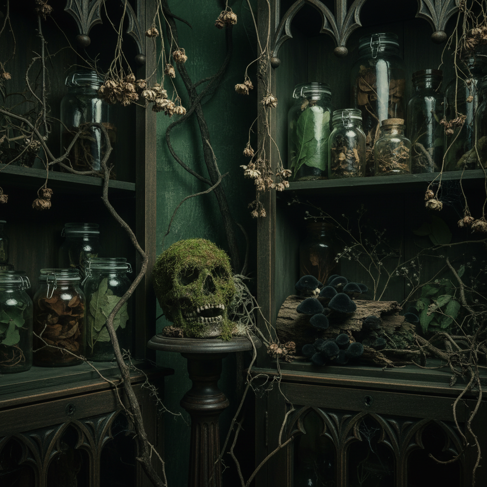

# Dark Natural 暗黑自然



> **"枯枝、苔藓、骨骼标本——自然不只有阳光，还有腐朽的美。"**

## 概述

| 维度 | 描述 |
|------|------|
| 时期 | 2015–至今 |
| 别名 | Dark Natural, Dark Botanical, Gothic Nature |
| 核心色彩 | 深绿、黑色、棕色、暗红、骨白 |
| 关键元素 | 枯枝干花、苔藓、骨骼/标本、暗色植物、蘑菇 |
| 代表人物 | Instagram 暗色植物博主、Cabinet of Curiosities |
| 关联风格 | Witchcore, Dark Cottagecore, Goblincore, Mushroomcore |

---

## 历史脉络

| 年份 | 事件 |
|------|------|
| 2015 | "Dark Botanical" 在 Instagram 上兴起 |
| 2017 | 与 Witchcore 交叉——"自然女巫"美学 |
| 2019 | Cabinet of Curiosities 复兴——博物学美学 |
| 2020 | 疫情期间——对自然的重新关注（包括暗面） |
| 2022 | 与 Goblincore/Mushroomcore 融合 |

### 核心哲学

Dark Natural 的精神是**"自然不只有花园和阳光——腐朽、死亡、黑暗也是自然的一部分"**：
- 腐朽 = 美（"枯萎的花比盛开的花更有故事"）
- 死亡 = 自然（"骨骼是自然最精致的雕塑"）
- 收集 = 理解（"Cabinet of Curiosities = 对世界的好奇"）
- 黑暗 = 诚实（"自然不总是'美好'的"）
- "如果 Cottagecore 是花园的白天，Dark Natural 是森林的午夜"

---

## 视觉语法

### 色彩系统

```
主色：
  深绿 (#013220) — 苔藓、暗叶
  黑色 (#000000) — 基底、阴影
  棕色 (#3B2F2F) — 枯枝、泥土
  暗红 (#4A0000) — 干血、浆果
  骨白 (#F5F5DC) — 骨骼、蘑菇

辅色：
  深紫 (#1A001A) — 毒蘑菇
  铜绿 (#2E8B57) — 氧化
  灰色 (#555555) — 石头

质感：
  苔藓 — 湿润、柔软
  枯枝 — 干燥、脆弱
  骨骼 — 光滑、坚硬
  蘑菇 — 柔软、有机
  标本 — 干燥、精致
```

### 标志性元素

| 类别 | 元素 |
|------|------|
| 植物 | 枯枝、干花、苔藓、蕨类、暗色多肉 |
| 动物 | 骨骼标本、昆虫标本、乌鸦羽毛 |
| 真菌 | 蘑菇、地衣、菌丝 |
| 容器 | 玻璃瓶、标本罐、木盒 |
| 空间 | 暗色书房、温室、森林地面 |
| 态度 | 好奇、收集、暗黑、自然、博物学 |

---

## 与千禧怀旧的关系

### Cottagecore 的暗面
- Cottagecore = 自然的"光明面"（花园、烘焙、阳光）
- Dark Natural = 自然的"黑暗面"（腐朽、标本、午夜）
- 两者共享"对自然的热爱"——但角度不同
- "同一片森林，不同的时间"

### 博物学复兴
- 维多利亚时代的 Cabinet of Curiosities 在 2020s 复兴
- 与 Dark Academia 的交叉（学术+收集+暗色）
- "Instagram 让每个人都可以成为博物学家"

---

## 中国语境

- 与中国"枯山水"美学的交叉
- 中国传统"赏石"文化的暗黑版
- 小红书上的"暗黑植物"/"标本收集"
- 与中国"中药标本"美学的意外交叉

---

## 设计应用

| 场景 | 应用方式 |
|------|----------|
| 空间 | 暗色+植物+标本+玻璃+木质 |
| 品牌 | 自然+暗黑+博物学+收集+有机 |
| 摄影 | 暗色调+微距+标本+自然光+质感 |
| 产品 | 天然成分+暗色包装+植物图鉴风 |

---

## 相关风格

← [Dark Cottagecore 暗黑田园](dark-cottagecore.md) | [Mushroomcore 蘑菇核](mushroomcore.md) →

↑ [返回千禧怀旧目录](README.md) | [返回总目录](../README.md)
