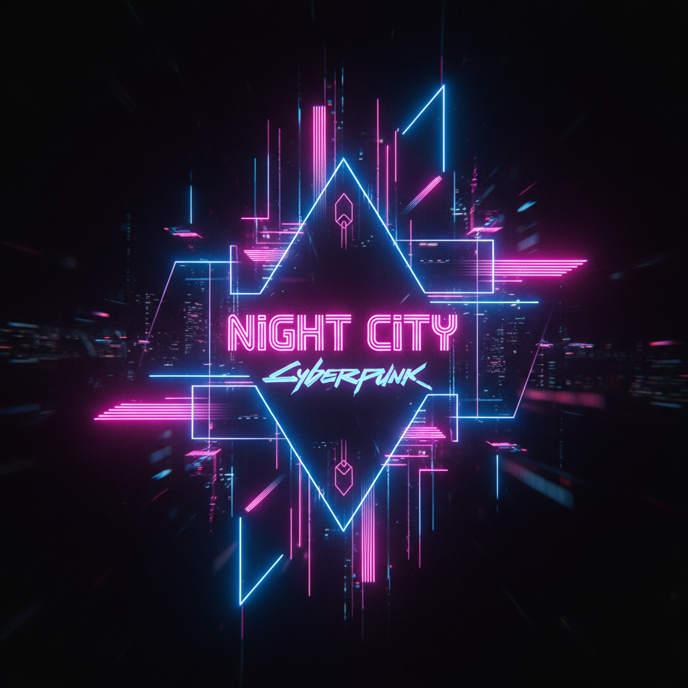

# Dark Neon 暗黑霓虹



> **"纯黑背景上的霓虹线条——夜晚城市的电子脉搏。"**

## 概述

| 维度 | 描述 |
|------|------|
| 时期 | 2016–至今 |
| 别名 | Dark Neon, Neon Noir, Electric Dark, Neon Glow |
| 核心色彩 | 纯黑、霓虹粉、电光蓝、霓虹紫、荧光绿 |
| 关键元素 | 霓虹灯管、发光线条、暗色背景、光晕效果 |
| 代表人物 | Blade Runner 2049、John Wick、Tron Legacy |
| 关联风格 | Cyberpunk, Synthwave, Vaporwave, Nu-Rave |

---

## 历史脉络

### 霓虹的文化史

| 时代 | 霓虹表现 |
|------|---------|
| 1920s | 霓虹灯发明，商业招牌 |
| 1950s–60s | Las Vegas、汽车旅馆霓虹 |
| 1980s | 霓虹+黑色 = 夜店文化 |
| 2010 | Tron: Legacy 重新定义霓虹美学 |
| 2017 | Blade Runner 2049 的霓虹城市 |
| 2016–至今 | Dark Neon 成为数字设计趋势 |

### 文化基因

| 来源 | 贡献 |
|------|------|
| 赛博朋克电影 | 霓虹雨夜的视觉原型 |
| 夜店文化 | 黑光+霓虹的体验 |
| 电子音乐 | 视觉化的节拍和频率 |
| LED 技术 | 让霓虹效果数字化 |
| 暗色模式 | 深色界面的流行 |

### 核心吸引力

Dark Neon 的魅力在于**"黑暗中的光"**：
- 纯黑 = 无限深度
- 霓虹 = 能量、生命力
- 对比 = 戏剧性、冲击力
- 夜晚 = 自由、神秘、可能性

---

## 视觉语法

### 色彩系统

```
主色：
  纯黑 (#000000 或 #0D0D0D) — 背景
  霓虹粉 (#FF1493) — 主要发光色
  电光蓝 (#00BFFF) — 次要发光色
  霓虹紫 (#BF00FF) — 氛围色
  荧光绿 (#39FF14) — 点缀色

规则：
  - 背景必须是深色/纯黑
  - 发光色必须是高饱和
  - 光晕效果（glow/blur）
  - 颜色数量控制在2-3种
  - 大面积黑色 + 小面积霓虹

效果：
  text-shadow: 0 0 10px #ff1493, 0 0 40px #ff1493;
  box-shadow: 0 0 20px rgba(255,20,147,0.5);
```

### 标志性元素

| 类别 | 元素 |
|------|------|
| 线条 | 霓虹灯管形状、发光边框 |
| 文字 | 霓虹字体、发光效果 |
| 图形 | 几何线条、网格、圆环 |
| 场景 | 夜晚城市、暗室、夜店 |
| 动效 | 闪烁、脉冲、呼吸灯 |
| 材质 | 玻璃反射、湿润表面 |

---

## 与千禧怀旧的关系

### 2010s 的暗色模式浪潮
- 2019 年 iOS/Android 推出暗色模式
- Dark Neon 是暗色模式的"华丽版"
- 它代表了 2010s 后期的数字美学

### 与 Synthwave 的交叉
- Synthwave = 80s 怀旧 + 霓虹
- Dark Neon = 当代 + 霓虹
- 两者共享霓虹色彩，但时代感不同

---

## 中国语境

- "霓虹风"/"赛博霓虹"设计
- 夜店/酒吧的视觉设计
- 电竞/游戏品牌的常用风格
- 抖音/B站的"霓虹字幕"特效
- 城市夜景摄影的后期风格

---

## 设计应用

| 场景 | 应用方式 |
|------|----------|
| 品牌 | 深色底+霓虹logo+发光效果 |
| UI | 暗色模式+霓虹高亮+发光边框 |
| 海报 | 纯黑+霓虹文字+光晕 |
| 空间 | LED灯带+暗色墙面+镜面反射 |

---

## 相关风格

← [Cyberpunk 赛博朋克](cyberpunk.md) | [Synthwave 合成波](synthwave.md) →

↑ [返回千禧怀旧目录](README.md) | [返回总目录](../README.md)
