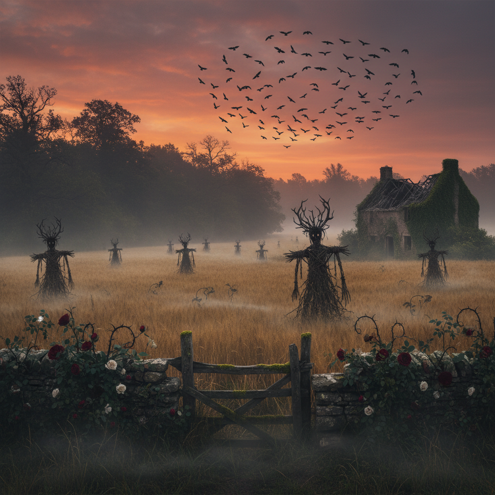

# Dark Pastoral Art 暗黑田园艺术

> "Dark Pastoral takes the idyllic countryside and reveals what always lurked beneath — the rot in the hedgerow, the bones under the barley field, the ancient violence that fertilized the soil, the folk horror that lives in the space between the picturesque and the uncanny, where every golden sunset also illuminates something watching from the tree line, where the beauty of the landscape is inseparable from its capacity for terror, and where pastoral nostalgia is revealed as a thin veneer over deep ecological and historical trauma." — Unknown

## 概述

暗黑田园（Dark Pastoral）是一种将传统田园美学与不安、恐怖和哥特元素结合的艺术和文学流派。它颠覆了田园诗（Pastoral）的理想化传统——将乡村描绘为纯净、和平、远离城市腐败的伊甸园——而是揭示乡村景观中潜藏的暴力、衰败、异教遗存和生态创伤。

暗黑田园的视觉语言包括：阴郁的乡村风景、废弃的农舍、雾中的树林、枯萎的花园、古老的仪式场所、以及将美丽与不安并置的构图。这种美学与"民间恐怖"（Folk Horror）电影传统密切相关——如《柳条人》（The Wicker Man, 1973）、《仲夏夜惊魂》（Midsommar, 2019）——也与英国的"怪异乡村"（Weird Rural）文学传统相连。在视觉艺术中，暗黑田园影响了摄影、插画、专辑封面设计和当代绘画。

## 核心特征

| 特征 | 描述 |
|------|------|
| 颠覆 | 颠覆田园理想 |
| 不安 | 美丽中的不安 |
| 民间 | 民间传说和仪式 |
| 衰败 | 乡村的衰败 |
| 哥特 | 乡村哥特元素 |
| 生态 | 生态创伤的揭示 |

## 视觉特征

- **雾气**：雾中的乡村景观
- **黄昏**：暮色和黎明的光线
- **废墟**：废弃的农业建筑
- **植物**：过度生长的植被
- **仪式**：暗示古老仪式的元素
- **动物**：乌鸦、兔子、鹿等象征性动物

## 代表作品

| 作品 | 艺术家 | 年代 | 意义 |
|------|--------|------|------|
| *The Wicker Man* poster art | Various | 1973 | 民间恐怖的视觉 |
| *Midsommar* production design | Henrik Svensson | 2019 | 当代民间恐怖美学 |
| *English Pastoral* | James Rebanks | 2020 | 暗黑田园文学 |
| *Folk horror photography* | Various | 2010年代 | 民间恐怖摄影 |
| *Dark pastoral album art* | Various | 2010年代 | 音乐中的暗黑田园 |

## 历史时间线

| 时期 | 事件 |
|------|------|
| 18世纪 | 哥特小说中的乡村恐怖 |
| 1970年代 | 民间恐怖电影的兴起 |
| 2010年代 | 暗黑田园美学的命名 |
| 2019 | 《仲夏夜惊魂》的文化影响 |
| 当代 | 气候焦虑下的暗黑田园 |

## 中国语境

暗黑田园在中国有独特的文化对应。中国文学中有丰富的"乡村恐怖"传统——从《聊斋志异》中的乡村鬼怪故事，到鲁迅笔下令人窒息的乡村社会，到莫言小说中暴力与美并存的高密东北乡。中国当代艺术中也有对乡村的"去理想化"表达——揭示农村的空心化、环境污染、传统消逝。中国的"乡愁"叙事往往带有暗黑田园的色彩——对故乡的怀念中混杂着对其衰败的哀伤和对其封闭性的恐惧。在视觉上，中国的一些摄影师和电影导演（如毕赣的《路边野餐》）创造了具有暗黑田园气质的乡村影像。

## AI生成概念图

## 与其他风格的关系

- **Folk Horror** → 民间恐怖
- **Gothic Art** → 哥特艺术
- **Pastoral Art** → 田园艺术
- **Romanticism** → 浪漫主义
- **Southern Gothic** → 南方哥特
- **Eco-Art** → 生态艺术

---

*浮光艺志 | Chronicle of Artistry*
