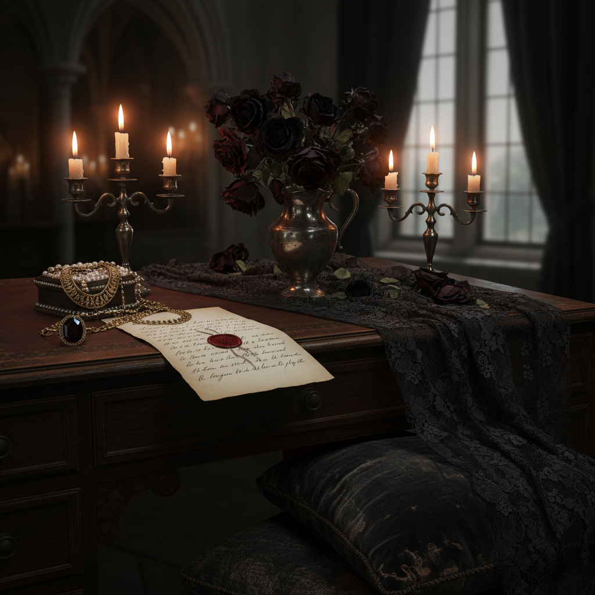

# Dark Romance 暗黑浪漫



> **"黑色蕾丝、枯萎玫瑰、烛光下的情书——爱情最美的时刻是它即将消逝的瞬间。"**

## 概述

| 维度 | 描述 |
|------|------|
| 时期 | 2022–至今 |
| 别名 | Dark Romance, Dark Romantic, Gothic Romance |
| 核心色彩 | 黑色、深红、深紫、金色、暗粉 |
| 关键元素 | 黑色蕾丝、枯萎花卉、烛光、丝绒、暗色珠宝 |
| 代表人物 | Alexander McQueen, Ann Demeulemeester |
| 关联风格 | Gothic, Dark Luxe, Lovecore, Coquette Dark |

---

## 历史脉络

| 年份 | 事件 |
|------|------|
| 1764 | 哥特小说诞生（《奥特兰托城堡》） |
| 1800s | 浪漫主义文学——爱与死的交织 |
| 1990s | Alexander McQueen——暗黑浪漫时装 |
| 2022 | Dark Romance 在 TikTok/Pinterest 兴起 |
| 2023 | 与 BookTok "dark romance" 小说热交叉 |
| 2024 | 成为独立美学分支，持续流行 |

### 核心哲学

Dark Romance 的精神是**"爱情不只有甜蜜——痛苦、渴望、失去也是浪漫的一部分"**：
- 浪漫 ≠ 甜蜜（可以是苦涩的、危险的）
- 美 = 短暂（"枯萎的玫瑰比盛开的更美"）
- 黑暗 = 深度（"浅薄的爱不值得"）
- 痛苦 = 证明（"如果不痛，就不是真的"）
- 文学性 = 核心（每个场景都像小说）

---

## 视觉语法

### 色彩系统

```
主色：
  黑色 (#0A0A0A) — 夜晚、神秘
  深红 (#4A0000) — 血液、玫瑰
  深紫 (#1A0033) — 渴望、皇室
  金色 (#8B6914) — 烛光、古老
  暗粉 (#8B4557) — 枯萎的花

辅色：
  银色 (#808080) — 月光、刀刃
  象牙 (#FFFFF0) — 皮肤、信纸
  深蓝 (#0A1628) — 午夜

质感：
  蕾丝 — 黑色、精致
  丝绒 — 深色、触感
  丝绸 — 流动、光泽
  纸张 — 泛黄、手写
  花瓣 — 枯萎、干燥
```

### 标志性元素

| 类别 | 元素 |
|------|------|
| 花卉 | 枯萎玫瑰、黑色大丽花、干花 |
| 物件 | 蜡烛、情书、古董珠宝、匕首 |
| 服装 | 黑色蕾丝、丝绒长裙、紧身胸衣 |
| 场景 | 烛光晚餐、废弃教堂、月光花园 |
| 文学 | 手写信、旧书、诗集、日记 |
| 态度 | 渴望、神秘、危险、深情 |

---

## 与千禧怀旧的关系

### BookTok 的 "Dark Romance" 热潮
- BookTok = TikTok 读书社区
- "Dark Romance" 小说类型爆发
- 从文学到视觉美学的转化
- "我想活在一本 dark romance 小说里"

### 与 Gothic 的区别
- Gothic = 更广泛（建筑、音乐、亚文化）
- Dark Romance = 专注"爱情的暗面"
- Gothic 可以没有浪漫
- Dark Romance 必须有浪漫（只是暗色的）

---

## 中国语境

- 与中国"暗黑系"/"病娇"文化的交叉
- 中国古风中的"虐恋"美学
- 与中国网文"黑化"角色的关系
- 小红书上的 Dark Romance 穿搭

---

## 设计应用

| 场景 | 应用方式 |
|------|----------|
| 品牌 | 黑色+深红+蕾丝+烛光+文学感 |
| 空间 | 深色+丝绒+蜡烛+干花+古董 |
| 时尚 | 黑色蕾丝+丝绒+暗色珠宝+层叠 |
| 出版 | 暗色封面+手写字体+花卉+神秘 |

---

## 相关风格

← [Gothic 哥特美学](gothic.md) | [Lovecore 爱心核](lovecore.md) →

↑ [返回千禧怀旧目录](README.md) | [返回总目录](../README.md)
