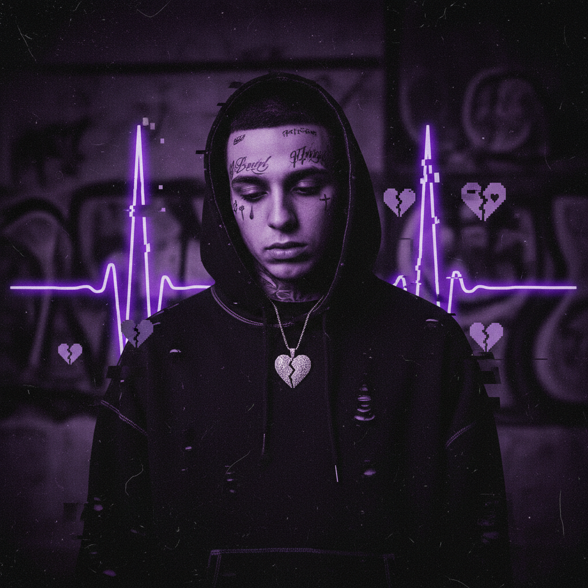

# Dark Trap 暗黑陷阱



> **"808低音、暗黑旋律、SoundCloud说唱——互联网时代最阴暗的Hip-Hop变体。"**

## 概述

| 维度 | 描述 |
|------|------|
| 时期 | 2014–至今 |
| 别名 | Dark Trap, SoundCloud Rap, Emo Rap, Cloud Rap |
| 核心色彩 | 黑色、暗紫、血红、灰色 |
| 关键元素 | 808 Bass、暗黑旋律、Auto-tune、SoundCloud |
| 代表人物 | XXXTentacion, Lil Peep, Juice WRLD, Suicideboys |
| 关联风格 | Trap, Emo, Punk, Cloud Rap, Phonk |

---

## 历史脉络

| 年份 | 事件 |
|------|------|
| 2014 | SoundCloud Rap 场景形成 |
| 2015 | Bones, Xavier Wulf——地下 Dark Trap |
| 2016 | Lil Peep "Hellboy"——Emo+Trap 融合 |
| 2017 | XXXTentacion "17"——主流突破 |
| 2018 | Juice WRLD "Lucid Dreams"——全球 #1 |
| 2020s | 继续演化——融入主流 Hip-Hop |

### 核心哲学

Dark Trap 的精神是**"痛苦是真实的——用808和Auto-tune把它变成音乐"**：
- 痛苦 = 真实（"我们不假装快乐"）
- 情感 = 核心（"Trap 也可以让你哭"）
- SoundCloud = 民主（"不需要厂牌——直接上传"）
- 混合 = 创新（"Emo+Trap+Punk = 新的声音"）
- "Dark Trap 是这一代人的 Nirvana"

---

## 视觉语法

### 色彩系统

```
主色：
  黑色 (#000000) — 黑暗、痛苦
  暗紫 (#2D0033) — 忧郁
  血红 (#8B0000) — 痛苦、愤怒

辅色：
  灰色 (#444444) — 阴郁
  白色 (#FFFFFF) — 对比
  霓虹 — 偶尔点缀

规则：
  - 暗色调为主
  - 高对比
  - 面部纹身美学
  - Lo-fi/颗粒感

质感：
  颗粒 — Lo-fi照片
  烟雾 — 模糊
  墨水 — 纹身
  破碎 — 故障
```

### 标志性元素

| 类别 | 元素 |
|------|------|
| 视觉 | 面部纹身、暗色、Lo-fi照片、故障 |
| 音乐 | 808 Bass、暗黑旋律、Auto-tune、Emo歌词 |
| 时尚 | 染发、面部纹身、宽松服装、链条 |
| 平台 | SoundCloud、YouTube、Instagram |
| 文化 | 心理健康话题、反主流、DIY |
| 态度 | 痛苦、真实、情感、反叛、脆弱 |

---

## 与千禧怀旧的关系

### SoundCloud 时代的声音
- Dark Trap = 2015-2020 互联网音乐的核心
- SoundCloud = 这一代人的 MySpace
- "SoundCloud Rap 是互联网原生的音乐运动"
- 面部纹身 = 2010s 最具标志性的视觉

### Emo 的回归
- Dark Trap = Emo + Trap 的融合
- Lil Peep = "Emo 的 Kurt Cobain"
- "2000s 的 Emo 在 2010s 变成了 Dark Trap"
- 心理健康话题的去污名化

---

## 中国语境

- Dark Trap 在中国说唱中的影响
- 中国 SoundCloud/网易云说唱社区
- 与中国"丧文化"的交叉
- 中国 Emo Rap 制作人

---

## 设计应用

| 场景 | 应用方式 |
|------|----------|
| 音乐 | 暗色+Lo-fi+面部纹身+故障 |
| 品牌 | 真实+情感+反叛+年轻+地下 |
| 时尚 | 染发+纹身+宽松+链条+暗色 |
| 数字 | 暗色+故障+颗粒+Lo-fi+情感 |

---

## 相关风格

← [Phonk 放克浪潮](phonk.md) | [Emo 情绪硬核](emo.md) →

↑ [返回千禧怀旧目录](README.md) | [返回总目录](../README.md)
