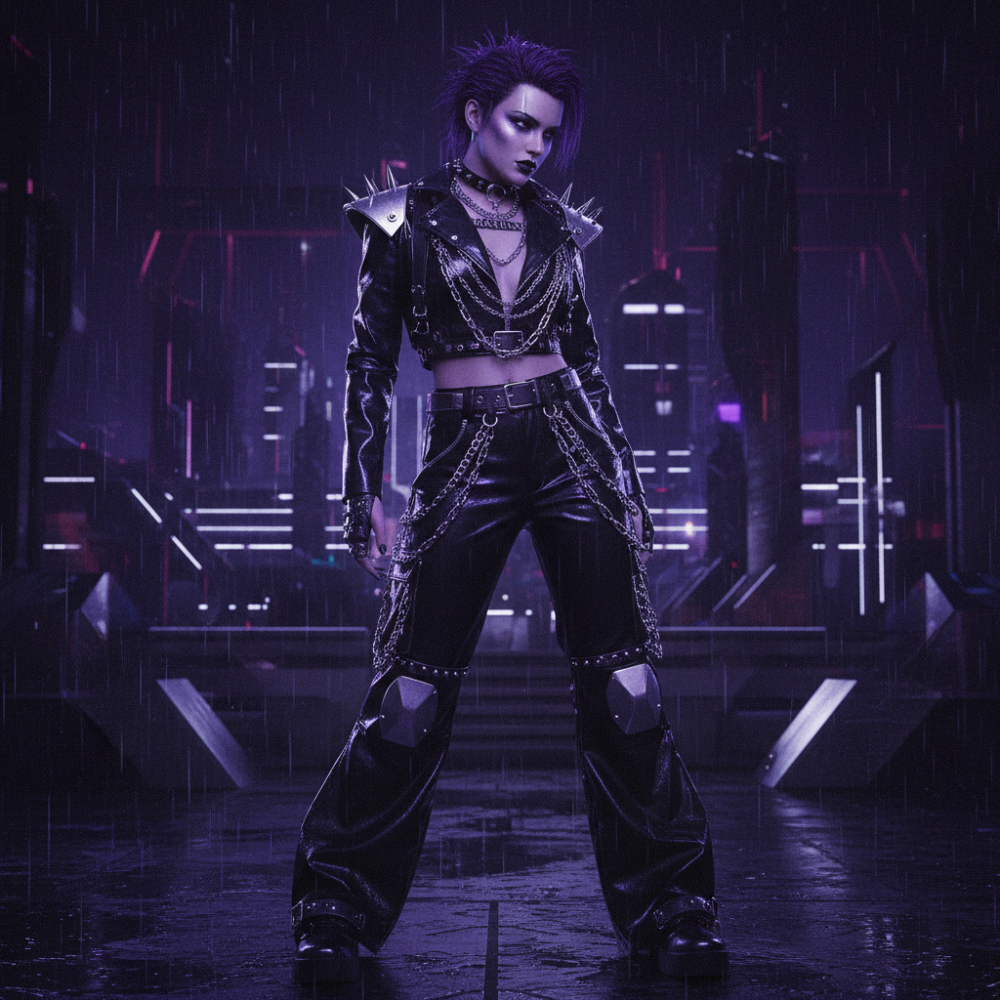
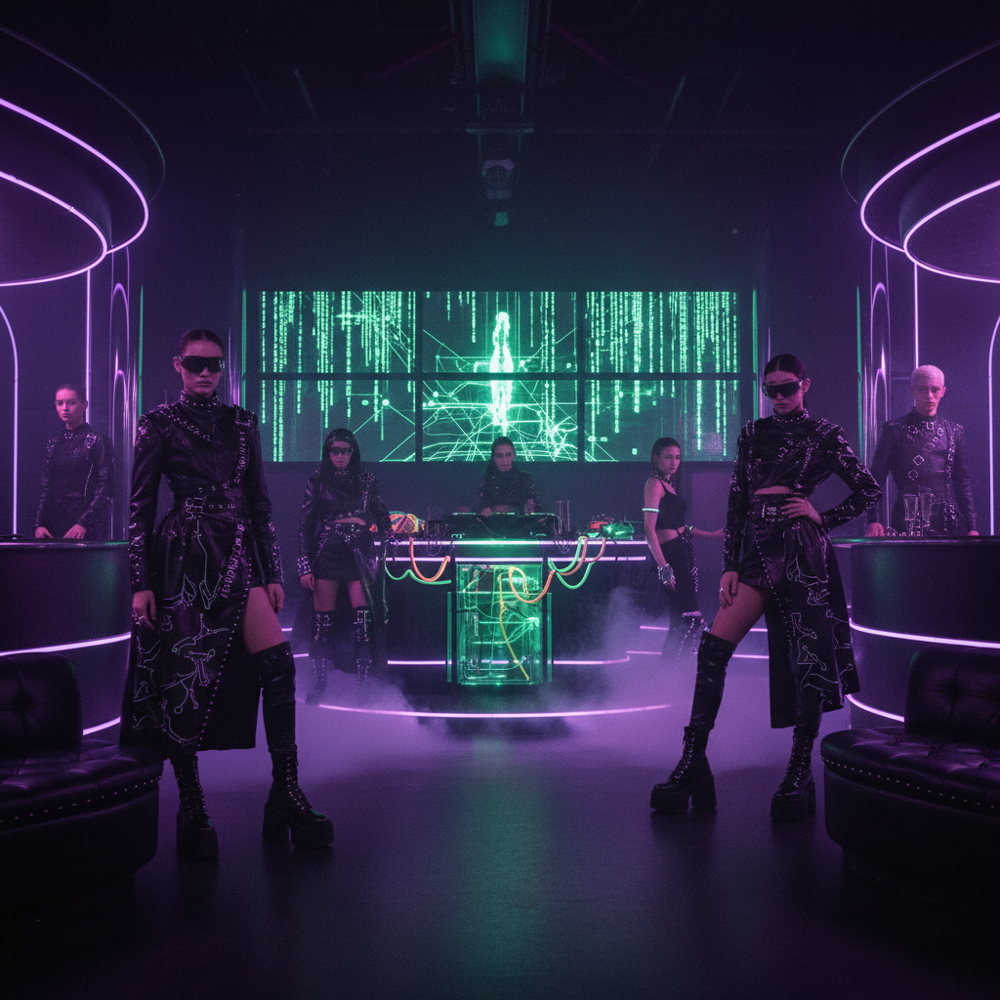

# Dark Y2K 暗黑千禧





> **"Y2K 的阴影面——当千禧乐观主义遇见世纪末恐惧。"**

## 概述

| 维度 | 描述 |
|------|------|
| 时期 | 1999–2004 原型 / 2021–至今 回潮 |
| 别名 | Y2K Goth, Cyber Goth Y2K, McBling Dark Side |
| 核心色彩 | 黑色、深紫、暗红、银色金属 |
| 关键元素 | 黑色PVC、银色链条、暗色唇妆、蝙蝠翼、骷髅 |
| 代表人物 | The Craft (1996), Aaliyah, early Evanescence |
| 关联风格 | Mall Goth, Cyber Y2K, 90s Cool, Emo |

---

## 历史脉络

### 世纪末的双面性

Y2K 时代并非只有乐观主义。千禧虫恐慌、《黑客帝国》的反乌托邦叙事、哥伦拜恩事件后的青年焦虑，都在塑造一种更暗沉的千禧美学。Dark Y2K 就是这枚硬币的另一面：它保留了 Y2K 的未来感和技术质感，但将色调从明亮转向阴暗。

### 视觉来源

- **电影**：《The Craft》(1996)、《Blade》(1998)、《Underworld》(2003)
- **音乐**：Evanescence、Marilyn Manson、Aaliyah 后期造型
- **游戏**：《暗黑破坏神》、《恶魔城》系列的哥特界面
- **时尚**：Alexander McQueen 1999 春夏"No.13"系列

### 2020s 回潮

TikTok 上的 Dark Y2K 回潮将这种美学重新带入主流视野。与原版不同的是，当代 Dark Y2K 更加自觉地混合了哥特元素和千禧时尚——比如黑色低腰裤配银色蝴蝶腰链，或者暗色唇妆配亮片眼影。

---

## 视觉语法

### 色彩系统

```
主色：纯黑 (#000000)、深紫 (#2D0A31)、暗红 (#8B0000)
金属色：银色、铬色、枪灰色
点缀：血红 (#DC143C)、毒绿 (#39FF14)、电蓝 (#0000FF)
质感：哑光黑 + 高光金属的对比
```

### 与标准 Y2K 的对比

| 维度 | Y2K Futurism | Dark Y2K |
|------|-------------|----------|
| 情绪 | 乐观、未来 | 神秘、危险 |
| 色调 | 明亮、彩虹 | 暗沉、单色 |
| 材质 | 透明塑料、糖果色 | 黑色PVC、银色金属 |
| 图腾 | 蝴蝶、星星、花朵 | 蝙蝠、骷髅、蛇 |
| 技术感 | 友好的、圆润的 | 冰冷的、锋利的 |

### 标志性元素

- **服装**：黑色PVC长裤、网眼上衣、银色拉链装饰
- **配饰**：粗链条项链、尖刺手环、暗色水晶
- **妆容**：深色唇线、烟熏眼、银色高光
- **发型**：黑色直发、挑染银色/紫色条纹

---

## 文化语境

Dark Y2K 反映了千禧年交替时期的集体焦虑：

1. **千禧虫恐慌**：技术可能毁灭文明的恐惧
2. **后冷战身份危机**：没有明确敌人的时代，恐惧变得弥散
3. **青年亚文化的暗面**：不是所有人都在跳 Bubblegum Dance
4. **哥特文化的商业化**：Hot Topic 将哥特美学带入购物中心

---

## 中国语境

在中国，Dark Y2K 的对应物可以在以下地方找到：
- 2000年代初的网吧文化：暗色调的游戏界面、《暗黑破坏神》的视觉影响
- QQ 空间的"非主流"暗黑系皮肤
- 周杰伦《以父之名》MV 中的哥特视觉
- 当代的"暗黑系"穿搭博主

---

## 设计应用

| 场景 | 应用方式 |
|------|----------|
| 海报设计 | 黑色背景 + 银色金属字体 + 暗红点缀 |
| UI设计 | 深色模式 + 铬色图标 + 锋利边角 |
| 品牌 | 哥特字体 + 极简银色logo + 黑色包装 |
| 摄影 | 低调光线 + 金属反光 + 烟雾效果 |

---

## 延伸阅读

- Aesthetics Wiki: [Dark Y2K](https://aesthetics.fandom.com/wiki/Dark_Y2K)
- 电影《The Craft》(1996) 美术分析
- Alexander McQueen "No.13" 系列回顾

---

## 相关风格

← [Mall Goth 商场哥特](mall-goth.md) | [90s Cool](90s-cool.md) →

↑ [返回千禧怀旧目录](README.md) | [返回总目录](../README.md)
