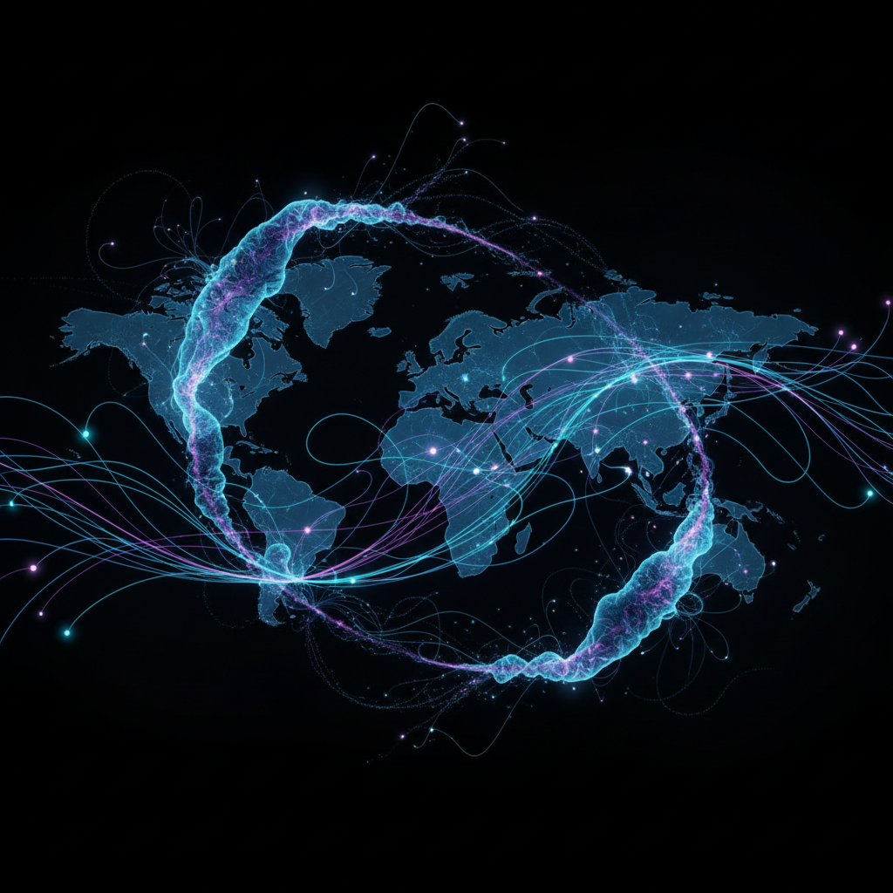

# Data Art 数据艺术

> "Data is the new oil, but it's also the new paint." — Jer Thorp

## 概述

数据艺术（Data Art / Data-Driven Art / Algorithmic Art）是利用数据集作为创作原材料的艺术实践。艺术家将抽象的数字、统计、传感器读数、社交媒体流、基因序列等数据转化为视觉、声音或物理形态，揭示数据背后隐藏的模式、关系和美学。

数据艺术不同于数据可视化（信息设计）——后者追求清晰传达信息，前者追求审美体验和情感共鸣，允许模糊、诗意和主观解读。

## 核心特征

| 特征 | 描述 |
|------|------|
| 数据驱动 | 真实数据集是创作的核心原材料 |
| 算法转化 | 通过编程将数据映射为视觉/声音形态 |
| 涌现美学 | 美来自数据本身的模式而非预设构图 |
| 实时性 | 许多作品随数据流实时变化 |
| 跨学科 | 融合艺术、科学、编程、统计 |
| 规模感 | 处理人类无法直接感知的大规模数据 |

## 视觉特征

- **形态**：网络图、粒子系统、流场、生长结构
- **色彩**：数据映射的渐变色谱、信息编码色彩
- **动态**：实时变化、生长、流动
- **精度**：像素级精确的计算生成
- **密度**：大量数据点的聚合和涌现
- **维度**：将高维数据降维为可感知的2D/3D形态

## 代表作品

| 作品 | 艺术家 | 年代 | 意义 |
|------|--------|------|------|
| *Flight Patterns* | Aaron Koblin | 2005 | 美国航班轨迹的可视化——数据之美 |
| *Wind Map* | Fernanda Viégas & Martin Wattenberg | 2012 | 实时风场的诗意可视化 |
| *Dear Data* | Giorgia Lupi & Stefanie Posavec | 2014-15 | 手绘数据——个人数据的人文化 |
| *Unnumbered Sparks* | Janet Echelman & Aaron Koblin | 2014 | 众包数据驱动的巨型网状雕塑 |
| *Listening Post* | Mark Hansen & Ben Rubin | 2001 | 实时网络聊天的声音装置 |
| *The Refugee Project* | Hyperakt & Ekene Ijeoma | 2014 | 难民数据的情感化呈现 |

## 历史时间线

| 时期 | 事件 |
|------|------|
| 1960s | 早期计算机艺术——算法生成图形 |
| 1970s | Vera Molnár等——程序化绘画 |
| 1990s | 互联网数据流成为创作素材 |
| 2001 | *Listening Post*——里程碑式数据装置 |
| 2005 | Processing语言普及——降低编程门槛 |
| 2010s | 大数据时代——数据艺术爆发 |
| 2012 | *Wind Map*——数据可视化的诗意化 |
| 2015+ | AI/机器学习成为新的数据艺术工具 |
| 2020s | 生成式AI——数据艺术的新范式 |

## 子类型

| 子类型 | 特征 |
|--------|------|
| 数据可视化艺术 | 将数据集转化为美学形态 |
| 生成艺术 | 算法规则生成的视觉作品 |
| 实时数据艺术 | 随传感器/网络数据实时变化 |
| 物理化数据 | 将数据转化为3D打印/物理雕塑 |
| 声音数据艺术 | 数据的声音化（sonification） |
| 个人数据艺术 | 自我追踪数据的艺术化 |

## 中国语境

中国的数据艺术在近年快速发展。中央美术学院、中国美术学院等设立了数据艺术相关方向。中国艺术家如曹斐的数字作品、邱志杰的地图系列、以及新媒体艺术节中的数据装置都体现了数据艺术的中国实践。中国庞大的互联网用户基数和数据规模为数据艺术提供了独特的素材——从外卖骑手轨迹到春运迁徙图，中国的数据景观本身就是一种壮观的视觉现象。

## 争议与遗产

- **争议**：数据可视化和数据艺术的边界在哪里？
- **隐私问题**：使用个人数据创作的伦理边界
- **可及性**：需要编程能力——是否排斥了传统艺术家？
- **遗产**：将数据从纯粹的工具变成了审美和反思的对象
- **当代回响**：AI艺术、生成艺术、创意编程、数据人文主义

## AI生成概念图

## 与其他风格的关系

- **Generative Art** → 生成艺术是数据艺术的近亲，共享算法基础
- **Net Art** → 网络艺术为数据艺术提供了互联网数据源
- **Conceptual Art** → 概念艺术的去物质化为数据艺术提供理论先驱
- **Kinetic Art** → 动态艺术的实时变化与数据艺术的实时性相通
- **Systems Art** → 系统艺术对复杂系统的关注是数据艺术的先驱
- **Bio Art** → 生物艺术使用基因数据，与数据艺术交叉

---

*浮光艺志 | Chronicle of Artistry*
