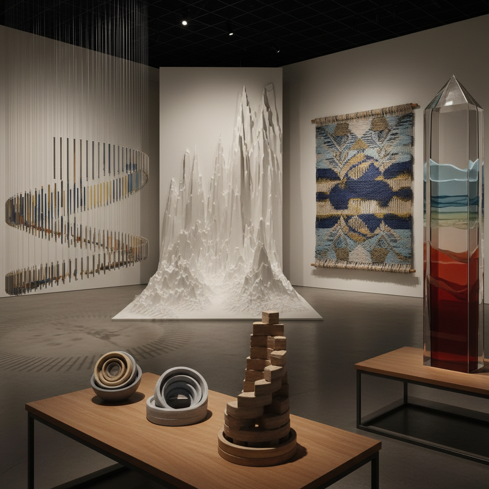

# Data Sculpture Art 数据雕塑艺术

> "Data sculpture gives physical form to the invisible — it takes the abstract numbers that increasingly define our world and renders them tangible, touchable, walkable, inhabitable. Where a chart flattens data into two dimensions, a data sculpture restores its full dimensionality, allowing us to experience information with our whole bodies rather than just our eyes, to feel the weight of statistics, to walk through the architecture of algorithms, to touch the texture of time series." — Unknown

## 概述

数据雕塑艺术（Data Sculpture Art）是将数据转化为三维物理形式的艺术实践。与数据可视化（在屏幕上用图表展示数据）不同，数据雕塑将数据"物质化"——用物理材料、空间和形式来表达数据的模式、关系和意义。

数据雕塑艺术的实践包括：1）数据的物理化——将数据集转化为可触摸的三维物体；2）数据建筑——用数据驱动建筑和空间的形式；3）数据织物——将数据编码到纺织品的图案和结构中；4）数据景观——创造由数据塑造的地形和景观；5）实时数据雕塑——随着数据的变化而实时改变形态的动态雕塑。

## 核心特征

| 特征 | 描述 |
|------|------|
| 物质 | 数据的物质化 |
| 三维 | 三维形式 |
| 触觉 | 可触摸 |
| 空间 | 空间体验 |
| 编码 | 数据编码 |
| 身体 | 身体感知 |

## 视觉特征

- **起伏**：数据驱动的起伏表面
- **密度**：密度变化的结构
- **层叠**：数据层的叠加
- **编织**：数据编织的纹理
- **地形**：数据地形
- **材料**：多种材料的组合

## 代表作品

| 作品 | 艺术家 | 年代 | 意义 |
|------|--------|------|------|
| *3D printed data* | Various | 2010年代 | 3D打印数据 |
| *Data-driven architecture* | Various | 2010年代 | 数据建筑 |
| *Knitted data* | Various | 2010年代 | 编织数据 |
| *Physical data installations* | Various | 2020年代 | 物理数据装置 |
| *Real-time data sculptures* | Various | 当代 | 实时数据雕塑 |

## 历史时间线

| 时期 | 事件 |
|------|------|
| 2000年代 | 数据物理化概念的提出 |
| 2010年代 | 3D打印使数据雕塑可行 |
| 2010年代 | 数据雕塑的学术化 |
| 2020年代 | 实时和动态数据雕塑 |
| 当代 | 与AR/VR的融合 |

## 中国语境

数据雕塑艺术在中国有独特的发展机遇。中国是世界上数据产生量最大的国家之一——海量的城市数据、社交数据、经济数据为数据雕塑提供了丰富的素材。中国的3D打印产业和数字制造能力也为数据雕塑的物理实现提供了技术支持。中国的一些当代艺术家在探索数据雕塑：将中国城市的交通数据转化为流动的雕塑形式、用空气质量数据塑造"呼吸"的装置、以及将中国社交媒体的情感数据编码到物理形式中。中国传统的"算盘"——一种将数字物质化的古老工具——可以被视为数据雕塑的文化先驱。

## AI生成概念图

## 与其他风格的关系

- **Data Art** → 数据艺术
- **Sculpture** → 雕塑
- **3D Printing Art** → 3D打印艺术
- **Information Art** → 信息艺术
- **Installation Art** → 装置艺术
- **Parametric Design** → 参数化设计

---

*浮光艺志 | Chronicle of Artistry*
