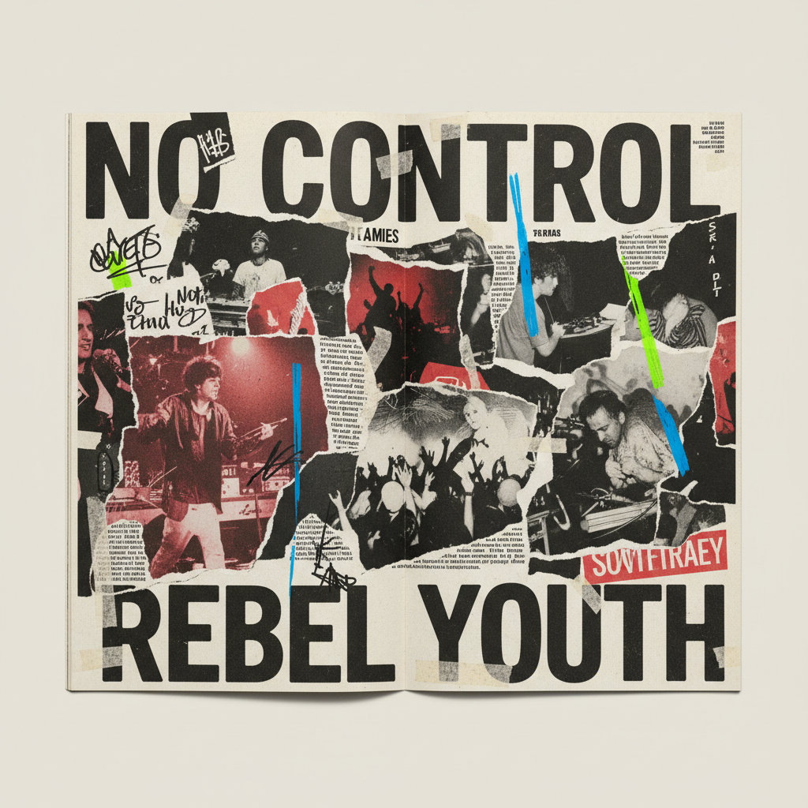

# David Carson 大卫·卡森

> **时期：** 1955–至今  
> **关键词：** 解构排版、垃圾美学、Ray Gun杂志、反网格

## 概述

David Carson 是美国平面设计师，1990年代《Ray Gun》杂志的艺术总监。他彻底打破了传统排版规则——文字重叠、倒置、模糊到无法阅读，图片被裁切、扭曲、层层叠加——将平面设计从信息传达工具变成了视觉摇滚乐。

## 风格特征

- **反可读性**：文字故意模糊、重叠、难以阅读
- **解构排版**：打破网格、基线和所有排版规则
- **层叠混乱**：多层图像和文字相互覆盖
- **手工质感**：撕纸、手写、复印机纹理
- **情绪优先**：传达感觉而非信息

## 代表作品

- *Ray Gun*杂志设计（1992–1995）
- *The End of Print*（1995）
- *Pepsi、Nike广告设计*
- *Grafik*杂志

## 概念图

