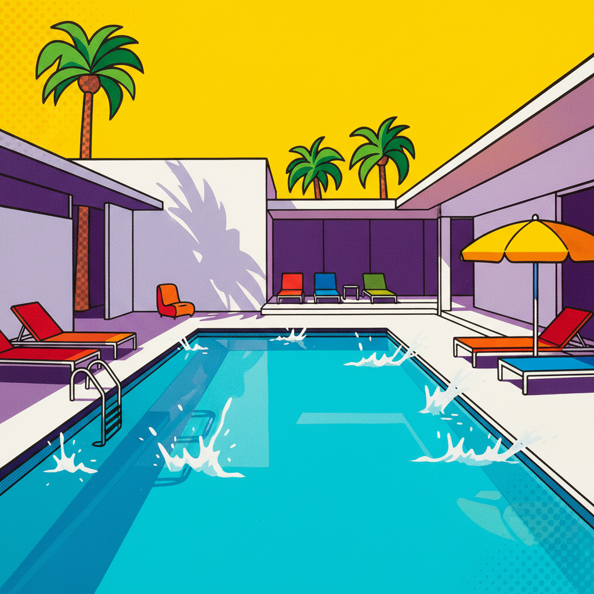

# David Hockney 大卫·霍克尼

> **流派**: 波普艺术 · 现代主义 · 当代艺术  
> **时期**: 1937–至今 英国/美国  
> **关键词**: 泳池蓝、加州阳光、iPad绘画、多视角拼贴

## 概述

大卫·霍克尼是在世最具影响力的英国艺术家之一。从1960年代的加州泳池系列到21世纪的iPad绘画，他始终在探索观看与再现的方式。他的作品以明亮的色彩、平面化的空间和对日常生活的诗意观察著称。

## 视觉特征

- **泳池蓝**: 标志性的加州泳池，水面波纹用白色曲线表现
- **平面化空间**: 压缩透视，强调色块和图案的装饰性
- **明亮色彩**: 阳光充沛的调色板，蓝、绿、粉占主导
- **多视角拼贴**: 用照片或画面碎片组合多角度观看体验
- **数字绘画**: 晚年大量使用iPad创作，保持笔触的鲜活感

## 代表作品

- 《更大的水花》(1967)
- 《艺术家肖像（泳池与两个人物）》(1972)
- 《我的父母》(1977)
- 《沃德盖特的树林》系列 (2006–2011)

## 历史影响

霍克尼重新定义了风景画和肖像画在当代的可能性，并率先拥抱数字工具进行严肃艺术创作。他对透视和观看方式的持续实验影响了摄影、设计和数字艺术领域。

## 相关风格

- [Pop Art 波普艺术](pop-art.md)
- [Edward Hopper 爱德华·霍珀](edward-hopper.md)
- [Henri Matisse 亨利·马蒂斯](matisse.md)
