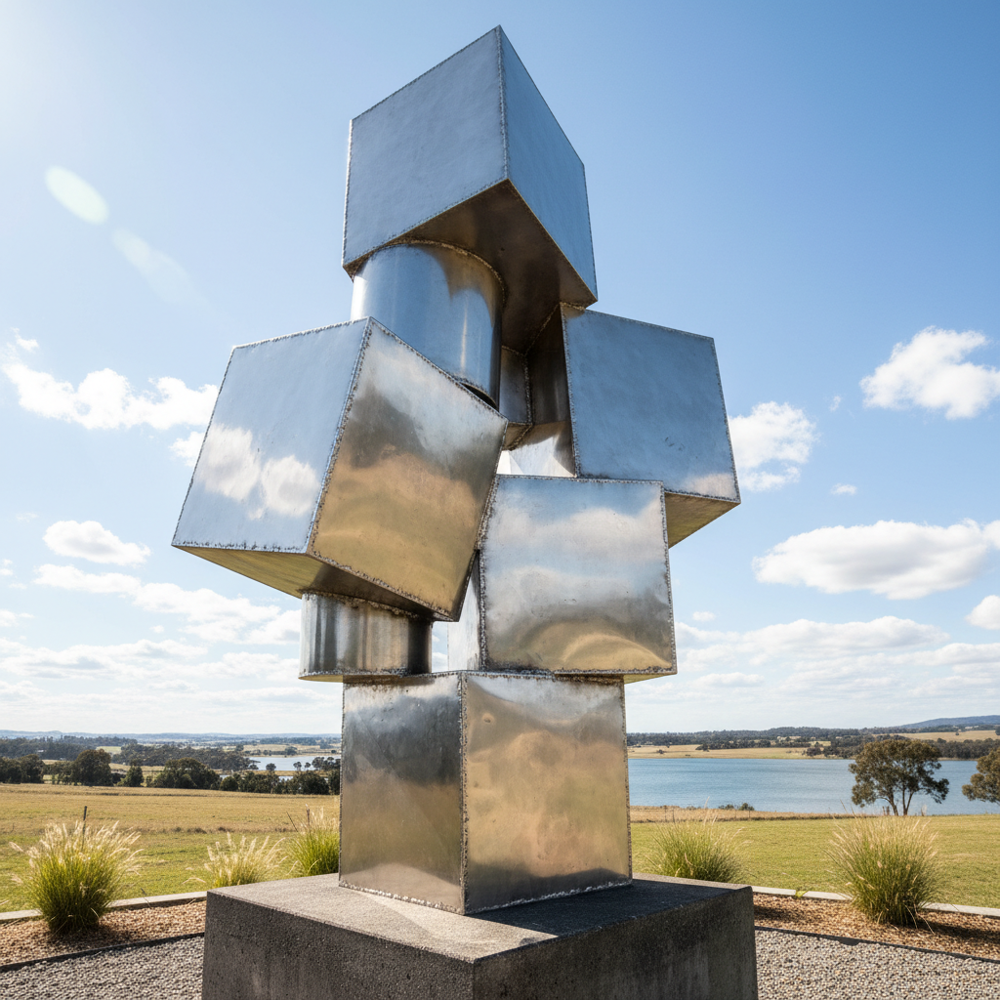

# David Smith 大卫·史密斯

> **时期：** 1906–1965  
> **关键词：** 焊接钢雕塑、立体主义雕塑、不锈钢几何、美国现代雕塑之父

## 概述

David Smith 被称为"美国现代雕塑之父"，是第一位将工业焊接技术系统性地应用于艺术雕塑的美国艺术家。他的职业生涯从立体主义影响的线性钢铁构成，演变为晚期标志性的"Cubi"系列——抛光不锈钢几何体的堆叠组合，在阳光下闪烁如同凝固的光。

## 风格特征

- **焊接技术**：将工厂焊接工人的技能转化为艺术创作方法
- **线性构成**：早期作品如同空间中的三维绘画，线条在空中展开
- **不锈钢光泽**：晚期Cubi系列的抛光表面反射天空和环境
- **几何堆叠**：立方体、圆柱体和平面的动态平衡组合
- **户外尺度**：作品设计为在户外自然光线中观看

## 代表作品

- *Cubi*系列（1961–1965）
- *Hudson River Landscape*（1951）
- *Voltri-Bolton*系列（1962）
- *Zig*系列（1961–1964）

## 历史意义

Smith 将雕塑从铸造和雕刻的传统解放为焊接和组装的现代方法，他的工作方式——在户外工厂般的工作室中用起重机操作大型钢铁——定义了战后美国雕塑的工作模式。他是Caro、Serra等后来雕塑家的直接先驱。

## 概念图

