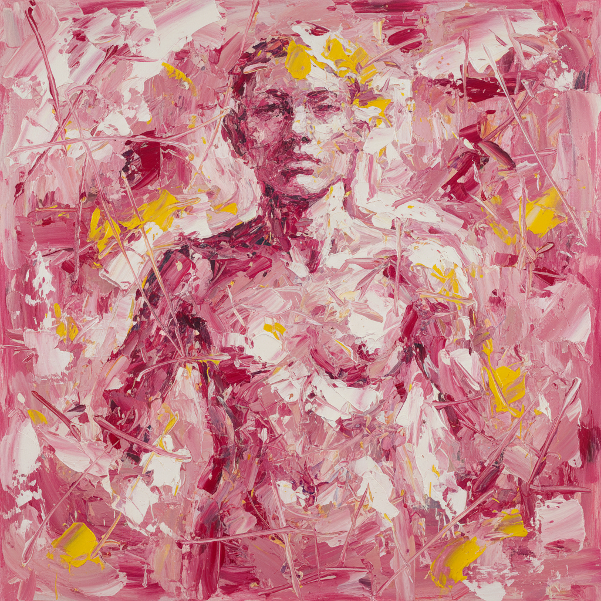

# Willem de Kooning 德·库宁

> "I have to change to stay the same." — Willem de Kooning

## 概述

威廉·德·库宁（Willem de Kooning，1904–1997）是荷兰裔美国画家，抽象表现主义的核心人物之一。与波洛克的纯粹抽象不同，德·库宁始终在抽象与具象之间游走，以其狂暴的笔触和对女性人体的激烈重新诠释闻名。

## 核心特征

| 特征 | 描述 |
|------|------|
| 暴力笔触 | 宽大的、攻击性的刷痕 |
| 具象与抽象交织 | 人体在抽象中若隐若现 |
| 肉粉色调 | 标志性的肉色与粉色 |
| 不断修改 | 反复刮除、覆盖、重画 |
| 城市能量 | 纽约的速度与混乱 |
| 女性系列 | 对女性形象的激烈解构 |

## 代表作品

| 作品 | 年代 | 意义 |
|------|------|------|
| *Woman I* | 1950–52 | 具象回归的争议之作 |
| *Excavation* | 1950 | 抽象表现主义的巅峰 |
| *Interchange* | 1955 | 拍卖史上最贵画作之一 |
| *Door to the River* | 1960 | 风景抽象的转折 |

## AI生成概念图

## 与其他风格的关系

- **Abstract Expressionism** → 核心成员，行动绘画
- **Pollock** → 同代人，不同路径的抽象
- **Picasso** → 受立体主义影响
- **Lucian Freud** → 共享对肉体的执着
