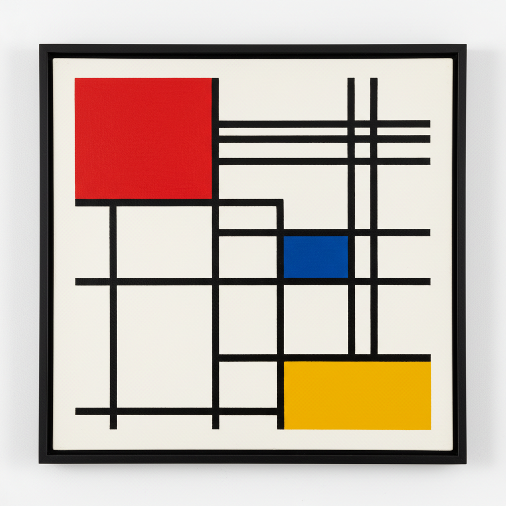

# De Stijl Painting 风格派绘画

> **时期：** 1917年–1931年  
> **关键词：** 蒙德里安、纯粹抽象、直线与原色、荷兰、宇宙和谐

## 概述

De Stijl（风格派，荷兰语"风格"）是1917年在荷兰由蒙德里安和凡·杜斯堡创立的艺术运动——他们追求绝对的纯粹：只用水平线和垂直线，只用红黄蓝三原色加黑白灰。蒙德里安的网格画布不是装饰，而是对宇宙和谐秩序的视觉证明——当一切多余都被剥离，剩下的就是真理本身。

## 风格特征

- **直线唯一**：只有水平和垂直，拒绝曲线
- **三原色**：红、黄、蓝加黑、白、灰
- **不对称平衡**：动态的视觉均衡
- **平面性**：完全消除深度幻觉
- **普遍性**：超越个人表达的客观美

## 代表人物与作品

- 皮特·蒙德里安《红黄蓝的构成》
- 特奥·凡·杜斯堡 反构成
- 巴特·凡·德·莱克 几何色块
- 赫里特·里特费尔德 红蓝椅

## 概念图

