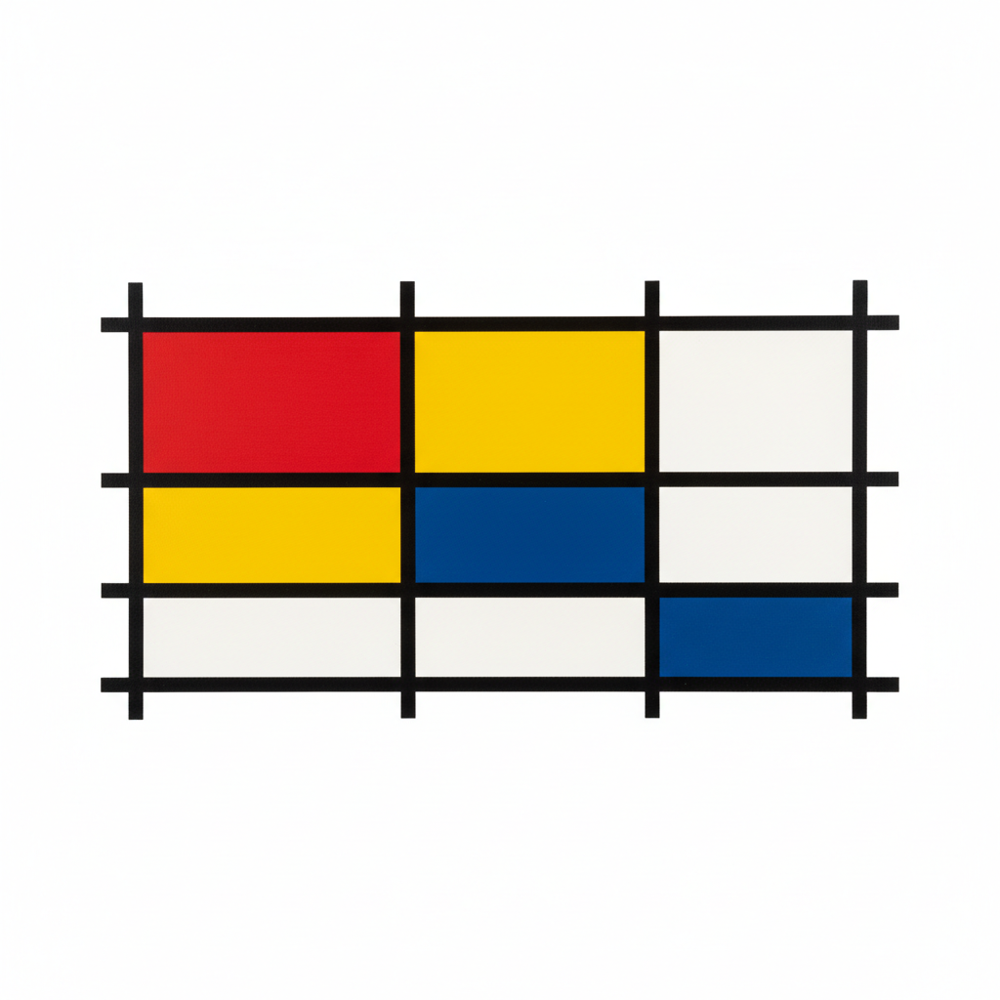

# De Stijl 风格派



> **"红黄蓝+黑色网格——Mondrian 相信这就是宇宙的本质。"**

## 概述

| 维度 | 描述 |
|------|------|
| 时期 | 1917–1931 原版 / 影响至今 |
| 别名 | De Stijl, Neoplasticism, The Style |
| 核心色彩 | 红、黄、蓝 + 黑、白、灰 |
| 关键元素 | 直角网格、三原色色块、黑色线条 |
| 代表人物 | Piet Mondrian、Theo van Doesburg、Gerrit Rietveld |
| 关联风格 | Bauhaus, Constructivism, Minimalism, Swiss Design |

---

## 历史脉络

### 从荷兰到全球设计语言

| 年份 | 事件 |
|------|------|
| 1917 | Theo van Doesburg 创办《De Stijl》杂志 |
| 1917 | Mondrian 发展"新造型主义"理论 |
| 1918 | De Stijl 宣言发表 |
| 1924 | Rietveld Schröder House——De Stijl 建筑 |
| 1925 | Rietveld Red and Blue Chair |
| 1931 | Van Doesburg 去世——运动结束 |
| 至今 | Mondrian 的网格成为设计史经典 |

### 核心哲学

De Stijl 的精神是**"将一切还原为最基本的元素——直线、直角、三原色"**：
- 自然的本质是数学秩序
- 水平 + 垂直 = 宇宙的基本结构
- 三原色 = 色彩的本质
- "去掉一切个人表达——留下普遍真理"
- 艺术 = 精神的纯粹表达

---

## 视觉语法

### 色彩系统

```
主色（且仅有这些色）：
  红色 (#FF0000) — 三原色
  黄色 (#FFFF00) — 三原色
  蓝色 (#0000FF) — 三原色
  黑色 (#000000) — 网格线
  白色 (#FFFFFF) — 背景/色块
  灰色 (#808080) — 偶尔使用

规则：
  - 只用三原色 + 黑白灰
  - 绝对不用曲线
  - 只有水平和垂直
  - 不对称平衡
  - 色块由黑线分隔

质感：
  绝对平涂 — 无任何质感
  精确 — 数学般的精确
  纯净 — 无笔触、无表情
```

### 标志性元素

| 类别 | 元素 |
|------|------|
| 线条 | 只有水平和垂直的黑色线条 |
| 色块 | 红、黄、蓝、白的矩形区域 |
| 构图 | 不对称平衡、网格分割 |
| 建筑 | 开放平面、色彩墙面 |
| 家具 | Red and Blue Chair、几何形态 |
| 态度 | 绝对、纯粹、普遍 |

---

## 与千禧怀旧的关系

### 永恒的设计图标
- Mondrian 的网格 = 设计史最可辨识的图像之一
- YSL Mondrian Dress (1965) = 时尚史经典
- 每隔几年就有品牌致敬 Mondrian
- CSS Grid = De Stijl 的数字实现

### 对现代设计的影响
- 网格系统的哲学基础
- "少即是多"的极端版本
- 影响了 Bauhaus → Swiss Design → 现代UI
- 三原色 + 网格 = 永恒的设计语言

---

## 中国语境

- Mondrian 在中国设计教育中的经典地位
- "蒙德里安风格"在中国商业设计中的应用
- 与极简主义设计的关联
- 中国当代艺术中的几何抽象

---

## 设计应用

| 场景 | 应用方式 |
|------|----------|
| 品牌 | 网格+三原色+极简+辨识度 |
| 时尚 | Mondrian图案+色块+几何 |
| 空间 | 色彩墙面+开放平面+几何家具 |
| 数字 | 网格布局+原色+黑线分隔 |

---

## 相关风格

← [Constructivism 构成主义](constructivism.md) | [Bauhaus 包豪斯](bauhaus.md) →

↑ [返回千禧怀旧目录](README.md) | [返回总目录](../README.md)
