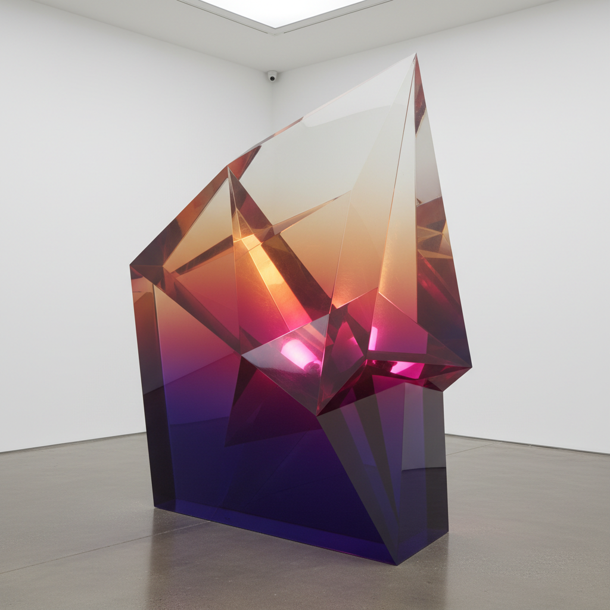

# De Wain Valentine 德韦恩·瓦伦丁

> **时期：** 1936–2022  
> **关键词：** 树脂雕塑、色彩渐变、加州光与空间、透明体量

## 概述

De Wain Valentine 是美国雕塑家，"光与空间"运动的核心成员，以大型铸造聚酯树脂雕塑闻名。他与化学公司合作开发了能够铸造超大体量而不开裂的树脂配方，创造出从深色到透明渐变的巨大光学体——如同凝固的加州日落或海洋深处的光线。

## 风格特征

- **铸造树脂**：使用特殊配方的聚酯树脂铸造大型透明/半透明雕塑
- **色彩渐变**：从深色到浅色到透明的连续渐变，如同大气层
- **光的折射**：树脂内部的光线折射创造出深度和体量的幻觉
- **几何简洁**：圆盘、柱体、楔形等简单几何形态
- **加州光线**：作品捕捉并凝固了南加州特有的光线质量

## 代表作品

- *Gray Column*（1975–1976，高12英尺）
- *Double Pyramid Red*（1968）
- *Circle Series*（1970s）
- *Triple Disk Red*（1966）

## 历史意义

Valentine 将工业材料科学引入艺术创作，他与PPG Industries合作开发的树脂配方使得前所未有的大型透明雕塑成为可能。他的作品是"光与空间"运动中最具物质感和色彩感的表达。

## 概念图

