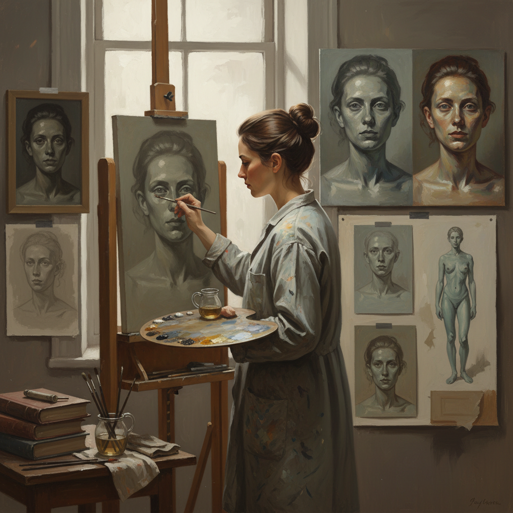

# Dead Coloring 死色底层

> "Dead coloring is the painting's first breath — a thin, muted approximation of the final image laid down without detail or brilliance, establishing the composition and values that will later be brought to life by glazes and impasto." — Unknown

## 概述

死色底层（Dead Coloring，也称dead layer或dead painting）是古典油画中的一个重要阶段——在底层画（underpainting）之后、最终罩染和细节之前的中间层。死色底层使用较为暗淡、不饱和的颜色（通常比最终效果更灰、更冷）来建立画面的基本色彩关系和形体。之所以称为"死色"，是因为这一层看起来缺乏生气——颜色暗淡、缺少光泽。

死色底层的目的是：建立准确的明暗关系和色彩温度、为后续的罩染提供基础、允许画家在不担心最终效果的情况下解决构图和形体问题。在古典画法中，死色底层之后会通过透明的罩染（glazing）来"激活"颜色——罩染为暗淡的死色层注入饱和度和深度，使画面"活"过来。

## 核心特征

| 特征 | 描述 |
|------|------|
| 暗淡 | 暗淡不饱和的颜色 |
| 中间层 | 底层画和罩染之间 |
| 基础 | 建立色彩基础 |
| 灰冷 | 比最终效果更灰更冷 |
| 结构 | 解决结构问题 |
| 准备 | 为罩染做准备 |

## 视觉特征

- **暗淡**：暗淡的色彩
- **灰调**：偏灰的色调
- **冷调**：偏冷的色温
- **平整**：相对平整的表面
- **结构**：清晰的结构
- **未完成**：看似未完成的状态

## 代表作品

| 作品 | 艺术家 | 年代 | 意义 |
|------|--------|------|------|
| *Unfinished paintings* | Various Old Masters | 15-18世纪 | 可见死色层的未完成作品 |
| *X-ray studies of paintings* | Various | 研究 | X光下的死色层 |
| *Academic painting stages* | Various | 19世纪 | 学院派的阶段性展示 |
| *Contemporary dead coloring* | Various | 当代 | 当代古典画法 |
| *Teaching demonstrations* | Various | 当代 | 教学演示 |

## 历史时间线

| 时期 | 事件 |
|------|------|
| 15世纪 | 油画分层技法中的死色层发展 |
| 16-17世纪 | 古典大师的系统使用 |
| 18-19世纪 | 学院派的标准化教学 |
| 20世纪 | 直接画法取代分层画法 |
| 当代 | 古典技法复兴中的重新重视 |
| 当代 | 在线教学中的死色层教程 |

## 中国语境

死色底层在中国的古典油画教育中有一定的教学。中国的美术院校油画系在教授古典技法时会介绍死色底层的概念和方法。中国的古典写实画家在创作大型作品时会使用死色底层来建立画面的基础。中国的油画技法研究者对古典大师的分层画法（包括死色层）进行了研究。一些中国画家将死色底层与中国传统绘画的"打底"步骤进行比较。

## AI生成概念图

## 与其他风格的关系

- **Glazing Technique** → 罩染技法
- **Verdaccio** → 绿灰底层画
- **Imprimatura** → 有色底层
- **Grisaille** → 灰色画
- **Underpainting** → 底层画
- **Classical Realism** → 古典写实

---

*浮光艺志 | Chronicle of Artistry*
