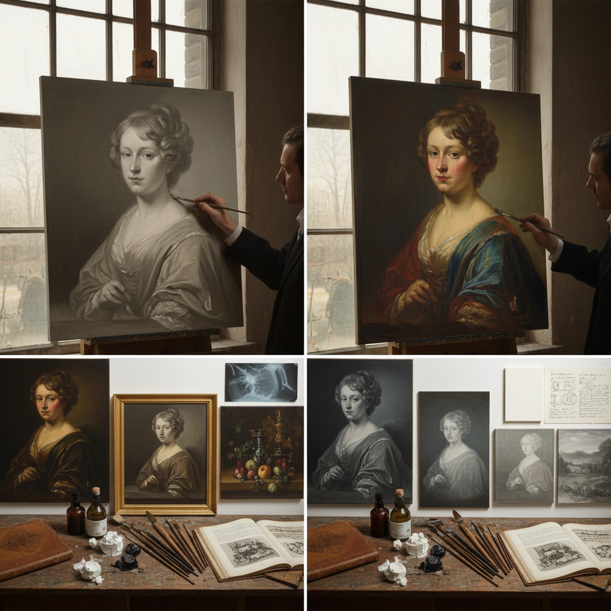

# Dead Layer 死色层画法

> "The dead layer is painting's skeleton — a monochrome ghost of the final image, establishing every value and form in neutral gray before color breathes life into the composition, ensuring that structure precedes beauty." — Unknown

## 概述

死色层画法（Dead Layer / Dead Coloring）是古典油画中的一种底层绘画技法——在正式上色之前，先用灰色或中性色调完成整幅画面的明暗关系和形体塑造。这一层被称为"死色层"（dead layer），因为它缺乏色彩的"生命力"——只有黑白灰的明暗关系。死色层完成后，画家再通过透明或半透明的色彩罩染（glazing）为画面注入色彩。

死色层画法是古典多层油画技法（indirect painting）的核心步骤之一。其优势在于：将"明暗"和"色彩"两个复杂问题分开解决——先专注于形体和光影的准确性，再专注于色彩的丰富性。这种方法被伦勃朗、维米尔、卡拉瓦乔等古典大师广泛使用。死色层通常使用铅白加象牙黑或生赭等中性颜料，有时也使用绿灰色调。

## 核心特征

| 特征 | 描述 |
|------|------|
| 单色 | 单色/灰色底层 |
| 明暗 | 建立明暗关系 |
| 分离 | 明暗与色彩分离 |
| 底层 | 作为底层使用 |
| 古典 | 古典油画技法 |
| 结构 | 建立画面结构 |

## 视觉特征

- **灰色**：灰色的色调
- **明暗**：清晰的明暗关系
- **结构**：坚实的形体结构
- **中性**：中性的色彩
- **层次**：丰富的灰度层次
- **骨架**：画面的"骨架"

## 代表作品

| 作品 | 艺术家 | 年代 | 意义 |
|------|--------|------|------|
| *Unfinished paintings* | Rembrandt | 17世纪 | 可见死色层的未完成作品 |
| *X-ray studies* | Various Old Masters | 古典 | X光下可见的死色层 |
| *Night Watch (underlayer)* | Rembrandt | 1642 | 死色层的经典应用 |
| *Girl with a Pearl Earring* | Vermeer | 1665 | 维米尔的底层技法 |
| *Contemporary classical works* | Various | 当代 | 当代古典画家的死色层 |

## 历史时间线

| 时期 | 事件 |
|------|------|
| 15世纪 | 油画技法发展中的底层概念 |
| 16世纪 | 威尼斯画派的底层技法 |
| 17世纪 | 伦勃朗等大师的系统使用 |
| 18-19世纪 | 学院派对死色层的标准化教学 |
| 印象派后 | 直接画法兴起，死色层减少 |
| 当代 | 古典技法复兴中的重新学习 |

## 中国语境

死色层画法在中国的古典写实油画教育中有重要地位。中国的一些美术学院在教授古典油画技法时，会系统讲授死色层画法。中国的写实油画传统中，一些画家使用死色层来建立画面的明暗基础。中国的油画修复和研究中，对古典油画的死色层有深入的分析。中国的一些当代写实画家（如冷军等）在创作中使用类似的多层技法。

## AI生成概念图

## 与其他风格的关系

- **Grisaille** → 灰色画法
- **Glazing** → 罩染法
- **Terre Verte Underpainting** → 绿土底层
- **Indirect Painting** → 间接画法
- **Chiaroscuro** → 明暗对比法
- **Academic Painting** → 学院派绘画

---

*浮光艺志 | Chronicle of Artistry*
