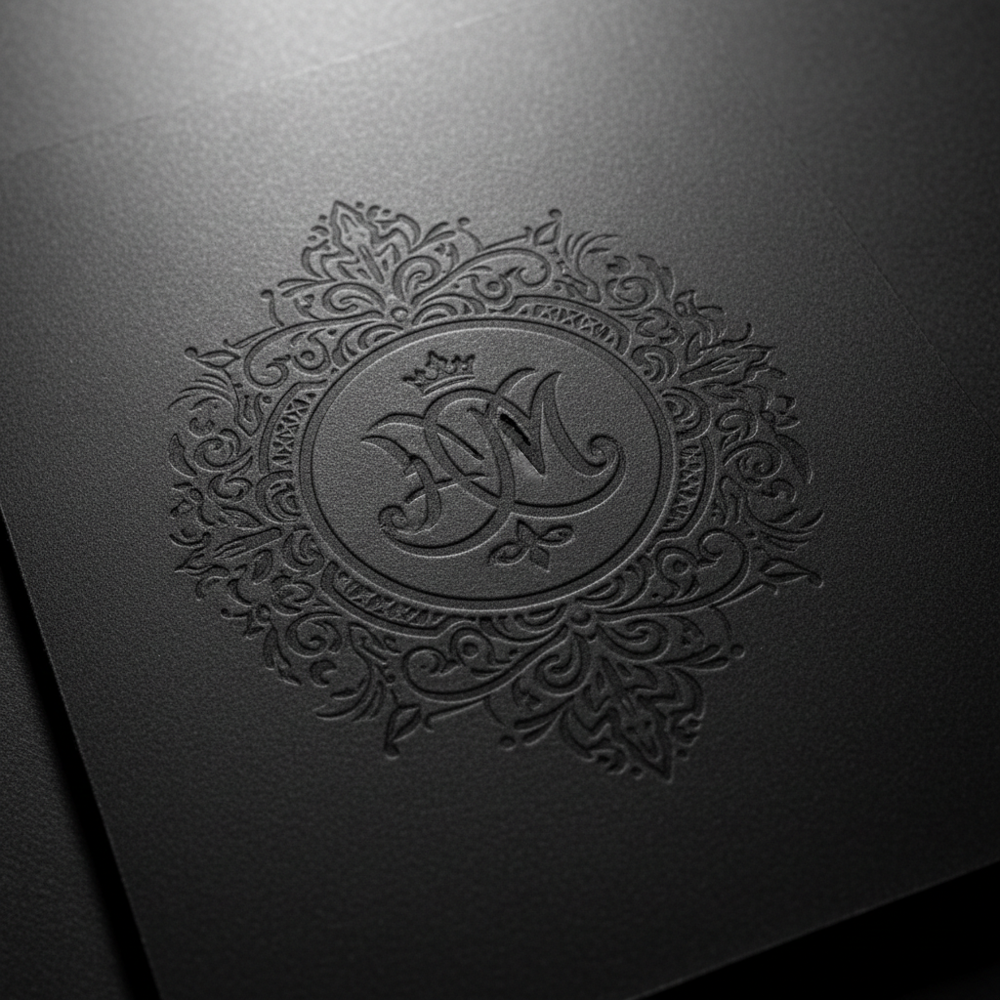

# Debossing Art 压凹艺术

> "Debossing is embossing's quiet twin — where embossing raises the surface toward the viewer, debossing pushes it away, pressing the design into the paper to create a recessed impression that catches shadow in its valleys. The sunken image has a meditative quality, inviting the finger to trace its channels like a path worn into stone by centuries of pilgrims." — Unknown

## 概述

压凹艺术（Debossing Art）是一种将图案压入纸面使其凹陷的印刷装饰技法——与压凸（embossing）相反，压凹使纸面向下凹陷形成凹槽图案。压凹创造出一种内敛、沉静的视觉效果，图案在凹陷处捕捉阴影，呈现出独特的深度感。

压凹艺术的实践包括：1）模具制作——雕刻压凹用的金属模具；2）压印——从纸面正面施加压力使其凹陷；3）深度控制——控制凹陷的深度和清晰度；4）纸张选择——选择适合压凹的厚纸或皮革；5）填色压凹——在凹陷处填充颜色或箔；6）组合工艺——与其他印刷工艺结合；7）当代压凹——将传统技法与现代设计结合的创作。

## 核心特征

| 特征 | 描述 |
|------|------|
| 凹陷 | 纸面向下凹陷 |
| 内敛 | 内敛沉静的效果 |
| 阴影 | 凹陷捕捉阴影 |
| 触感 | 丰富的触觉体验 |
| 深度 | 视觉上的深度感 |
| 耐久 | 耐久的物理印记 |

## 视觉特征

- **凹陷**：纸面的凹陷效果
- **阴影**：凹陷中的阴影
- **内敛**：内敛含蓄的美感
- **触感**：可触摸的凹槽
- **精确**：精确的边缘轮廓
- **深度**：物理的深度感

## 代表作品

| 作品 | 艺术家/文化 | 年代 | 意义 |
|------|-------------|------|------|
| *Leather bookbinding* | 欧洲 | 中世纪起 | 皮革书籍装帧压凹 |
| *Wax seal impressions* | 欧洲 | 中世纪 | 蜡封印记 |
| *Contemporary debossing* | 国际 | 当代 | 当代压凹设计 |
| *Luxury brand packaging* | 国际 | 当代 | 奢侈品牌包装 |
| *Art stationery* | 国际 | 当代 | 艺术文具压凹 |

## 历史时间线

| 时期 | 事件 |
|------|------|
| 古代 | 印章和封泥的使用 |
| 中世纪 | 皮革装帧中的压凹 |
| 19世纪 | 工业化压凹技术 |
| 20世纪 | 商业设计中的应用 |
| 当代 | 压凹的艺术化和精细化 |

## 中国语境

压凹在中国的印刷和设计中有广泛的应用。中国的传统印章和封泥——是压凹的古老形式。中国的书籍装帧设计中，压凹作为一种含蓄的装饰手法——在高端出版物中使用。中国的包装设计中，压凹——常与烫金结合使用创造层次感。中国的皮具和文具设计中，压凹——是常见的品牌标识方式。中国的设计教育中，压凹作为印后工艺——在相关课程中教授。中国的印刷产业中，压凹与压凸——是最常见的特种印刷工艺之一。

## AI生成概念图

## 与其他风格的关系

- **Blind Embossing** → 无墨压凸
- **Foil Stamping** → 烫金
- **Letterpress** → 活版印刷
- **Seal** → 印章
- **Paper Art** → 纸艺
- **Leather Craft** → 皮革工艺

---

*浮光艺志 | Chronicle of Artistry*
