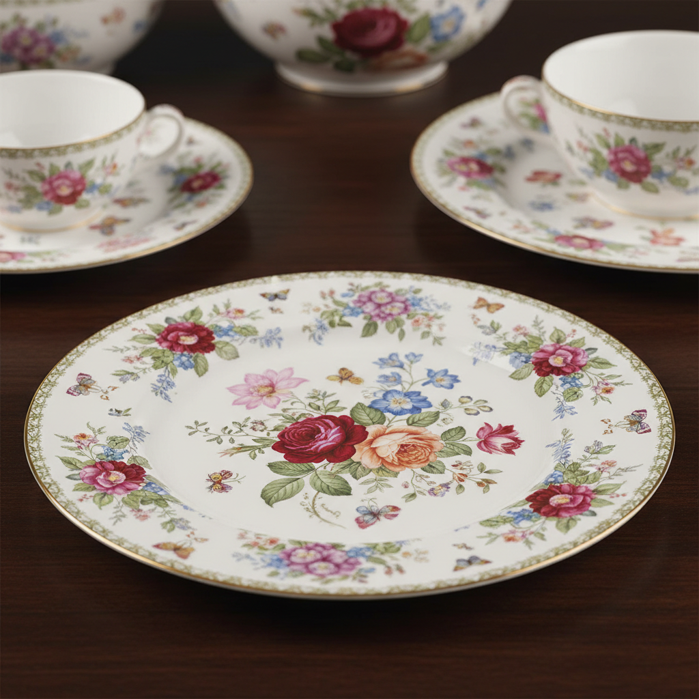

# Decal Art 贴花纸艺术

> "Decal is printing married to ceramics — an image screen-printed or lithographed onto special transfer paper with ceramic pigments, then soaked in water and slid onto a glazed surface like a temporary tattoo, fired until the paper burns away and the pigments fuse permanently into the glaze, allowing photographic detail and mechanical precision impossible to achieve by hand, democratizing decoration for the industrial age." — Unknown

## 概述

贴花纸艺术（Decal Art）是一种将预先印刷在特殊转印纸上的陶瓷颜料图案转移到釉面上，再经烧制使图案永久固定的陶瓷装饰技法。贴花纸（也称水转印花纸）使用丝网印刷或平版印刷将陶瓷颜料印在特殊的水溶性纸上——使用时将纸浸水后将图案滑移到器物表面，烧制后纸张燃烧消失，颜料与釉面融合。贴花纸使精细复杂的图案可以大量复制。

贴花纸艺术的核心要素包括：1）转印纸——特殊的水溶性转印载体；2）陶瓷颜料——使用陶瓷级别的印刷颜料；3）印刷制作——丝网印刷或平版印刷图案；4）水转印——浸水后将图案滑移到器物上；5）烧制固定——低温烧制使颜料与釉融合；6）精细复制——可复制极精细的图案；7）批量生产——适合工业化批量装饰。

## 核心特征

| 特征 | 描述 |
|------|------|
| 转印技术 | 将印刷图案转移到陶瓷上 |
| 精细复制 | 可复制极精细的图案 |
| 批量生产 | 适合工业化大量生产 |
| 照片级别 | 可实现照片级精细度 |
| 低温烧制 | 在较低温度下固定 |
| 设计自由 | 可印刷任何设计图案 |

## 视觉特征

- **精细图案**：极其精细的印刷图案
- **照片效果**：可达到照片级精细度
- **色彩丰富**：多色印刷的丰富色彩
- **均匀一致**：批量生产的一致性
- **平面感**：印刷的平面装饰效果
- **设计多样**：从传统到现代的各种设计

## 代表作品

| 作品 | 艺术家/文化 | 年代 | 意义 |
|------|-------------|------|------|
| *工业瓷器贴花* | 欧洲各厂 | 19世纪起 | 工业贴花的普及 |
| *当代艺术贴花* | 各地陶艺家 | 当代 | 贴花的艺术化应用 |
| *照片贴花陶瓷* | 当代艺术家 | 当代 | 照片转印陶瓷 |
| *混合媒介贴花* | 当代陶艺家 | 当代 | 贴花与手绑结合 |
| *定制贴花设计* | 当代设计师 | 当代 | 个性化贴花设计 |

## 历史时间线

| 时期 | 事件 |
|------|------|
| 18世纪 | 早期转印技术的发展 |
| 19世纪 | 贴花纸技术的工业化 |
| 20世纪 | 丝网印刷贴花的普及 |
| 1990年代 | 数字打印贴花的出现 |
| 当代 | 贴花在艺术与工业中的广泛应用 |

## 中国语境

贴花纸技术在中国陶瓷工业中有极其广泛的应用。中国是世界上最大的陶瓷贴花纸生产国之一——景德镇、潮州、德化等陶瓷产区都大量使用贴花纸装饰。中国的日用瓷——从餐具到茶具——大部分使用贴花纸装饰。中国当代陶艺家也开始将贴花纸作为艺术创作的媒介——将照片、数字图像或手绘图案制成贴花纸，与手工装饰结合创造独特效果。中国的贴花纸产业在数字化转型中走在前列，激光打印和喷墨打印贴花纸正在改变传统的生产方式。

## AI生成概念图

## 与其他风格的关系

- **Screen Printing** → 丝网印刷
- **Transferware** → 转印陶
- **Overglaze Enamel** → 釉上彩
- **Industrial Design** → 工业设计
- **Digital Art** → 数字艺术
- **Pop Art** → 波普艺术

---

*浮光艺志 | Chronicle of Artistry*
