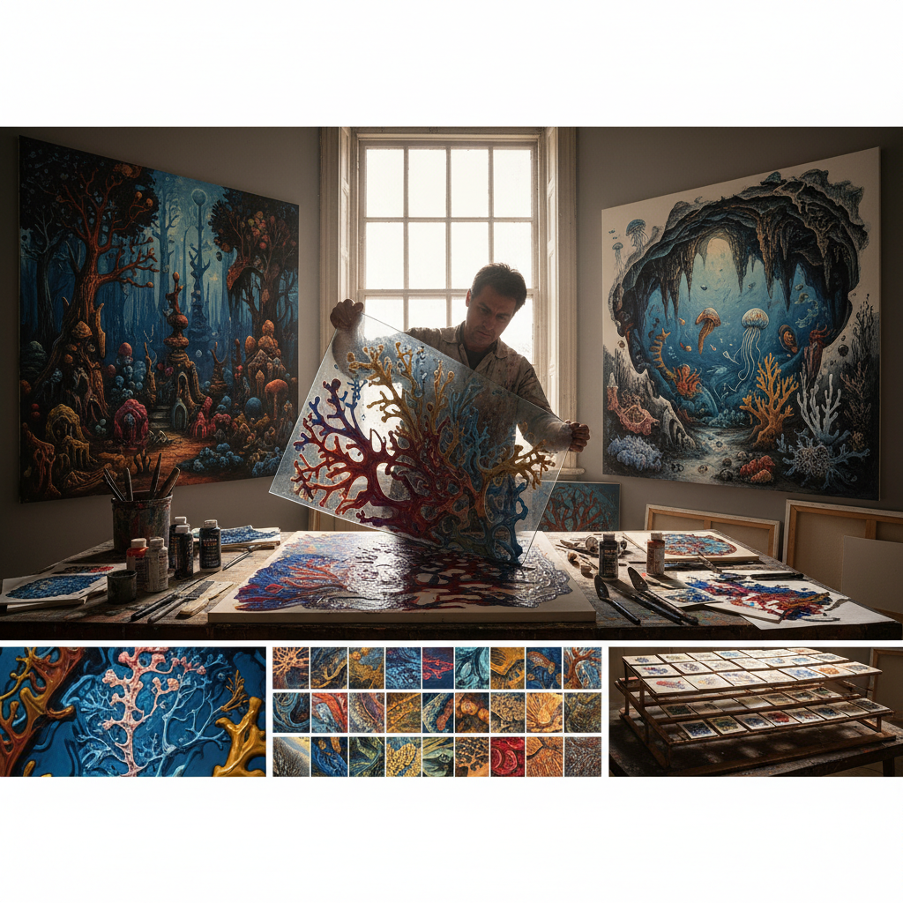

# Decalcomania Art 转印画

> "Decalcomania is painting by pressure and release — spreading pigment between two surfaces and pulling them apart to reveal landscapes of chance, coral forests and submarine caves that no hand could draw, each separation a unique revelation where paint becomes geology, biology, and dream simultaneously, the technique that let Oscar Dominguez and Max Ernst harvest images directly from the unconscious through the physics of viscous fluids." — Unknown

## 概述

转印画（Decalcomania），来自法语"décalcomanie"（转印），是一种将颜料涂在一个表面上，然后将另一个表面（通常是纸或玻璃）压上去再揭开，利用颜料在两个表面之间的粘附和分离产生偶然性图案的艺术技法。这种技法产生的图案往往呈现出类似珊瑚、岩石、洞穴、植物等自然形态的纹理。

Decalcomania作为一种有意识的超现实主义艺术方法，由奥斯卡·多明格斯（Oscar Dominguez）在1936年引入超现实主义运动。马克斯·恩斯特（Max Ernst）随后将这一技法发展到极致，在转印产生的偶然图案基础上进行再创作，发展出完整的超现实风景画。Decalcomania的核心理念与超现实主义的"自动主义"一致——通过物理过程的偶然性来绕过理性控制，直接从潜意识中获取图像。

## 核心特征

| 特征 | 描述 |
|------|------|
| 压印 | 两个表面之间的压印 |
| 分离 | 揭开时的偶然图案 |
| 偶然 | 不可预测的结果 |
| 有机 | 类似自然的有机形态 |
| 超现实 | 超现实主义的方法 |
| 自动 | 自动主义的创作过程 |

## 视觉特征

- **珊瑚**：类似珊瑚的分支结构
- **岩石**：类似岩石的纹理
- **洞穴**：类似洞穴的空间感
- **有机**：有机的自然形态
- **层次**：丰富的层次变化
- **偶然**：不可重复的偶然性

## 代表作品

| 作品 | 艺术家 | 年代 | 意义 |
|------|--------|------|------|
| *Decalcomania without preconceived object* | Oscar Dominguez | 1936 | 多明格斯的开创性作品 |
| *Europe After the Rain II* | Max Ernst | 1940-42 | 恩斯特的转印风景 |
| *The Eye of Silence* | Max Ernst | 1943-44 | 恩斯特的转印杰作 |
| *Swamp Angel* | Max Ernst | 1940 | 恩斯特的沼泽天使 |
| *Decalcomania experiments* | Various Surrealists | 1930-40年代 | 超现实主义者的实验 |

## 历史时间线

| 时期 | 事件 |
|------|------|
| 19世纪 | 装饰性转印的商业应用 |
| 1936 | Oscar Dominguez引入超现实主义 |
| 1940年代 | Max Ernst的系统化发展 |
| 战后 | 转印技法的多元化应用 |
| 当代 | 当代艺术中的转印实验 |

## 中国语境

转印画在中国当代艺术教育中作为超现实主义的重要技法被介绍。中国的美术院校在材料技法课程中会教授decalcomania作为创意实验方法。有趣的是，中国传统的"水拓画"（墨流）技法与decalcomania有相似的偶然性美学——都利用液体材料的物理特性产生不可预测的图案。中国的水拓画将墨或颜料滴在水面上，利用水的表面张力形成图案，然后用纸吸附——这与decalcomania的压印-分离过程有异曲同工之妙。当代中国的一些实验艺术家将传统水拓与西方decalcomania结合创作。

## AI生成概念图

## 与其他风格的关系

- **Surrealism** → 超现实主义
- **Automatism** → 自动主义
- **Max Ernst** → 马克斯·恩斯特
- **Frottage** → 拓印艺术
- **Grattage** → 刮擦画
- **Collage** → 拼贴艺术

---

*浮光艺志 | Chronicle of Artistry*
