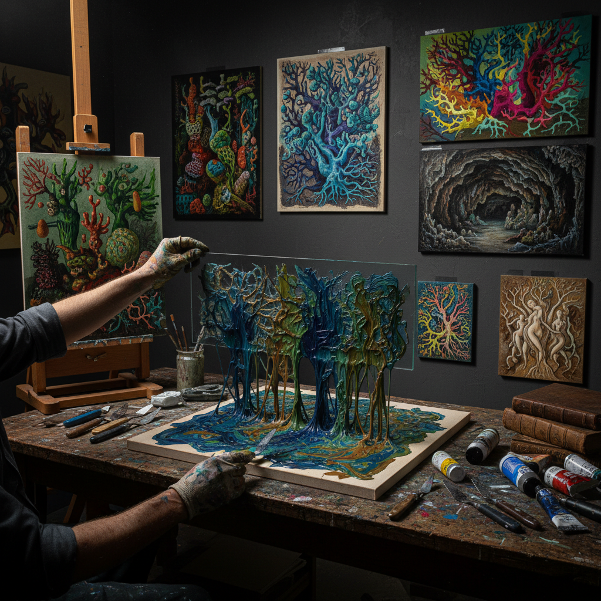

# Decalcomania 转印法

> "Decalcomania is the Surrealist's oracle — press paint between two surfaces, pull them apart, and in the random branching patterns that emerge, find forests, coral reefs, alien landscapes, and the architecture of dreams that the conscious mind could never design." — Unknown

## 概述

转印法（Decalcomania）是一种通过在两个表面之间压印颜料来创造随机图案的技法。最基本的方法是：在一个表面上涂抹颜料，然后将另一个表面压上去，再拉开——颜料在两个表面之间被拉伸和分离，产生独特的树枝状、珊瑚状或岩石状的随机图案。

转印法在超现实主义运动中被广泛使用——Oscar Dominguez在1936年将其引入超现实主义艺术。Max Ernst后来发展了"干转印法"（dry decalcomania），使用油画颜料在画布上创造复杂的纹理。超现实主义者被转印法吸引，因为它产生的随机图案可以激发"自动主义"（automatism）——艺术家在随机图案中"发现"形象，然后加以发展。

## 核心特征

| 特征 | 描述 |
|------|------|
| 压印 | 两个表面之间压印 |
| 随机 | 随机的图案生成 |
| 超现实 | 超现实主义技法 |
| 纹理 | 独特的纹理效果 |
| 自动 | 自动主义的表达 |
| 发现 | 在随机中发现形象 |

## 视觉特征

- **树枝状**：树枝状的图案
- **随机**：随机的纹理
- **有机**：有机的自然形态
- **复杂**：复杂的细节
- **梦幻**：梦幻的视觉效果
- **层次**：丰富的层次

## 代表作品

| 作品 | 艺术家 | 年代 | 意义 |
|------|--------|------|------|
| *Decalcomania works* | Oscar Dominguez | 1936 | 转印法的引入 |
| *Europe After the Rain* | Max Ernst | 1940-42 | 转印法的杰作 |
| *The Eye of Silence* | Max Ernst | 1943-44 | 转印法风景 |
| *Surrealist decalcomania* | Various | 1930s-40s | 超现实主义转印 |
| *Contemporary decalcomania* | Various | 当代 | 当代转印法 |

## 历史时间线

| 时期 | 事件 |
|------|------|
| 19世纪 | 装饰性转印贴花的使用 |
| 1936 | Oscar Dominguez引入艺术转印法 |
| 1930s-40s | 超现实主义者的广泛使用 |
| 1940s | Max Ernst发展干转印法 |
| 20世纪后半 | 转印法在艺术教育中的应用 |
| 当代 | 转印法在混合媒介中的使用 |

## 中国语境

转印法在中国的美术教育中作为创意技法之一被介绍。中国的一些美术院校在创意绘画课程中教授转印法。中国的儿童美术教育中，转印法因其趣味性和不可预测性而受欢迎。中国的一些当代艺术家使用转印法创作抽象和超现实主义风格的作品。转印法的"偶然性"和"发现性"与中国传统美学中的"天成"理念有某种共鸣。

## AI生成概念图

## 与其他风格的关系

- **Surrealism** → 超现实主义
- **Frottage** → 拓印法
- **Automatism** → 自动主义
- **Abstract Art** → 抽象艺术
- **Mixed Media** → 混合媒介
- **Texture** → 纹理艺术

---

*浮光艺志 | Chronicle of Artistry*
