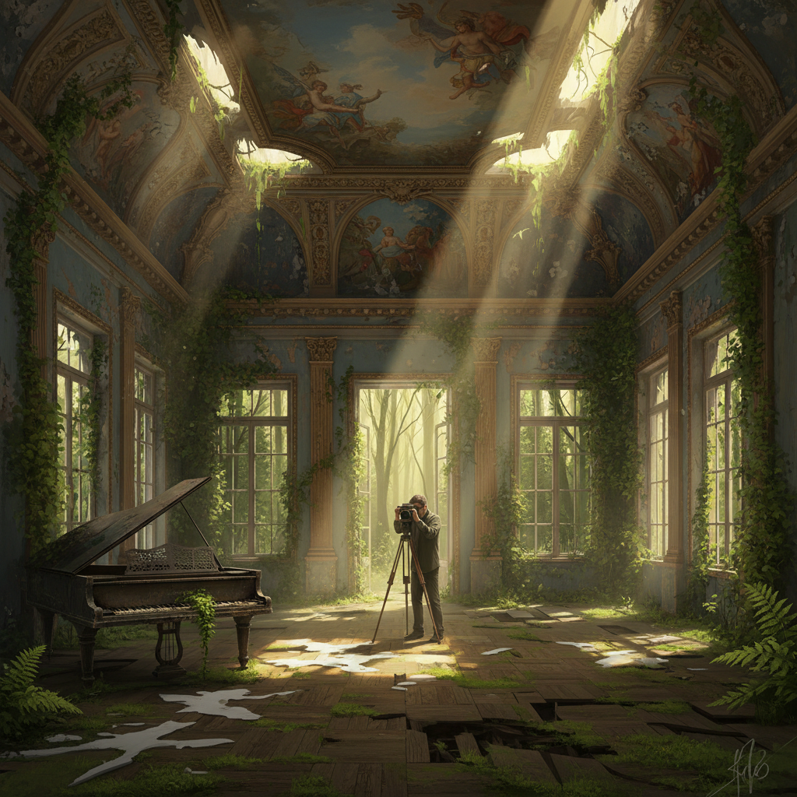

# Decay Art 衰变艺术

> "Decay art finds beauty in decomposition — in the slow unraveling of order into chaos, in the patient work of bacteria and fungi breaking down what was once whole, in the understanding that decay is not an ending but a transformation, not destruction but redistribution, not death but the beginning of new life. Every fallen leaf becoming soil, every rotting log becoming a nursery for seedlings, every crumbling wall becoming a habitat for moss and lichen — these are acts of creation disguised as destruction." — Unknown

## 概述

衰变艺术（Decay Art）是以物质的分解、腐烂和衰变过程为核心美学元素的艺术实践。衰变是自然界最普遍的过程之一——所有有机物最终都会分解，所有人造物最终都会崩塌。衰变艺术将这个通常被视为负面的过程重新定义为一种创造性力量。

衰变艺术的实践包括：1）有机衰变——让有机材料（食物、植物、木材）自然腐烂作为艺术过程；2）建筑衰变——将废墟和衰败建筑作为美学对象（废墟美学）；3）数字衰变——模拟数字信息的降解和损坏（glitch art的一种）；4）加速衰变——用化学或生物手段加速材料的分解；5）衰变记录——通过摄影或延时记录衰变过程；6）衰变隐喻——用物质衰变作为记忆、文明和时间的隐喻。

## 核心特征

| 特征 | 描述 |
|------|------|
| 分解 | 物质的分解 |
| 时间 | 时间的流逝 |
| 转化 | 形态的转化 |
| 自然 | 自然过程 |
| 美学 | 衰败之美 |
| 循环 | 生命循环 |

## 视觉特征

- **褪色**：颜色的褪去
- **剥落**：表面的剥落
- **霉斑**：霉菌的生长
- **裂纹**：材料的开裂
- **苔藓**：植物的侵入
- **废墟**：建筑的废墟

## 代表作品

| 作品 | 艺术家 | 年代 | 意义 |
|------|--------|------|------|
| *Decomposition art* | Dieter Roth | 1960年代 | 食物腐烂艺术 |
| *Ruin photography* | Various | 2000年代 | 废墟摄影 |
| *Decay installations* | Various | 2010年代 | 衰变装置 |
| *Digital decay* | Various | 2010年代 | 数字衰变 |
| *Abandoned places* | Various | 当代 | 废弃空间美学 |

## 历史时间线

| 时期 | 事件 |
|------|------|
| 17世纪 | Vanitas静物画（衰败象征） |
| 18世纪 | 浪漫主义废墟美学 |
| 1960年代 | Dieter Roth的腐烂艺术 |
| 2000年代 | 废墟摄影/Urbex运动 |
| 当代 | 衰变与生态艺术的结合 |

## 中国语境

衰变艺术在中国有独特的文化和哲学背景。中国传统哲学中对"生灭"的辩证理解——佛教的"成住坏空"、道家的"物极必反"——为衰变美学提供了深刻的思想基础。中国传统美学中对"残缺美"的欣赏——残荷、枯木、断壁——是一种衰变美学。中国古典诗词中大量的"废墟"意象——"旧时王谢堂前燕，飞入寻常百姓家"——表达了对衰变的诗意感受。中国当代的一些艺术家在探索衰变艺术：记录中国快速城市化中被拆除建筑的衰变过程、用中国传统材料（宣纸、丝绸、漆器）的自然老化作为创作、以及将中国传统的"物哀"美学与当代衰变艺术结合。

## AI生成概念图

## 与其他风格的关系

- **Erosion Art** → 侵蚀艺术
- **Rust Art** → 锈蚀艺术
- **Process Art** → 过程艺术
- **Vanitas** → 虚空画
- **Ruin Art** → 废墟艺术
- **Entropy Art** → 熵艺术

---

*浮光艺志 | Chronicle of Artistry*
