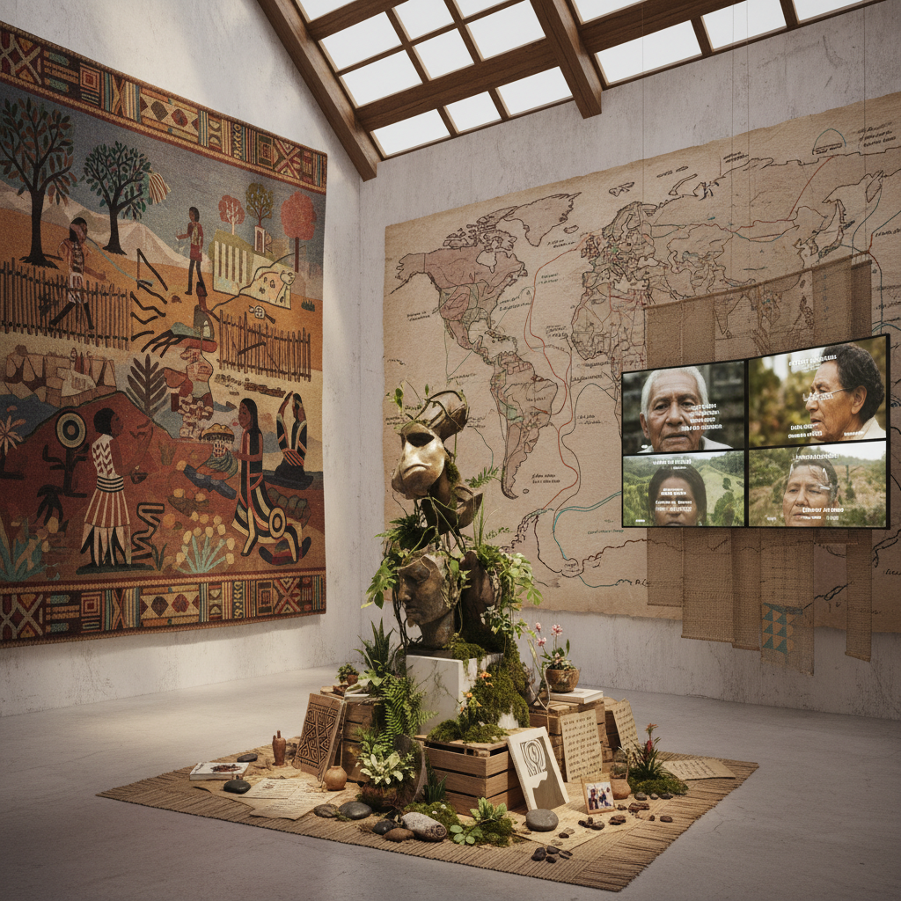

# Decolonial Art 去殖民艺术

> "Decolonial art is not simply art about colonialism — it is art that actively undoes the colonial matrix of power in its very form, materials, and modes of circulation, that refuses the Western art historical canon as the universal measure of aesthetic value, that recovers suppressed knowledge systems and ways of seeing, that insists the museum itself is a colonial technology and that the white cube is not neutral but ideological, that creates from epistemologies the colonial project tried to destroy, and that understands decolonization not as a metaphor but as an ongoing material practice of liberation that must transform not just what art depicts but how art is made, shown, valued, and understood." — Unknown

## 概述

去殖民艺术（Decolonial Art / Decolonial Aesthetics）是2000年代以来在全球南方和离散社群中发展起来的一种艺术实践和理论框架，根植于去殖民思想（decolonial thought）——特别是安尼巴尔·基哈诺（Aníbal Quijano）的"殖民性权力"（coloniality of power）理论和沃尔特·米尼奥洛（Walter Mignolo）的"去殖民选择"（decolonial option）。

去殖民艺术不仅仅是关于殖民主义的艺术，而是在形式、材料、流通方式和认识论层面上主动解构殖民性的艺术实践。它质疑西方艺术史作为普遍标准的合法性，恢复被压制的知识体系和审美传统，挑战博物馆和画廊作为殖民性机构的角色，并从被殖民项目试图摧毁的认识论出发进行创作。

## 核心特征

| 特征 | 描述 |
|------|------|
| 解构 | 解构殖民性权力 |
| 恢复 | 恢复被压制的知识 |
| 认识论 | 多元认识论 |
| 机构 | 挑战艺术机构 |
| 土地 | 土地和领土 |
| 实践 | 去殖民作为实践 |

## 视觉特征

- **材料**：本土材料和技术
- **叙事**：被压制的历史叙事
- **身体**：殖民化的身体
- **土地**：土地和领土的图像
- **文字**：本土语言和文字
- **仪式**：仪式和集体实践

## 代表作品

| 作品 | 艺术家 | 年代 | 意义 |
|------|--------|------|------|
| *Decolonial Aesthetics Manifesto* | Various | 2011 | 去殖民美学宣言 |
| *Epistemologies of the South* | Boaventura de Sousa Santos | 2014 | 南方认识论 |
| *Bienal de São Paulo* | Various | 2010年代 | 去殖民策展实践 |
| *documenta 14* | Various | 2017 | 雅典-卡塞尔的去殖民转向 |
| *Kara Walker installations* | Kara Walker | 2014 | 种族历史的视觉化 |

## 历史时间线

| 时期 | 事件 |
|------|------|
| 2000年代 | 去殖民理论进入艺术界 |
| 2011 | 去殖民美学宣言 |
| 2010年代 | 全球双年展的去殖民转向 |
| 2017 | documenta 14的去殖民实践 |
| 当代 | 去殖民成为主流话语 |

## 中国语境

去殖民艺术在中国有复杂的语境。中国既是历史上的半殖民地（经历了鸦片战争、不平等条约、租界等），又在当代被一些批评者视为在某些地区实施新殖民主义。中国的当代艺术界面临着自己的"去殖民"问题：如何摆脱西方艺术标准的主导？如何重新评价中国自身的艺术传统？如何在全球艺术体系中建立文化主体性？中国的一些艺术家和策展人在探索这些问题——重新激活中国传统的审美范畴、挑战西方当代艺术的普遍性假设、以及从中国自身的文化逻辑出发进行创作和策展。

## AI生成概念图

## 与其他风格的关系

- **Indigenous Futurism** → 原住民未来主义
- **Afrofuturism** → 非洲未来主义
- **Post-Colonial Art** → 后殖民艺术
- **Social Practice** → 社会实践艺术
- **Institutional Critique** → 机构批评
- **Community Art** → 社区艺术

---

*浮光艺志 | Chronicle of Artistry*
