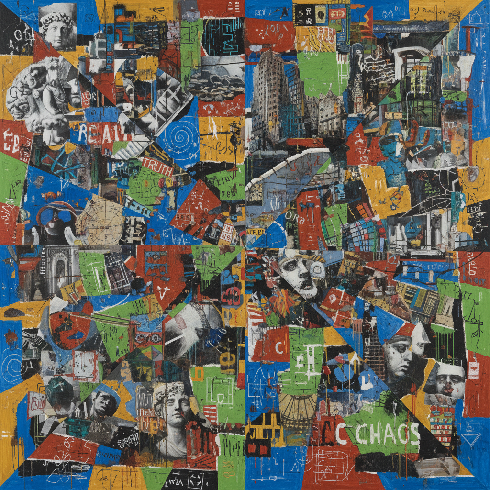

# Deconstructivism Art 解构主义艺术

> **时期：** 1980年代–至今  
> **关键词：** 德里达、碎片化、不稳定、反中心、视觉哲学

## 概述

Deconstructivism Art（解构主义艺术）将雅克·德里达的解构哲学转化为视觉实践——质疑一切稳定的结构、意义和等级。在绘画中，它表现为画面的碎片化、多重视角的叠加、文本与图像的互相侵蚀。没有中心，没有基础，没有最终的意义——只有永恒的差异和延宕。

## 风格特征

- **碎片化**：画面被分裂为不连续的片段
- **多重视角**：拒绝单一观看位置
- **文本介入**：文字作为视觉元素侵入画面
- **不稳定**：构图暗示即将崩塌
- **自我矛盾**：作品质疑自身的存在条件

## 代表人物与作品

- 大卫·萨利 并置绘画
- 西格玛·波尔克 多层透明画
- 乔纳森·拉斯克 解构抽象
- 杰西卡·斯托克霍尔德 碎片装置

## 概念图

