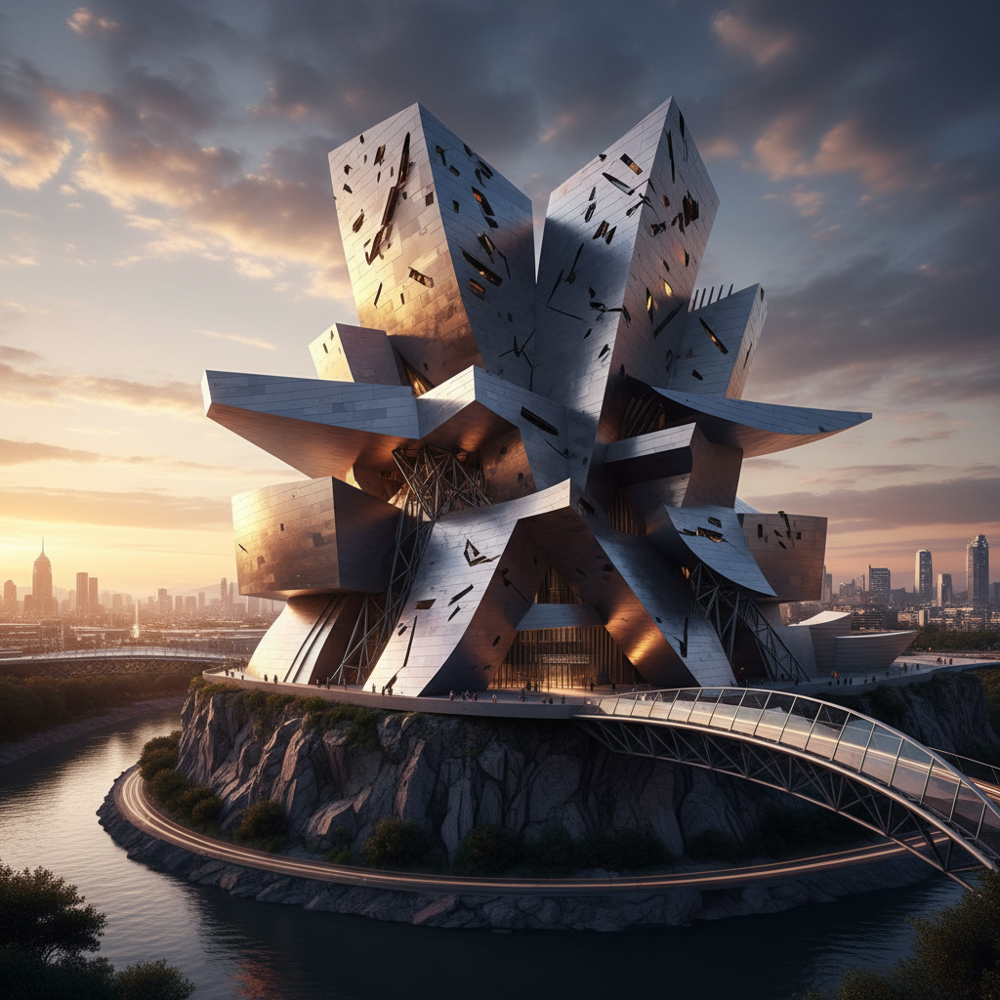

# Deconstructivism 解构主义建筑

> "Architecture should speak of its time and place, but yearn for timelessness." — Frank Gehry

## 概述

解构主义（Deconstructivism）是1980年代末兴起的建筑运动，以弗兰克·盖里（Frank Gehry）、扎哈·哈迪德（Zaha Hadid）、丹尼尔·里伯斯金（Daniel Libeskind）和雷姆·库哈斯（Rem Koolhaas）为代表。它打破了建筑的传统秩序——直角、对称、稳定——创造出倾斜、碎片化、看似即将坍塌的建筑形态。

解构主义受德里达哲学和俄国构成主义的双重影响，追问：建筑必须是稳定的吗？形式必须服从功能吗？秩序之下隐藏着什么？

## 核心特征

| 特征 | 描述 |
|------|------|
| 碎片化 | 建筑被"打碎"和重新组合 |
| 非线性 | 拒绝直角和对称 |
| 不稳定感 | 看似即将坍塌或运动中的形态 |
| 表皮自由 | 外表皮与结构分离，自由流动 |
| 冲突 | 不同几何系统的碰撞和叠加 |
| 反功能主义 | 形式不必服从功能 |

## 视觉特征

- **形态**：倾斜的墙面、扭曲的体量、锐角
- **材料**：钛金属、玻璃、混凝土、钢
- **色彩**：金属银、混凝土灰、偶尔的鲜艳色块
- **线条**：斜线、曲线、折线——没有水平和垂直
- **空间**：内部空间的不可预测性
- **光线**：通过不规则开口创造戏剧性光影

## 代表作品

| 作品 | 建筑师 | 年代 | 意义 |
|------|--------|------|------|
| *Guggenheim Museum Bilbao* | Frank Gehry | 1997 | 解构主义的标志——"毕尔巴鄂效应" |
| *Jewish Museum Berlin* | Daniel Libeskind | 2001 | 建筑作为创伤的物质化 |
| *Vitra Fire Station* | Zaha Hadid | 1993 | 哈迪德的第一个建成作品 |
| *CCTV Headquarters* | Rem Koolhaas/OMA | 2012 | 环形摩天楼——挑战垂直性 |
| *Walt Disney Concert Hall* | Frank Gehry | 2003 | 不锈钢帆的交响曲 |
| *Heydar Aliyev Center* | Zaha Hadid | 2012 | 流动的白色曲面 |

## 历史时间线

| 时期 | 事件 |
|------|------|
| 1982 | Gehry的自宅改造——解构主义建筑的先声 |
| 1988 | MoMA"Deconstructivist Architecture"展览——运动正式命名 |
| 1993 | Hadid的Vitra消防站建成 |
| 1997 | Bilbao Guggenheim开馆——解构主义的全球胜利 |
| 2001 | 柏林犹太博物馆——建筑作为记忆 |
| 2004 | Hadid获普利兹克奖（首位女性） |
| 2010s | 参数化设计使解构主义形态更加自由 |

## 子类型

| 子类型 | 特征 |
|--------|------|
| 金属流体 | Gehry——钛金属的自由曲面 |
| 锐角碎片 | Libeskind——尖锐的折线和切割 |
| 流动曲面 | Hadid——无缝流动的有机形态 |
| 概念解构 | Koolhaas——程序和功能的解构 |
| 参数化 | Schumacher——算法生成的复杂形态 |

## 中国语境

解构主义在中国有大量实践。扎哈·哈迪德在中国建造了多个标志性项目（广州大剧院、北京大兴机场、南京青奥中心）。CCTV总部大楼（库哈斯设计）是北京天际线上最具争议的建筑之一。中国的快速城市化为解构主义提供了前所未有的实验场地，但也引发了"奇奇怪怪的建筑"的公众争议。马岩松的MAD建筑事务所代表了中国本土的解构/参数化实践。

## 争议与遗产

- **争议**：是建筑的解放还是形式主义的自恋？
- **功能问题**：倾斜的墙面和不规则空间是否适合使用？
- **造价**：复杂形态导致极高的建造成本
- **"毕尔巴鄂效应"**：城市用标志性建筑吸引旅游——建筑作为品牌
- **遗产**：永久改变了建筑的形式可能性
- **当代回响**：参数化设计、3D打印建筑、AI生成建筑

## AI生成概念图

## 与其他风格的关系

- **Constructivism** → 俄国构成主义的动态几何是解构主义的形式源头
- **Brutalism** → 粗野主义的混凝土力量感
- **International Style** → 解构主义是对国际风格理性秩序的反叛
- **Parametricism** → 参数化设计是解构主义的数字延伸
- **Futurism** → 未来主义的动态和速度感
- **Postmodernism** → 后现代建筑的多元性，但解构主义更激进

---

*浮光艺志 | Chronicle of Artistry*
