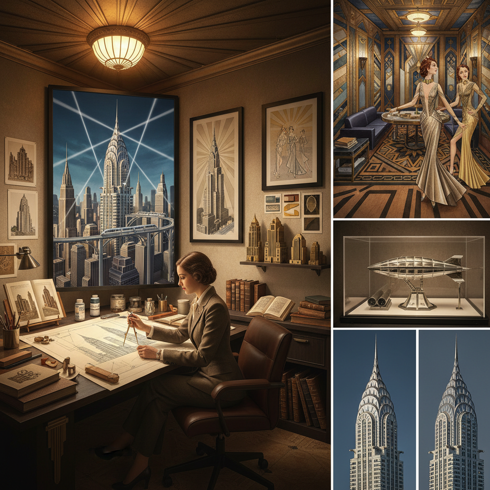

# Decopunk Art 装饰朋克艺术

> "Decopunk is Art Deco's dream of tomorrow made real — the geometric elegance and machine-age optimism of the 1920s-30s extrapolated into a gleaming utopia of chrome spires, geometric sunbursts, and streamlined perfection, a world where the Chrysler Building's crown became the template for an entire civilization, where luxury and technology merged into something simultaneously ancient and futuristic, Gatsby's party extended to the stars." — Unknown

## 概述

装饰朋克（Decopunk）是一种以装饰艺术（Art Deco）运动的美学为基础的复古未来主义风格，想象一个装饰艺术的设计原则被推向极致的世界。与柴油朋克的军事化和黑暗色调不同，装饰朋克更加优雅、乐观和奢华——它保留了Art Deco的几何精确、对称美感和装饰华丽，但将其应用于未来主义的建筑、交通工具和生活方式。

装饰朋克的视觉灵感来源包括：克莱斯勒大厦和帝国大厦等Art Deco摩天楼、1930年代世界博览会的未来主义展馆、好莱坞黄金时代的布景设计、以及雷蒙德·洛威（Raymond Loewy）等工业设计师的流线型作品。装饰朋克通常比柴油朋克更加乌托邦——它想象的是Art Deco承诺的美好未来真正实现的世界。

## 核心特征

| 特征 | 描述 |
|------|------|
| 装饰艺术 | Art Deco的美学核心 |
| 几何 | 精确的几何图案 |
| 奢华 | 奢华和优雅 |
| 乐观 | 乐观的未来想象 |
| 流线 | 流线型的设计 |
| 对称 | 严格的对称美感 |

## 视觉特征

- **金色**：金色和铬色的光泽
- **几何**：锯齿形和放射状图案
- **摩天楼**：Art Deco摩天楼
- **对称**：严格的对称构图
- **奢华**：奢华的材料和装饰
- **流线**：流线型的交通工具

## 代表作品

| 作品 | 艺术家 | 年代 | 意义 |
|------|--------|------|------|
| *BioShock* | 2K Games | 2007 | 水下Art Deco城市 |
| *The Great Gatsby (2013)* | Baz Luhrmann | 2013 | 盖茨比的装饰朋克 |
| *Batman: The Animated Series* | Bruce Timm | 1992 | 哥谭市的装饰朋克 |
| *Metropolis* | Fritz Lang | 1927 | 大都会的先驱美学 |
| *Tomorrowland* | Brad Bird | 2015 | 明日世界的乐观未来 |

## 历史时间线

| 时期 | 事件 |
|------|------|
| 1925 | 巴黎装饰艺术博览会 |
| 1920-30年代 | Art Deco的黄金时代 |
| 1992 | Batman TAS的装饰朋克美学 |
| 2007 | BioShock的Rapture城市 |
| 当代 | 装饰朋克的持续发展 |

## 中国语境

装饰朋克在中国有独特的历史参照——上海的外滩和法租界保留了大量1920-30年代的Art Deco建筑，这些建筑本身就是装饰朋克的现实基础。中国的一些影视和游戏作品已经开始探索"上海装饰朋克"的美学——将民国时期上海的Art Deco建筑与未来主义想象结合。中国的室内设计和建筑设计中也有Art Deco复兴的趋势。装饰朋克的奢华和乐观美学与中国当代消费文化中的"轻奢"趋势有一定的共鸣。

## AI生成概念图

## 与其他风格的关系

- **Art Deco** → 装饰艺术
- **Dieselpunk** → 柴油朋克
- **Retro-Futurism** → 复古未来主义
- **Steampunk** → 蒸汽朋克
- **Atompunk** → 原子朋克
- **Streamline Moderne** → 流线型现代

---

*浮光艺志 | Chronicle of Artistry*
