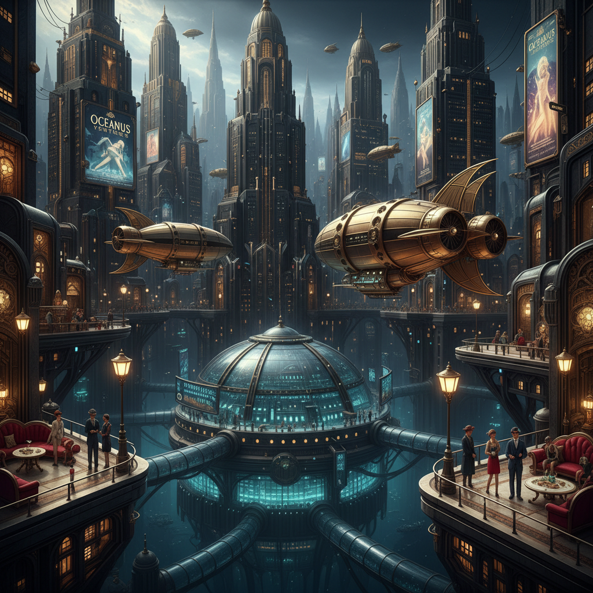

# Decopunk 装饰朋克



> **"Art Deco的世界如果从未结束——高科技与黄金几何的永恒帝国。"**

## 概述

| 维度 | 描述 |
|------|------|
| 时期 | 2000s–至今（作为美学标签）/ 灵感源1920s–1940s |
| 别名 | Decopunk, 装饰朋克, Deco-Futurism |
| 核心色彩 | 黑金、铬银、深翡翠绿、Art Deco几何 |
| 关键元素 | Art Deco建筑+高科技、黄金几何、摩天大楼、奢华未来 |
| 代表人物 | 视觉参考：BioShock Rapture, Metropolis, The Great Gatsby |
| 关联风格 | Art Deco, Dark Deco, Dieselpunk, Raygun Gothic, Cyberpunk |

---

## 历史脉络

| 年份 | 事件 |
|------|------|
| 1927 | Fritz Lang《大都会》——Decopunk的视觉原型 |
| 1982 | 《银翼杀手》——Art Deco + 赛博朋克的融合 |
| 2004 | "Decopunk"一词在网络社区出现 |
| 2007 | BioShock——Rapture城 = Decopunk的游戏经典 |
| 2013 | BioShock Infinite——Columbia = 天空中的Decopunk |
| 2020s | Decopunk在概念艺术和建筑可视化中持续流行 |

### 核心哲学

Decopunk的精神是**"如果Art Deco时代的技术继续发展——世界会是什么样？"**：
- "Art Deco的几何 + 未来的科技 = Decopunk"
- "奢华不是过去——奢华是未来"
- "摩天大楼应该是金色的——不是玻璃幕墙"
- "机器应该是美的——不只是功能的"
- 与Dieselpunk的区别：Decopunk更乐观、更奢华、更关注美学而非战争

---

## 视觉语法

### 色彩系统

```
主色：
  黑金 (#FFD700 on #000000) — 奢华、权力
  铬银 (#C0C0C0) — 金属、科技
  翡翠绿 (#046307) — 宝石、财富
  深蓝 (#191970) — 夜空、深邃

辅色：
  象牙白 (#FFFFF0) — 大理石、纯净
  铜色 (#B87333) — 温暖金属
  红宝石 (#9B111E) — 奢华、危险

建筑语言：
  几何装饰 — Art Deco的DNA
  垂直线条 — 摩天大楼、向上
  放射状图案 — 太阳、能量
  阶梯形轮廓 — 金字塔式退台
  金属+玻璃 — 透明与坚固

规则：
  - Art Deco几何是基础——永远不能丢
  - 科技是优雅的——不是粗糙的
  - 黑+金是默认配色
  - 建筑是巨大的——压倒性的
  - 奢华感 > 实用性
```

### 标志性元素

| 类别 | 元素 |
|------|------|
| 建筑 | Art Deco摩天大楼+高科技 |
| 交通 | 流线型飞艇、金色列车 |
| 服装 | 1920s剪裁+未来材料 |
| 字体 | Art Deco几何字体 |
| 图案 | 放射线、阶梯、几何花纹 |
| 态度 | 奢华、乐观、精英、美学至上 |

---

## 与Dark Deco的关系

| 维度 | Decopunk | Dark Deco |
|------|----------|-----------|
| 色调 | 黑金为主，但可以明亮 | 始终暗黑 |
| 情绪 | 乐观或中性 | 阴郁、哥特 |
| 科技 | 高科技+Art Deco | Art Deco+哥特 |
| 参考 | BioShock, Metropolis | 哥谭市, Noir |
| 本质 | "如果Deco时代继续" | "如果Deco时代堕落" |

---

## 设计应用

| 场景 | 应用方式 |
|------|----------|
| 游戏 | 复古未来城市+Art Deco建筑 |
| 影视 | 替代历史+奢华未来 |
| 品牌 | 高端+几何+黑金 |
| 建筑 | 新Art Deco+当代技术 |

---

## 相关风格

← [Dark Deco 暗黑装饰](dark-deco.md) | [Dieselpunk 柴油朋克](dieselpunk.md) →

↑ [返回千禧怀旧目录](README.md) | [返回总目录](../README.md)
