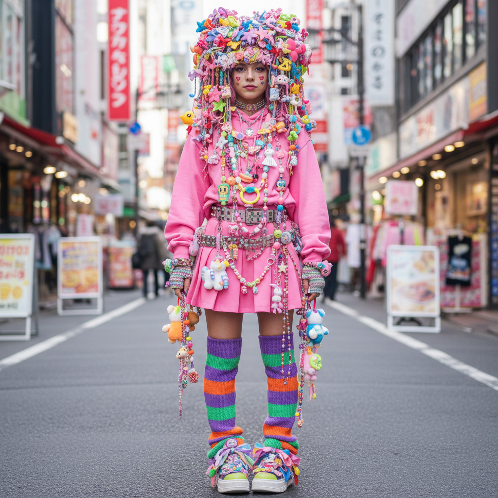

# Decora デコラ



> **"100个发夹、彩虹手环、玩具项链——'太多'这个词不存在。"**

## 概述

| 维度 | 描述 |
|------|------|
| 时期 | 1990s–至今 |
| 别名 | Decora, Decora-kei, デコラ |
| 核心色彩 | 全色谱——粉、红、黄、蓝、绿（越多越好） |
| 关键元素 | 大量发夹、塑料首饰、玩具配饰、层叠 |
| 代表人物 | FRUiTS 杂志、原宿街拍 |
| 关联风格 | Harajuku, Fairy Kei, Kidcore, Scene |

---

## 历史脉络

| 年份 | 事件 |
|------|------|
| 1990s | Decora 在原宿竹下通兴起 |
| 1997 | FRUiTS 杂志开始记录——Decora 被命名 |
| 2000s | 全盛期——原宿街头随处可见 |
| 2010s | 原宿街头时尚衰落——但 Decora 在线上延续 |
| 2020s | TikTok 上的 Decora 复兴 |

### 核心哲学

Decora 的精神是**"装饰就是一切——越多越快乐"**：
- Decora = Decoration（装饰）
- 更多 = 更好（没有上限）
- 快乐 = 目的（"穿得开心"）
- 规则 = 不存在（"没有'太多'"）
- "如果你觉得够了——再加一个发夹"

---

## 视觉语法

### 色彩系统

```
主色：
  所有颜色都可以，但偏好：
  粉色 (#FF69B4) — 最常见的基底
  红色 (#FF0000) — 活力
  黄色 (#FFFF00) — 快乐
  蓝色 (#0000FF) — 对比
  绿色 (#00FF00) — 活力

规则：
  - 越多颜色越好
  - 高饱和度
  - 可以全彩虹
  - 也可以单色系（全粉、全红）
  - 没有"不搭配"

质感：
  塑料 — 发夹、首饰、玩具
  毛绒 — 玩偶、毛绒配饰
  亮片 — 闪光、注意力
  棉 — 基础服装
```

### 标志性元素

| 类别 | 元素 |
|------|------|
| 头部 | 50-100个发夹、发带、帽子、假发 |
| 颈部 | 多层项链、玩具挂件、糖果项链 |
| 手臂 | 大量手环、手套、袖套 |
| 腿部 | 彩色袜子、腿套、多层 |
| 包 | 透明包+内容物展示、玩具挂件 |
| 态度 | 快乐、极端、无规则、装饰至上 |

---

## 与千禧怀旧的关系

### 原宿街头文化的代表
- Decora = 原宿"自由穿搭"精神的极致
- 与 Lolita、Fairy Kei 共同构成原宿三大风格
- FRUiTS 杂志 = 记录这一切的圣经
- "原宿教会世界：时尚可以是纯粹的快乐"

### 与 Kidcore/Clowncore 的交叉
- 三者共享"彩色""快乐""无规则"
- Decora = 日本版本（更精致、更系统）
- Kidcore = 西方版本（更怀旧）
- Clowncore = 更荒诞

---

## 中国语境

- 原宿文化在中国的影响
- 与中国"甜系"/"少女系"的交叉
- 中国 cosplay/二次元社区中的 Decora 元素
- 与中国"配饰堆叠"趋势的关系

---

## 设计应用

| 场景 | 应用方式 |
|------|----------|
| 时尚 | 配饰堆叠+彩色+塑料+玩具+快乐 |
| 品牌 | 彩色+可爱+堆叠+无规则+快乐 |
| 空间 | 彩色+装饰+玩具+展示+层叠 |
| 数字 | 贴纸+装饰+彩色+堆叠+可爱 |

---

## 相关风格

← [Fairy Kei 仙女系](fairy-kei.md) | [Kidcore 童核](kidcore.md) →

↑ [返回千禧怀旧目录](README.md) | [返回总目录](../README.md)
