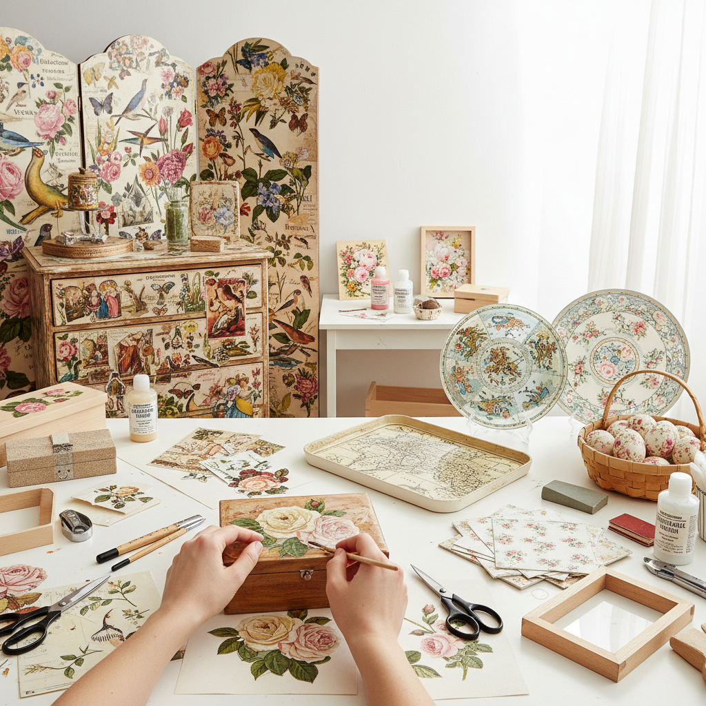

# Decoupage Art 拼贴装饰艺术

> "Decoupage is the art of transformation through paper — of taking flat printed images and giving them new life on new surfaces, building up layers of cut paper and varnish until the joins disappear and the images seem to have always belonged there. The decoupage artist is both curator and chemist, selecting images with an editor's eye and sealing them with a conservator's patience, coat after coat, until paper becomes porcelain." — Unknown

## 概述

拼贴装饰艺术（Decoupage Art）是将剪切的纸片（通常是印刷图案、织物或其他薄材料）粘贴到物体表面，然后涂覆多层清漆或树脂使其与表面融为一体的装饰工艺——通过精心剪切、排列和密封，将普通物品转化为精美的装饰品。

拼贴装饰艺术的实践包括：1）经典拼贴——将纸质图案粘贴并涂漆；2）3D拼贴——利用多层剪切创造立体效果；3）家具拼贴——在家具表面进行拼贴装饰；4）玻璃拼贴——在玻璃背面进行反向拼贴；5）蛋壳拼贴——利用蛋壳碎片创造龟裂效果；6）餐巾拼贴——使用印花餐巾纸的现代技法；7）当代拼贴——将传统技法与现代设计结合的创作。

## 核心特征

| 特征 | 描述 |
|------|------|
| 转化 | 将普通物品转化为艺术品 |
| 层次 | 多层涂漆的深度感 |
| 精细 | 精细的剪切和排列 |
| 经济 | 材料简单易得 |
| 装饰 | 强烈的装饰效果 |
| 耐心 | 需要耐心的多层涂漆 |

## 视觉特征

- **图案**：精美的印刷图案
- **光泽**：多层清漆的光泽
- **融合**：图案与表面的融合
- **色彩**：丰富的色彩组合
- **平整**：完全平整的表面
- **深度**：清漆层的视觉深度

## 代表作品

| 作品 | 艺术家/文化 | 年代 | 意义 |
|------|-------------|------|------|
| *Venetian lacca povera* | 威尼斯 | 17世纪 | 威尼斯穷人漆器 |
| *Victorian decoupage* | 英国维多利亚 | 19世纪 | 维多利亚拼贴 |
| *Mary Delany botanicals* | Mary Delany | 18世纪 | 植物拼贴先驱 |
| *Japanese chiyogami* | 日本传统 | 江户时代至今 | 日本千代纸 |
| *Contemporary decoupage* | Various | 当代 | 当代拼贴装饰 |

## 历史时间线

| 时期 | 事件 |
|------|------|
| 12世纪 | 中国剪纸装饰的早期形式 |
| 17世纪 | 威尼斯lacca povera的兴起 |
| 18世纪 | 法国宫廷的拼贴装饰 |
| 19世纪 | 维多利亚时代的拼贴热潮 |
| 当代 | 拼贴装饰的现代复兴 |

## 中国语境

拼贴装饰艺术在中国有独特的传统形式和当代发展。中国的剪纸艺术可以看作是拼贴装饰的一种源头——将剪纸贴在窗户、灯笼和器物上是中国最古老的装饰传统之一。中国的漆器装饰中也有类似拼贴的技法——如在漆面上贴金箔、银箔和螺钿片。中国当代的手工艺爱好者中，拼贴装饰（特别是餐巾拼贴技法）非常流行——各种手工工作坊提供拼贴装饰课程。中国的家居装饰市场中，拼贴风格的产品受到欢迎——从收纳盒到相框，拼贴装饰为日常物品增添了艺术感。中国的一些艺术家将中国传统图案（如青花瓷纹样、传统年画）用于拼贴创作——创造具有中国特色的拼贴装饰作品。

## AI生成概念图

## 与其他风格的关系

- **Collage** → 拼贴艺术
- **Paper Cutting** → 剪纸艺术
- **Lacquerware** → 漆器艺术
- **Folk Art** → 民间艺术
- **Mixed Media** → 混合媒介
- **Decorative Art** → 装饰艺术

---

*浮光艺志 | Chronicle of Artistry*
