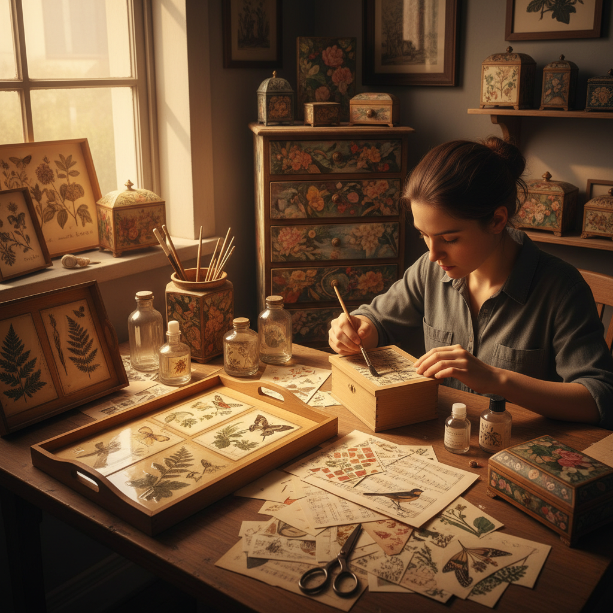

# Decoupage 拼贴装饰

> "Decoupage is the art of transformation — ordinary paper cutouts, layered with varnish, become surfaces of lacquered elegance." — Unknown

## 概述

拼贴装饰（Decoupage，源自法语"découper"意为"剪切"）是将剪切的纸片图案粘贴到物体表面，然后涂覆多层清漆或树脂使其与表面融为一体的装饰技法。最终效果看起来如同手绘或镶嵌——纸片的边缘消失在层层清漆之下。拼贴装饰可以应用于几乎任何表面——家具、盒子、托盘、屏风、墙面等。

拼贴装饰的魅力在于：化腐朽为神奇——普通的印刷品、包装纸、旧书页通过剪切、排列和封漆，变成了精美的装饰表面，赋予旧物新生。

## 核心特征

| 特征 | 描述 |
|------|------|
| 剪贴 | 剪切纸片并粘贴 |
| 封漆 | 多层清漆覆盖 |
| 装饰 | 装饰物体表面 |
| 融合 | 纸片与表面融合 |
| 变废为宝 | 利用现有印刷品 |
| 多层 | 多层涂覆的过程 |

## 视觉特征

- **平滑**：清漆下的平滑表面
- **图案**：精美的图案组合
- **光泽**：漆面的光泽效果
- **融合**：图案与表面的融合
- **复古**：常有复古美学
- **丰富**：丰富的视觉层次

## 代表作品

| 作品 | 艺术家 | 年代 | 意义 |
|------|--------|------|------|
| *Lacca povera furniture* | 匿名 | 17世纪 | 威尼斯"穷人的漆器" |
| *Mary Delany botanicals* | Mary Delany | 18世纪 | 植物学拼贴 |
| *Victorian scrap screens* | 匿名 | 19世纪 | 维多利亚拼贴屏风 |
| *Dora Maar collages* | Dora Maar | 20世纪 | 超现实主义拼贴 |
| *Contemporary decoupage* | Various | 当代 | 当代拼贴装饰 |

## 历史时间线

| 时期 | 事件 |
|------|------|
| 12世纪 | 中国剪纸装饰的影响 |
| 17世纪 | 威尼斯lacca povera的兴起 |
| 18世纪 | 法国宫廷的流行 |
| 19世纪 | 维多利亚时代的全民热潮 |
| 20世纪 | 与现代艺术拼贴的交叉 |
| 当代 | 当代拼贴装饰的复兴 |

## 中国语境

中国有悠久的纸质装饰传统——从剪纸贴窗到年画贴门，纸的装饰应用深入中国文化。当代中国的拼贴装饰（decoupage）作为手工艺爱好越来越流行，特别是在家居DIY和旧物改造领域。中国的手工爱好者常将中国传统图案（如青花瓷纹样、水墨画、古典花鸟）用于拼贴装饰，创造出中西合璧的效果。餐巾纸拼贴（napkin decoupage）在中国手工圈尤其受欢迎。

## AI生成概念图

## 与其他风格的关系

- **Collage** → 拼贴艺术
- **Paper Cutting** → 剪纸
- **Lacquerware** → 漆器（类似的封漆过程）
- **Mixed Media** → 混合媒介
- **Folk Art** → 民间装饰艺术
- **Upcycling** → 旧物改造

---

*浮光艺志 | Chronicle of Artistry*
