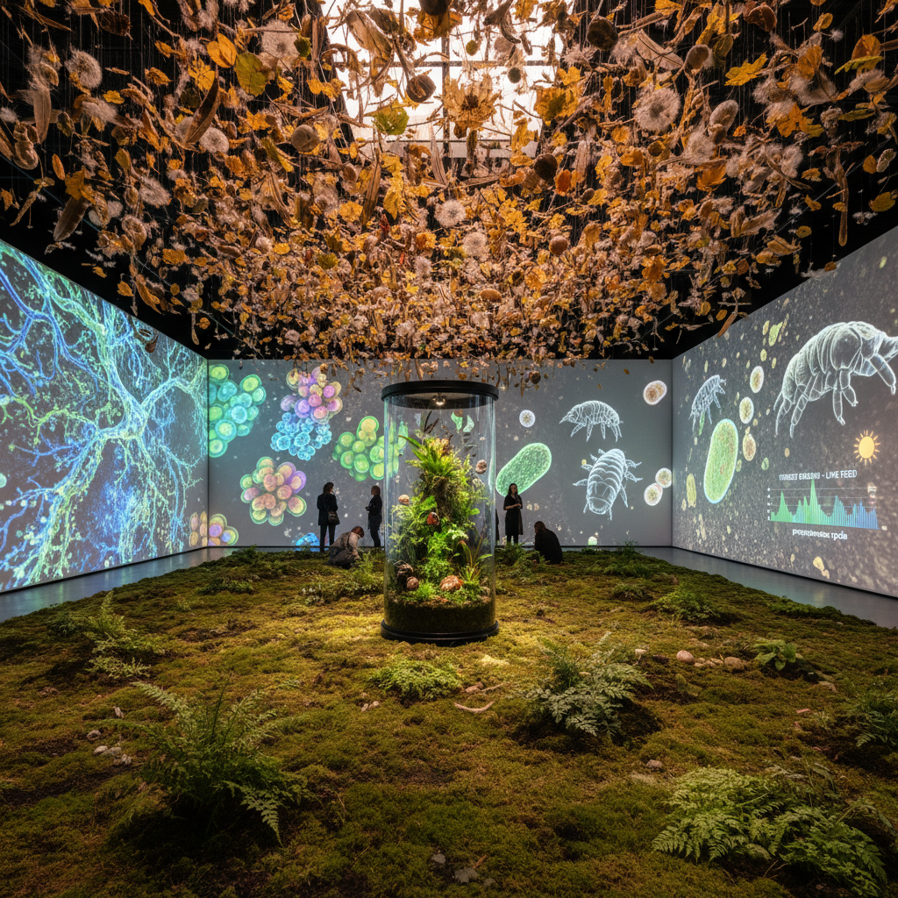

# Deep Ecology Art 深层生态艺术

> "Deep ecology art does not merely depict nature — it insists that nature has intrinsic value independent of human use, that a river has rights, that a forest has standing, that the web of life is not a resource to be managed but a community to which we belong, and that art made from this understanding looks fundamentally different from art that treats nature as scenery, backdrop, or raw material, because it begins not with the human gaze outward but with the recognition that we are already inside, already part of, already dependent upon the living systems we have spent centuries pretending to transcend." — Arne Næss

## 概述

深层生态艺术（Deep Ecology Art）是基于"深层生态学"（Deep Ecology）哲学的艺术实践。深层生态学由挪威哲学家阿恩·奈斯（Arne Næss）在1973年提出，主张自然界的所有生命形式都具有内在价值，不依赖于对人类的有用性。深层生态学批判"浅层"环保主义——仅仅为了人类利益而保护环境——而主张一种根本性的世界观转变：从人类中心主义转向生态中心主义。

深层生态艺术的实践包括：1）表达非人类视角的作品——试图从动物、植物或生态系统的角度看世界；2）挑战人类中心主义的装置——让观众体验自己作为生态系统一部分而非主宰者的感觉；3）与自然过程合作的创作——让风、水、生长和腐朽参与艺术创作；4）生态系统的艺术化呈现——将生态关系的复杂性转化为可感知的体验。

## 核心特征

| 特征 | 描述 |
|------|------|
| 内在价值 | 自然的内在价值 |
| 非人类 | 非人类中心的视角 |
| 整体 | 整体论的世界观 |
| 合作 | 与自然过程合作 |
| 谦卑 | 人类的谦卑 |
| 连接 | 万物的连接性 |

## 视觉特征

- **生态系统**：完整生态系统的呈现
- **微观**：微观世界的放大
- **网络**：生态网络的可视化
- **时间**：地质时间的尺度
- **共生**：共生关系的展示
- **循环**：生死循环的表达

## 代表作品

| 作品 | 艺术家 | 年代 | 意义 |
|------|--------|------|------|
| *7000 Oaks* | Joseph Beuys | 1982 | 社会雕塑与生态 |
| *Wheatfield* | Agnes Denes | 1982 | 城市中的自然 |
| *Deep ecology installations* | Various | 2000年代 | 深层生态装置 |
| *Multispecies art* | Various | 2010年代 | 多物种艺术 |
| *Mycorrhizal networks* | Various | 2020年代 | 菌根网络艺术 |

## 历史时间线

| 时期 | 事件 |
|------|------|
| 1973 | Næss提出深层生态学 |
| 1980年代 | 生态艺术的兴起 |
| 2000年代 | 深层生态艺术的发展 |
| 2010年代 | 多物种转向 |
| 当代 | 后人类主义的影响 |

## 中国语境

深层生态艺术在中国有深厚的哲学基础。中国传统思想中的"天人合一"、道家的"道法自然"、佛教的"众生平等"——这些理念与深层生态学的核心主张高度一致。中国传统山水画的精神——人在自然中的渺小、对自然的敬畏和融入——本身就体现了某种深层生态的世界观。中国当代的一些艺术家在探索将这些传统智慧与当代生态艺术实践结合：用水墨表达生态系统的整体性、用装置呈现人与自然的共生关系、以及用行为艺术探索身体与自然环境的连接。中国的一些环保组织也在使用艺术作为传达深层生态理念的工具。

## AI生成概念图

## 与其他风格的关系

- **Eco-Art** → 生态艺术
- **Land Art** → 大地艺术
- **Bio Art** → 生物艺术
- **Rewilding Art** → 再野化艺术
- **Environmental Art** → 环境艺术
- **Posthumanism** → 后人类主义

---

*浮光艺志 | Chronicle of Artistry*
