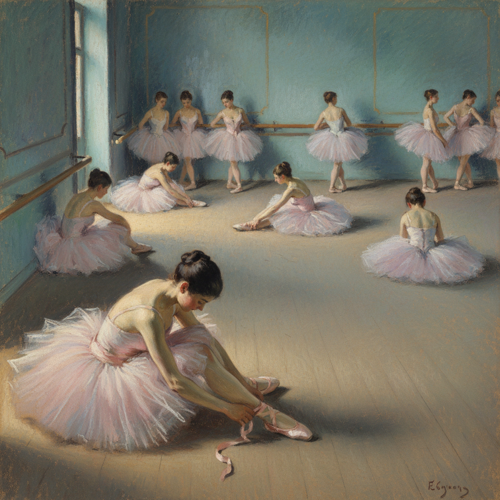

# Edgar Degas 德加

> "Art is not what you see, but what you make others see." — Edgar Degas

## 概述

埃德加·德加（Hilaire-Germain-Edgar De Gas，1834–1917）是法国印象派画家和雕塑家，以描绘芭蕾舞者、赛马和巴黎现代生活著称。虽然常被归入印象派，德加更准确地说是一位"现代生活的古典主义者"——他结合了安格尔式的精确素描与印象派的现代题材和非传统构图。

德加以独特的"偷窥视角"——从上方、从侧面、从幕后——捕捉人物最自然的瞬间，创造了一种摄影般的即时感。他也是粉彩画的最伟大革新者之一。

## 核心特征

| 特征 | 描述 |
|------|------|
| 非传统视角 | 从上方、侧面、幕后的"偷窥"视角 |
| 瞬间捕捉 | 摄影般的即时感——动作的瞬间 |
| 素描功力 | 安格尔传统的精确素描基础 |
| 粉彩革新 | 将粉彩画提升为独立的艺术形式 |
| 裁切构图 | 日本式的大胆裁切——人物被画框切断 |
| 人工光线 | 舞台灯光和煤气灯的人工照明效果 |

## 视觉特征

- **视角**：俯视、侧视、斜视的非传统角度
- **构图**：大胆的裁切和不对称布局
- **光线**：舞台灯光从下方照射的效果
- **色彩**：粉彩的柔和色调——粉、蓝、绿、橙
- **运动**：芭蕾舞者的瞬间姿态
- **空间**：深远的对角线透视

## 代表作品

| 作品 | 年代 | 意义 |
|------|------|------|
| *The Dance Class* | 1874 | 芭蕾题材的典范 |
| *L'Absinthe* | 1876 | 巴黎咖啡馆的孤独 |
| *The Star (L'Étoile)* | 1876-77 | 从幕后看舞台的独特视角 |
| *After the Bath* 系列 | 1880s-90s | 粉彩裸体画的巅峰 |
| *Little Dancer Aged Fourteen* | 1881 | 革命性的蜡像雕塑 |
| *At the Races* 系列 | 1860s-90s | 运动的瞬间捕捉 |

## 真实作品（公共领域）

| 作品 | 来源 |
|------|------|
| *The Dance Class* | [Met Museum](https://www.metmuseum.org/art/collection/search/438817) |
| *L'Absinthe* | [Musée d'Orsay](https://www.musee-orsay.fr/) |
| *The Star* | [Musée d'Orsay](https://www.musee-orsay.fr/) |

> ⚠️ 本条目优先使用真实作品。

## AI生成概念图

## 与其他风格的关系

- **Impressionism** → 参与印象派展览但保持独立
- **Ingres / Neoclassicism** → 继承安格尔的素描传统
- **Photography** → 受摄影构图的深刻影响
- **Japonisme** → 日本版画的裁切和视角
- **Pastel** → 粉彩画技法的最伟大革新者
- **Toulouse-Lautrec** → 劳特累克直接受德加影响

---

*浮光艺志 | Chronicle of Artistry*
