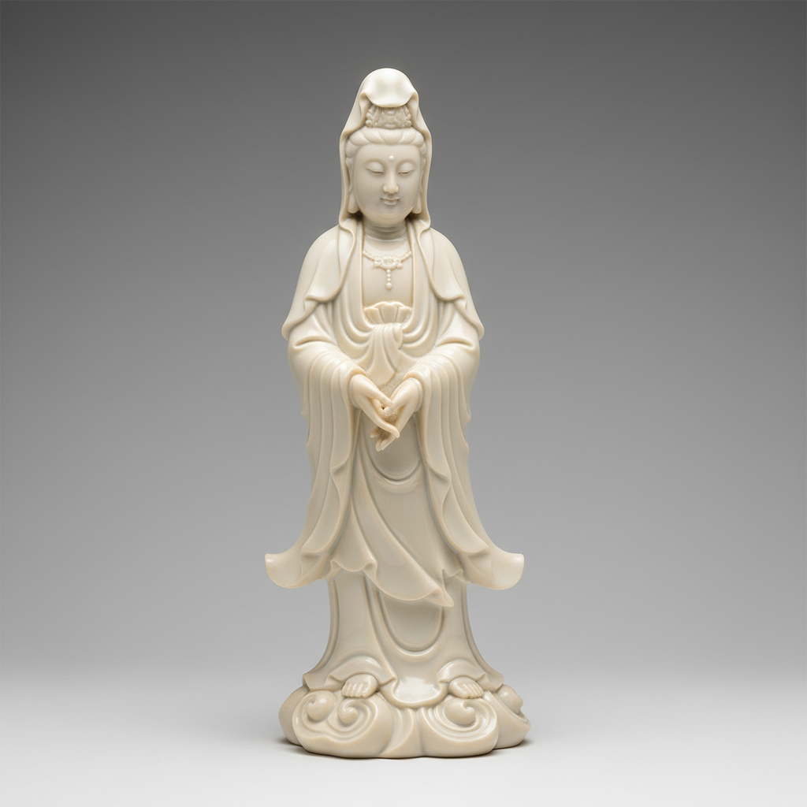

# Dehua White Art 德化白瓷艺术

> "Dehua white is porcelain distilled to its purest form — a body so white and translucent it was called blanc de Chine by the French, ivory-smooth and warm as milk, shaped into figures of Guanyin and scholars with a fluidity that makes fired clay look soft as fabric, the material itself becoming the decoration, needing no color because its own luminous whiteness is color enough." — Unknown

## 概述

德化白瓷艺术（Dehua White Art）是中国福建省德化县生产的以纯白色瓷器著称的陶瓷艺术，在西方被称为"Blanc de Chine"（中国白）。德化白瓷以其温润如玉的象牙白色、极高的透光性和精湛的雕塑技艺著称——特别是观音、达摩等宗教人物雕塑，将瓷塑艺术推向了极致。德化白瓷不施任何彩绘，完全依靠材质本身的白色之美和造型的精妙来打动人心。

德化白瓷艺术的核心要素包括：1）象牙白色——温润的象牙白釉色；2）高透光性——极高的透光性；3）瓷塑艺术——精湛的瓷雕技艺；4）宗教题材——观音达摩等宗教人物；5）不施彩绘——纯白无彩的美学；6）出口珍品——大量出口欧洲；7）材质之美——材质本身就是装饰。

## 核心特征

| 特征 | 描述 |
|------|------|
| 象牙白色 | 温润象牙白釉色 |
| 高透光性 | 极高的透光性 |
| 瓷塑艺术 | 精湛瓷雕技艺 |
| 宗教题材 | 观音达摩等人物 |
| 不施彩绘 | 纯白无彩美学 |
| 出口珍品 | 大量出口欧洲 |

## 视觉特征

- **象牙白**：温润的象牙白色
- **透光感**：薄处透出光线
- **雕塑感**：精美的立体雕塑
- **衣纹流畅**：如真实织物的衣纹
- **面部传神**：人物面部的传神表情
- **纯净无瑕**：纯白无瑕的表面

## 代表作品

| 作品 | 艺术家/文化 | 年代 | 意义 |
|------|-------------|------|------|
| *何朝宗观音* | 何朝宗 | 明代 | 德化瓷塑的巅峰 |
| *达摩像* | 德化窑 | 明清 | 宗教人物经典 |
| *德化白瓷杯* | 德化窑 | 各时期 | 日用白瓷 |
| *出口德化白瓷* | 德化窑 | 明清 | 欧洲收藏品 |
| *当代德化白瓷* | 当代艺人 | 当代 | 当代德化创作 |

## 历史时间线

| 时期 | 事件 |
|------|------|
| 宋代 | 德化窑的创烧 |
| 元代 | 德化白瓷的发展 |
| 明代 | 德化白瓷的鼎盛（何朝宗） |
| 清代 | 大量出口欧洲 |
| 当代 | 德化白瓷的当代传承 |

## 中国语境

德化白瓷是中国陶瓷中"以白为美"的极致体现。明代德化瓷塑大师何朝宗被誉为中国瓷塑艺术的最高峰——他创作的观音像面容慈祥、衣纹流畅，将瓷器的材质美和雕塑的造型美完美结合。德化白瓷在17-18世纪大量出口欧洲——法国人称之为"Blanc de Chine"（中国白），欧洲贵族竞相收藏。德化白瓷对欧洲陶瓷产生了深远影响——迈森等欧洲瓷厂在早期大量模仿德化白瓷的造型和风格。德化白瓷证明了中国陶瓷不仅擅长青花彩瓷，在纯白瓷器方面同样达到了世界最高水平。德化至今仍是中国最重要的陶瓷产区之一——当代德化艺人在传统白瓷基础上不断创新，使这一传统焕发新的活力。

## AI生成概念图

## 与其他风格的关系

- **Blanc de Chine** → 中国白
- **White Porcelain** → 白瓷
- **Ceramic Sculpture** → 瓷塑
- **Religious Art** → 宗教艺术
- **Export Porcelain** → 外销瓷
- **Translucency** → 透光性

---

*浮光艺志 | Chronicle of Artistry*
