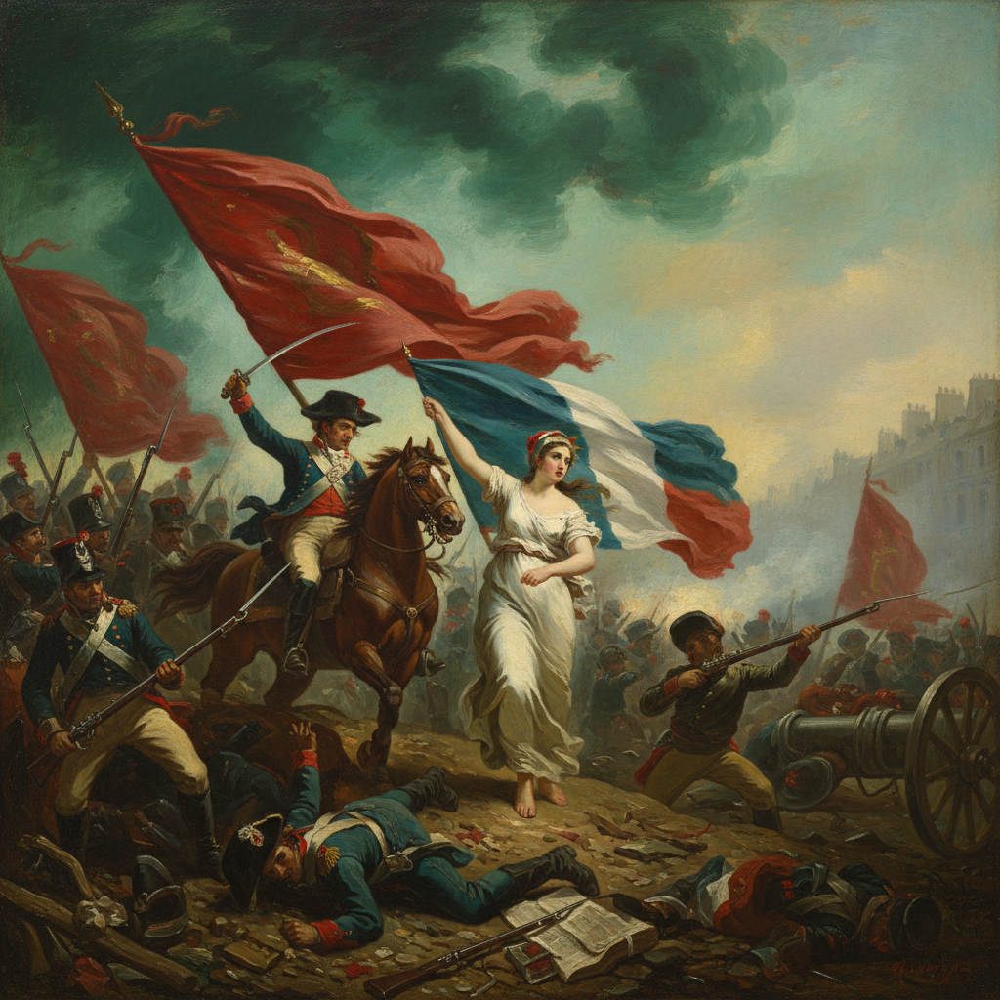

# Eugène Delacroix 德拉克洛瓦

> "What moves those of genius, what inspires their work is not new ideas, but their obsession with the idea that what has already been said is still not enough." — Eugène Delacroix

## 概述

欧仁·德拉克洛瓦（Eugène Delacroix，1798–1863）是法国浪漫主义绑画的领袖，以激烈的色彩、动态的构图和充满激情的历史题材闻名。他对色彩理论的探索直接影响了印象派和后印象派。

## 核心特征

| 特征 | 描述 |
|------|------|
| 激烈色彩 | 大胆的互补色对比 |
| 动态构图 | 对角线、旋转、戏剧性张力 |
| 历史题材 | 革命、战争、异域冒险 |
| 笔触可见 | 拒绝新古典主义的光滑表面 |
| 东方主义 | 北非旅行带来的异域色彩 |
| 情感优先 | 感情高于理性和规则 |

## 代表作品

| 作品 | 年代 | 意义 |
|------|------|------|
| *Liberty Leading the People* | 1830 | 法国革命精神的永恒象征 |
| *The Death of Sardanapalus* | 1827 | 浪漫主义的极致戏剧 |
| *Women of Algiers* | 1834 | 东方主义的色彩革命 |
| *The Massacre at Chios* | 1824 | 以色彩表达人道主义 |

## AI生成概念图

## 与其他风格的关系

- **Romanticism** → 法国浪漫主义绘画的领袖
- **Ingres** → 与新古典主义的终身对手
- **Impressionism** → 色彩理论直接影响莫奈等人
- **Van Gogh** → 梵高深受其色彩对比启发
