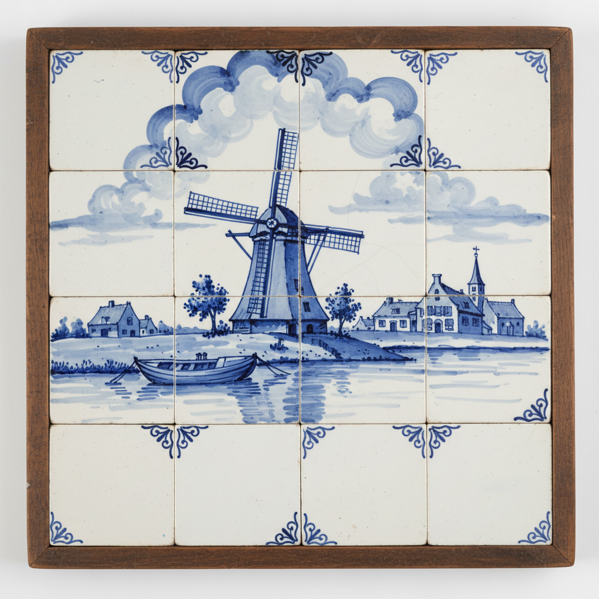

# Delft Art 代尔夫特艺术

> "The blue of Delft is the blue of the Dutch sky reflected in its canals." — Dutch proverb

## 概述

代尔夫特艺术（Delft Art）是17世纪荷兰代尔夫特市发展起来的锡釉陶器（Delftware）艺术传统。代尔夫特蓝陶是荷兰最具标志性的文化符号之一——它以独特的蓝白色调、精美的手绘装饰和丰富的题材著称。代尔夫特陶器的诞生直接受到中国青花瓷和日本伊万里瓷器的影响——17世纪荷兰东印度公司大量进口东方瓷器，激发了本地陶工的模仿和创新。

代尔夫特蓝陶的黄金时代是17世纪下半叶——当时代尔夫特有超过30家陶器工坊同时运营。早期产品直接模仿中国青花瓷的纹样，后来逐渐发展出独特的荷兰风格——将荷兰风景、风车、郁金香、航海场景和圣经故事融入蓝白装饰之中。代尔夫特陶器不仅用于餐具，还广泛用于瓷砖装饰——荷兰建筑中的蓝白瓷砖墙面成为独特的文化景观。

代尔夫特艺术的核心要素包括：1）蓝白色调——标志性的钴蓝与白色；2）锡釉技术——锡釉陶器的精湛工艺；3）中国影响——对中国青花瓷的模仿与转化；4）荷兰题材——风车、郁金香、航海等本土题材；5）瓷砖艺术——建筑装饰瓷砖的传统；6）手绘传统——每件作品的手工绑绘；7）文化符号——荷兰国家文化认同的象征。

## 核心特征

| 特征 | 描述 |
|------|------|
| 蓝白色调 | 标志性钴蓝与白色 |
| 锡釉技术 | 锡釉陶器精湛工艺 |
| 中国影响 | 对中国青花瓷模仿转化 |
| 荷兰题材 | 风车郁金香航海本土题材 |
| 瓷砖艺术 | 建筑装饰瓷砖传统 |
| 文化符号 | 荷兰国家文化认同象征 |

## 视觉特征

- **钴蓝纹样**：深浅不一的蓝色装饰
- **白色底釉**：锡釉的乳白色底色
- **风车风景**：荷兰风车和运河场景
- **花卉纹样**：郁金香和其他花卉
- **瓷砖画面**：方形瓷砖上的独立画面
- **边框装饰**：精美的边框和角饰

## 代表作品

| 作品 | 年代 | 意义 |
|------|------|------|
| *中国风花瓶* (Chinoiserie Vase) | 17世纪 | 早期模仿中国 |
| *荷兰风景瓷砖* | 17-18世纪 | 瓷砖艺术经典 |
| *郁金香花瓶* (Tulip Vase) | 17世纪末 | 独特器形 |
| *圣经故事瓷砖* | 17-18世纪 | 宗教题材 |
| *皇家代尔夫特蓝* (Royal Delft) | 1653至今 | 唯一存续的历史工坊 |
| *当代代尔夫特蓝* | 21世纪 | 传统与创新 |

## 历史时间线

| 时期 | 事件 |
|------|------|
| 1600年代初 | 荷兰东印度公司进口中国瓷器 |
| 1640年代 | 代尔夫特陶器工坊兴起 |
| 1650-1700年 | 黄金时代，30余家工坊 |
| 1653年 | 皇家代尔夫特工坊成立 |
| 18世纪 | 受英国陶器竞争衰落 |
| 19世纪 | 复兴运动 |
| 当代 | 皇家代尔夫特继续生产 |

## 中国语境

代尔夫特蓝陶与中国青花瓷有着直接的血缘关系——它是中国瓷器影响世界的最生动案例之一。17世纪荷兰东印度公司是中国瓷器最大的欧洲进口商——当明清交替导致中国瓷器出口中断时，代尔夫特陶工开始模仿中国青花瓷的风格。然而，由于技术限制（锡釉陶器而非真正的瓷器），代尔夫特蓝陶在模仿中发展出了自己的特色——更加自由的笔触、本土化的题材和独特的器形。代尔夫特蓝陶的故事展示了文化传播中"误读"和"创造性转化"的力量——模仿并不意味着复制，而是在新的文化土壤中生长出新的艺术形式。当代中国陶艺家与代尔夫特的交流也在继续——两地的蓝白传统在当代语境中找到了新的对话可能。

## 概念图

## 与其他风格的关系

- **Chinese Blue-and-White** → 中国青花瓷（灵感来源）
- **Majolica** → 马约利卡（技术来源）
- **Imari** → 伊万里（日本影响）
- **Wedgwood** → 韦奇伍德（英国竞争者）
- **Tile Art** → 瓷砖艺术
- **Dutch Golden Age** → 荷兰黄金时代

---

*浮光艺志 | Chronicle of Artistry*
