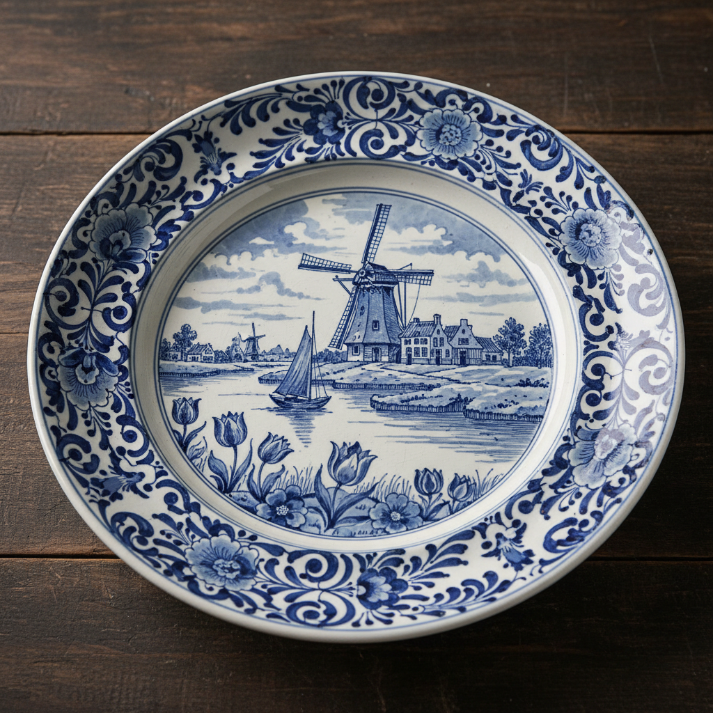

# Delft Blue 代尔夫特蓝 | Delfts Blauw

> **"荷兰人对中国青花瓷的深情回应——风车、郁金香和运河在蓝白之间。"**

## 概述

代尔夫特蓝（Delft Blue / Delfts Blauw）是荷兰代尔夫特（Delft）的传统蓝白陶瓷艺术，起源于17世纪荷兰黄金时代。当时荷兰东印度公司大量进口中国青花瓷，但由于明朝灭亡导致供应中断，代尔夫特的陶工开始仿制中国瓷器，逐渐发展出独特的荷兰风格——将中国的蓝白美学与荷兰的风景、风车、郁金香和日常生活场景结合。至今，代尔夫特蓝仍是荷兰最具辨识度的文化符号之一。

## 历史发展

| 时期 | 特征 |
|------|------|
| 1600–1650 | 早期仿中国青花瓷 |
| 1650–1700 | 黄金时代，独特荷兰风格形成 |
| 1700–1750 | 受日本伊万里瓷影响 |
| 1750–1800 | 衰落，英国陶瓷竞争 |
| 1876–至今 | Royal Delft复兴，旅游纪念品 |

## 核心特征

- **钴蓝色**：手绘钴蓝色在白色锡釉上
- **荷兰题材**：风车、郁金香、运河、帆船
- **中国影响**：早期直接模仿中国青花图案
- **手绘**：每件都是手工绘制
- **锡釉陶**：不是真正的瓷器，而是锡釉陶器
- **瓷砖画**：大面积瓷砖拼成的叙事画面

## 经典题材

| 题材 | 特征 |
|------|------|
| 风车 | 荷兰最经典的视觉符号 |
| 郁金香 | 花卉图案 |
| 帆船 | 海洋贸易的记忆 |
| 风景 | 运河、桥梁、城镇 |
| 人物 | 日常生活场景 |
| 中国风 | 早期的东方图案 |

## 视觉特征

- 纯净的钴蓝色在白色底上
- 精细的手绘笔触
- 荷兰风景的程式化描绘
- 装饰性边框
- 圆形盘面的中心构图
- 蓝色深浅的层次变化

## 与其他风格的关系

| 风格 | 关系 |
|------|------|
| 中国青花瓷 | 直接源流和灵感 |
| 葡萄牙Azulejo | 共享蓝白瓷砖传统 |
| 日本伊万里 | 18世纪互相影响 |
| İznik陶瓷 | 共享蓝白陶瓷传统 |
| 当代荷兰设计 | Delft Blue的现代诠释 |

## 概念图

---

*浮光艺志 | Chronicle of Artistry*
