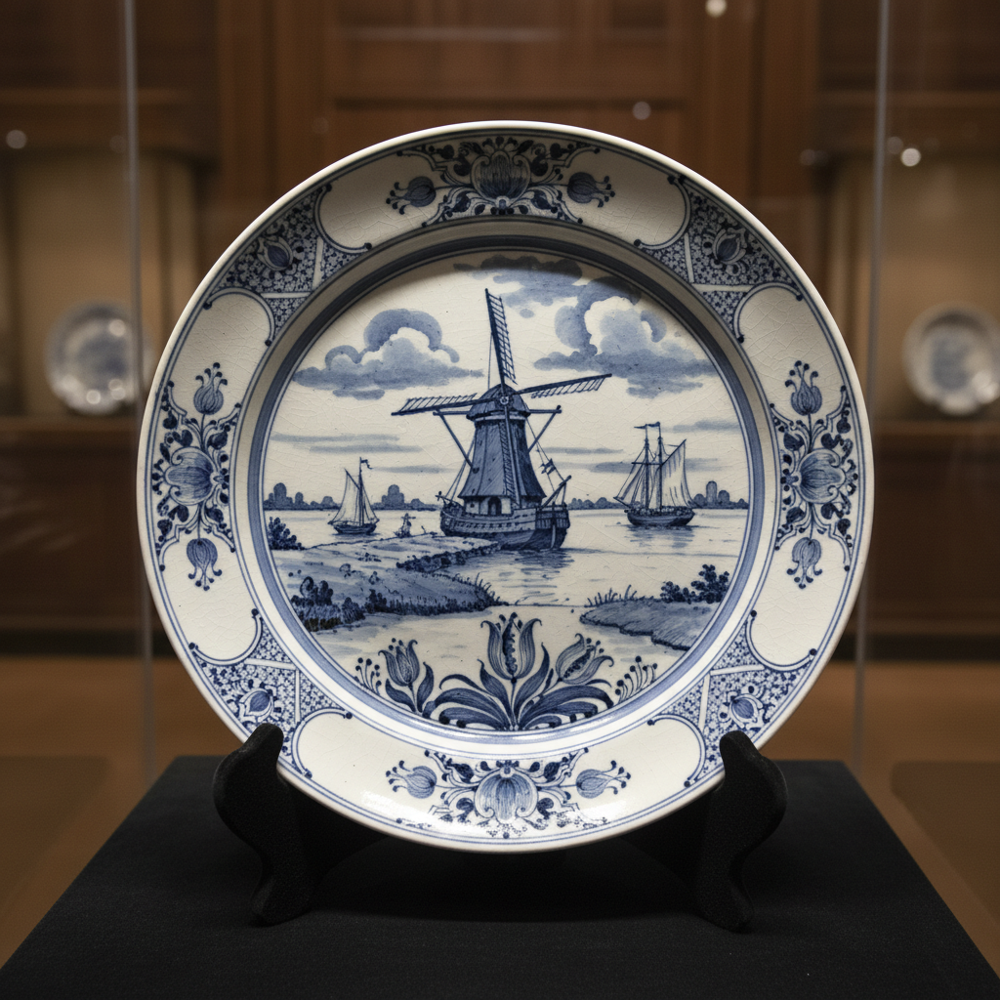

# Delftware Art 代尔夫特陶艺

> "Delftware is Holland's answer to Chinese porcelain — tin-glazed earthenware painted in cobalt blue on white, imitating the blue-and-white wares that Dutch traders brought from China in their East India Company ships, yet developing its own distinctive character: windmills and tulips alongside pagodas, Dutch landscapes rendered in a palette borrowed from Jingdezhen." — Unknown

## 概述

代尔夫特陶艺（Delftware Art）是17至18世纪荷兰代尔夫特市发展出的锡釉陶器传统——以蓝白装饰为主要特征，最初模仿中国青花瓷，后来发展出独特的荷兰风格。代尔夫特陶以其精美的蓝白绘画、丰富的题材和独特的荷兰文化特色著称，是荷兰黄金时代最重要的装饰艺术之一。

代尔夫特陶艺的实践包括：1）制坯——制作陶器坯体；2）素烧——初次烧制坯体；3）施锡釉——施加白色锡釉；4）蓝白绘画——用钴蓝颜料在釉面上绘画；5）多彩——后期发展的多彩装饰；6）瓷砖——代尔夫特蓝白瓷砖；7）当代代尔夫特——将传统风格与现代设计结合的创作。

## 核心特征

| 特征 | 描述 |
|------|------|
| 蓝白 | 蓝白色调为主 |
| 锡釉 | 白色锡釉底 |
| 荷兰 | 荷兰文化特色 |
| 仿瓷 | 最初模仿中国青花瓷 |
| 瓷砖 | 著名的蓝白瓷砖 |
| 黄金时代 | 荷兰黄金时代的产物 |

## 视觉特征

- **蓝白**：经典的蓝白色调
- **精细**：精细的蓝色绘画
- **荷兰**：荷兰风景和题材
- **东方**：东方风格的影响
- **瓷砖**：方形瓷砖的装饰
- **清新**：清新明快的整体感

## 代表作品

| 作品 | 艺术家/文化 | 年代 | 意义 |
|------|-------------|------|------|
| *De Porceleyne Fles* | 荷兰 | 1653年起 | 皇家代尔夫特工厂 |
| *Delft blue tiles* | 荷兰 | 17-18世纪 | 代尔夫特蓝白瓷砖 |
| *Delft tulip vases* | 荷兰 | 17世纪 | 代尔夫特郁金香花瓶 |
| *Delft chinoiserie* | 荷兰 | 17-18世纪 | 代尔夫特中国风 |
| *Contemporary Delft* | 荷兰 | 当代 | 当代代尔夫特 |

## 历史时间线

| 时期 | 事件 |
|------|------|
| 1600年代 | 荷兰东印度公司带回中国瓷器 |
| 1650年代 | 代尔夫特陶器工厂的建立 |
| 17世纪后半 | 代尔夫特陶的黄金时代 |
| 18世纪 | 与英国瓷器的竞争和衰落 |
| 当代 | 皇家代尔夫特的持续生产 |

## 中国语境

代尔夫特陶与中国的青花瓷有直接的历史渊源。中国的青花瓷——是代尔夫特陶模仿的原型，通过荷兰东印度公司大量进口。中国的景德镇——为荷兰市场定制了大量外销瓷。中国的青花瓷对代尔夫特的影响——是中西文化交流史的重要案例。中国的陶瓷研究中，代尔夫特陶作为中国瓷器影响欧洲的证据——是重要的研究对象。中国的博物馆——收藏有代尔夫特陶器，作为中荷文化交流的见证。中国当代的设计师——有时会将代尔夫特蓝白风格与中国青花进行对话式的创作。

## AI生成概念图

## 与其他风格的关系

- **Blue and White** → 青花瓷
- **Majolica** → 马约利卡
- **Faience** → 彩陶
- **Tin Glaze** → 锡釉
- **Dutch Golden Age** → 荷兰黄金时代
- **Chinoiserie** → 中国风

---

*浮光艺志 | Chronicle of Artistry*
