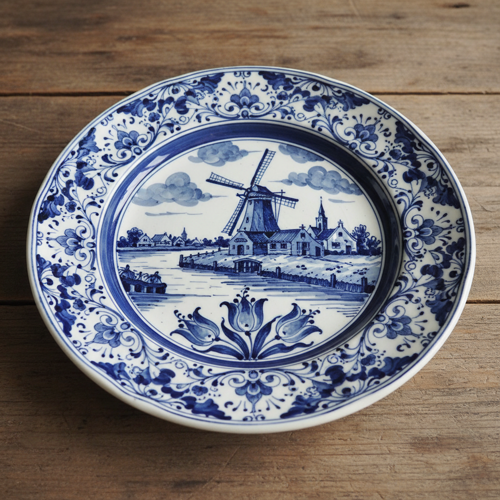

# Delftware 代尔夫特蓝陶 | Delfts Blauw

> **"荷兰人的中国梦——17世纪的代尔夫特陶工模仿中国青花瓷，却创造出了自己的蓝色世界。"**

## 概述

代尔夫特蓝陶（Delftware / Delfts Blauw）是荷兰代尔夫特市（Delft）的传统蓝白锡釉陶器，17世纪荷兰东印度公司大量进口中国青花瓷，当中国瓷器因明清交替而断供时，代尔夫特陶工开始模仿中国青花瓷的蓝白风格。然而他们逐渐发展出独特的荷兰风格——风车、郁金香、运河风景、圣经故事取代了中国的山水和龙凤。代尔夫特蓝陶成为荷兰黄金时代的文化象征，至今仍是荷兰最具辨识度的工艺品。

## 核心特征

- **锡釉陶**：锡釉白底（非真正瓷器）
- **钴蓝色**：手绘蓝色图案
- **荷兰题材**：风车、郁金香、运河
- **瓷砖**：大量用于墙面装饰
- **中国影响**：最初模仿青花瓷
- **手绘传统**：每件手工绘制

## 常见题材

| 题材 | 特征 |
|------|------|
| 风车 | 荷兰标志 |
| 郁金香 | 国花 |
| 运河风景 | 城市景观 |
| 渔船 | 海洋传统 |
| 圣经故事 | 宗教题材 |
| 中国风 | 早期模仿 |

## 视觉特征

- 锡釉白底的温润质感
- 钴蓝色的手绘线条
- 荷兰风景的田园感
- 瓷砖拼贴的装饰效果
- 精细的笔触和细节
- 蓝白对比的清新优雅

## 与其他风格的关系

| 风格 | 关系 |
|------|------|
| 中国青花瓷 | 代尔夫特模仿的对象 |
| Gzhel格热利 | 共享蓝白陶瓷传统 |
| Blue Willow | 共享中国风影响 |
| Azulejo葡萄牙瓷砖 | 共享蓝白瓷砖传统 |
| 当代陶瓷设计 | 代尔夫特的持续影响 |

## 概念图

---

*浮光艺志 | Chronicle of Artistry*
