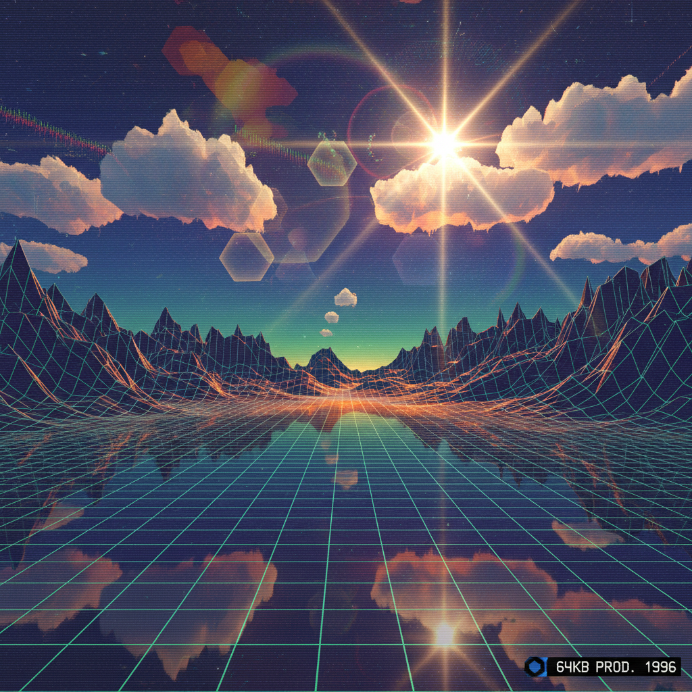

# Demoscene 演示场景

> **时期：** 1980年代–至今  
> **关键词：** 实时渲染、代码艺术、64K限制、程序生成、黑客美学

## 概述

Demoscene 是一种起源于1980年代欧洲计算机亚文化的数字艺术形式。程序员-艺术家们在极端的技术限制下（如64KB甚至4KB的文件大小）创造出令人惊叹的实时渲染视听作品（demo）。它是代码即艺术的最纯粹体现——每一个像素、每一帧动画都由数学公式和算法在运行时生成，没有预制素材。

## 风格特征

- **极端优化**：在最小文件中实现最大视觉效果
- **实时渲染**：所有画面在运行时即时计算生成
- **程序纹理**：用数学公式生成材质而非使用图片
- **光线追踪**：早于商业应用的实时光线计算
- **音乐合成**：用代码生成配乐而非录制

## 代表团体与作品

- Future Crew《Second Reality》（1993）
- Farbrausch《.kkrieger》（96KB FPS游戏）
- Conspiracy《Chaos Theory》（64KB）
- Elevated by Rgba & TBC（4KB）

## 概念图

