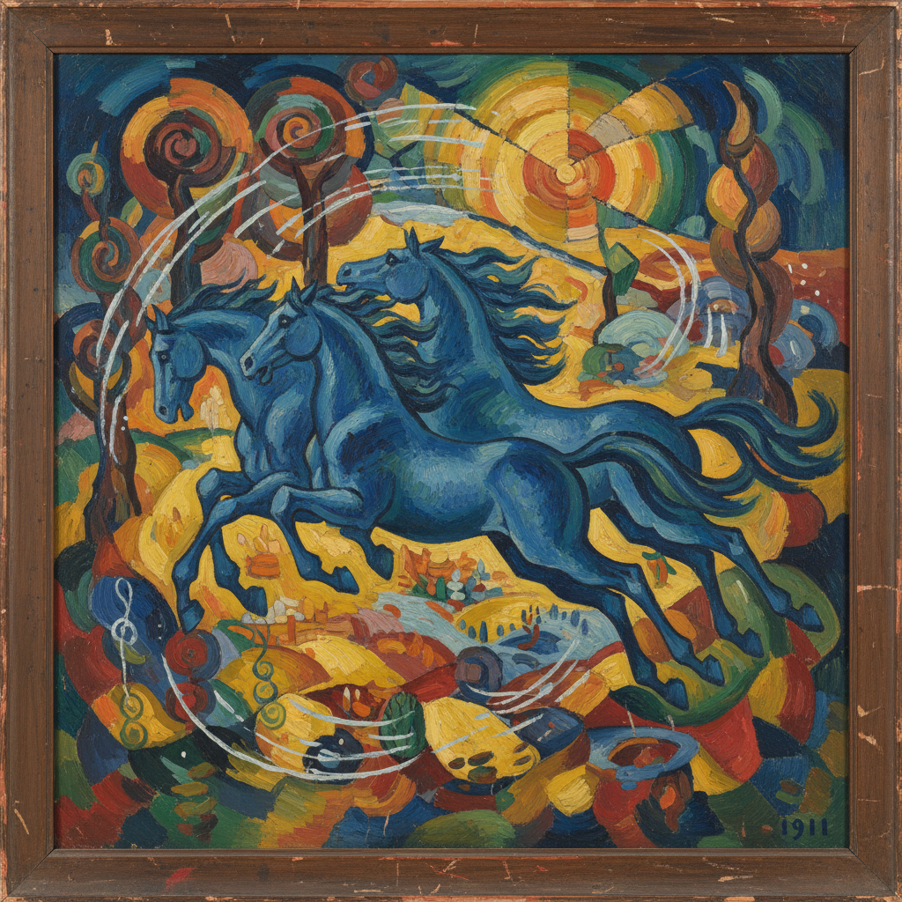

# Der Blaue Reiter 蓝骑士

> "The whole work, which is called art, knows no borders and peoples, only humanity." — Wassily Kandinsky

## 概述

蓝骑士（Der Blaue Reiter，1911–1914）是慕尼黑的表现主义艺术团体，由康定斯基和弗朗茨·马尔克创立。与桥社的原始粗犷不同，蓝骑士追求精神性和音乐性的抽象，探索色彩与形式的内在必然性，是通向纯粹抽象艺术的关键一步。

## 核心特征

| 特征 | 描述 |
|------|------|
| 精神性 | 艺术作为灵魂的表达 |
| 音乐性 | 色彩如音符，构图如乐章 |
| 走向抽象 | 从具象逐步走向纯粹抽象 |
| 色彩象征 | 每种颜色都有精神含义 |
| 动物主题 | 马尔克的蓝马——动物的纯真灵魂 |
| 国际性 | 跨国界的艺术家联盟 |

## 核心成员

| 画家 | 特色 |
|------|------|
| Wassily Kandinsky | 抽象艺术的理论奠基人 |
| Franz Marc | 蓝色马匹——动物的精神世界 |
| August Macke | 明亮色彩的都市生活 |
| Paul Klee | 线条散步的童趣与深邃 |
| Gabriele Münter | 巴伐利亚风景的大胆简化 |

## 代表作品

| 作品 | 画家 | 意义 |
|------|------|------|
| *Composition VII* | Kandinsky, 1913 | 纯粹抽象的里程碑 |
| *The Large Blue Horses* | Marc, 1911 | 动物精神的色彩象征 |
| *Turkish Café* | Macke, 1914 | 光与色的和谐 |
| *Der Blaue Reiter Almanac* | 合集, 1912 | 跨媒介的艺术宣言 |

## AI生成概念图

## 与其他风格的关系

- **Die Brücke** → 德国表现主义的另一极（原始性 vs 精神性）
- **Abstract Art** → 直接通向纯粹抽象
- **Bauhaus** → 康定斯基和克利后来加入包豪斯
- **Orphism** → 德劳内的色彩抽象是盟友
