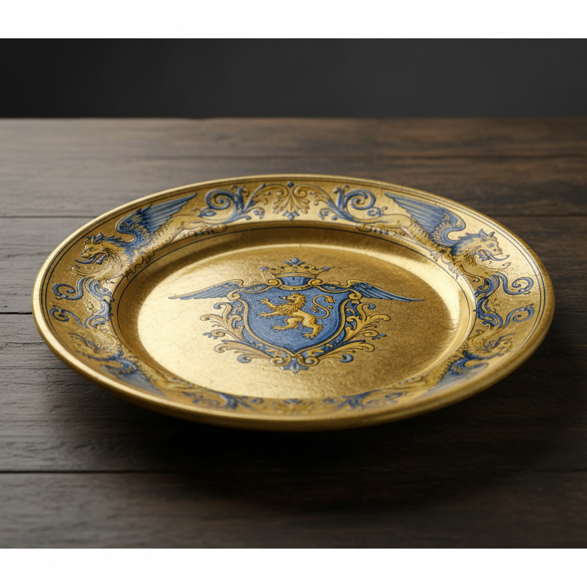

# Deruta Art 德鲁塔艺术

> "In Deruta, the earth becomes art." — Umbrian saying

## 概述

德鲁塔艺术（Deruta Art）是意大利翁布里亚大区德鲁塔镇为中心的锡釉陶器（maiolica）艺术传统。德鲁塔是意大利最古老、最持续的陶瓷生产中心之一——从中世纪至今已有超过700年的不间断制陶历史。德鲁塔陶器以其独特的金属光泽釉（lustro）、精美的拉斐尔式装饰和鲜艳的黄蓝配色著称——它代表了意大利文艺复兴陶瓷艺术的最高成就之一。

德鲁塔陶器最具标志性的特征是其金属光泽釉——一种通过还原烧成获得的金色或红铜色光泽，使陶器表面呈现出如金属般的闪耀效果。这一技术源自伊斯兰陶瓷传统——通过西班牙摩尔人传入意大利。德鲁塔的另一标志是"拉斐尔式"（raffaellesco）装饰——以蓝色和黄色为主色调，描绘龙、怪兽和卷草纹样的精美边框装饰。

德鲁塔艺术的核心要素包括：1）金属光泽釉——独特的lustro技术；2）拉斐尔式装饰——标志性的蓝黄装饰风格；3）持续传承——700年不间断的制陶传统；4）黄蓝配色——鲜艳的黄色和蓝色；5）龙纹装饰——标志性的龙和怪兽纹样；6）药罐传统——精美的药房陶器；7）当代活力——至今仍活跃的陶瓷产业。

## 核心特征

| 特征 | 描述 |
|------|------|
| 金属光泽釉 | 独特lustro技术 |
| 拉斐尔式装饰 | 标志性蓝黄装饰风格 |
| 持续传承 | 700年不间断制陶传统 |
| 黄蓝配色 | 鲜艳黄色和蓝色 |
| 龙纹装饰 | 标志性龙和怪兽纹样 |
| 当代活力 | 至今仍活跃陶瓷产业 |

## 视觉特征

- **金色光泽**：金属光泽釉的闪耀效果
- **蓝黄主调**：鲜艳的蓝色和黄色
- **龙纹边框**：精美的龙和卷草边框
- **中心图案**：盘心的人物或纹章
- **几何纹样**：精确的几何装饰带
- **丰富层次**：多层次的装饰构成

## 代表作品

| 作品 | 年代 | 意义 |
|------|------|------|
| *金属光泽釉盘* (Lustro Plate) | 15-16世纪 | lustro技术巅峰 |
| *拉斐尔式装饰盘* (Raffaellesco) | 16世纪 | 标志性风格 |
| *药罐* (Albarello) | 15-16世纪 | 药房陶器 |
| *圣母像陶板* | 文艺复兴时期 | 宗教陶艺 |
| *纹章盘* (Armorial Plate) | 15-16世纪 | 贵族定制 |
| *当代德鲁塔陶器* | 21世纪 | 传统延续 |

## 历史时间线

| 时期 | 事件 |
|------|------|
| 13世纪 | 德鲁塔陶器生产开始 |
| 14世纪 | 发展出独特的装饰风格 |
| 15世纪 | 金属光泽釉技术引入 |
| 16世纪 | 文艺复兴时期鼎盛 |
| 17-18世纪 | 持续生产但风格变化 |
| 19世纪 | 复兴运动 |
| 当代 | 200余家工坊仍在运营 |

## 中国语境

德鲁塔陶器与中国陶瓷的关系体现在技术传播的长链条中。金属光泽釉技术最初起源于中东——可能受到中国唐三彩和宋代窑变釉的间接影响——经由伊斯兰世界传入西班牙，再传入意大利。德鲁塔700年不间断的制陶传统与中国景德镇千年制瓷传统有某种平行关系——都是一个城镇因陶瓷而闻名世界、因陶瓷而延续文化认同的案例。德鲁塔至今仍有200余家陶瓷工坊在运营——这种"活态传承"的模式对中国传统陶瓷产区（如景德镇、宜兴、龙泉）的当代发展有重要的参考价值。德鲁塔证明了传统手工艺可以在现代经济中保持活力——关键在于品质、创新和文化认同的结合。

## 概念图

## 与其他风格的关系

- **Faenza** → 法恩扎（意大利陶瓷中心）
- **Majolica** → 马约利卡（同一传统）
- **Islamic Lustre** → 伊斯兰光泽陶（技术来源）
- **Renaissance Art** → 文艺复兴艺术
- **Spanish Ceramics** → 西班牙陶瓷（光泽釉传播）
- **Gubbio** → 古比奥（光泽釉中心）

---

*浮光艺志 | Chronicle of Artistry*
