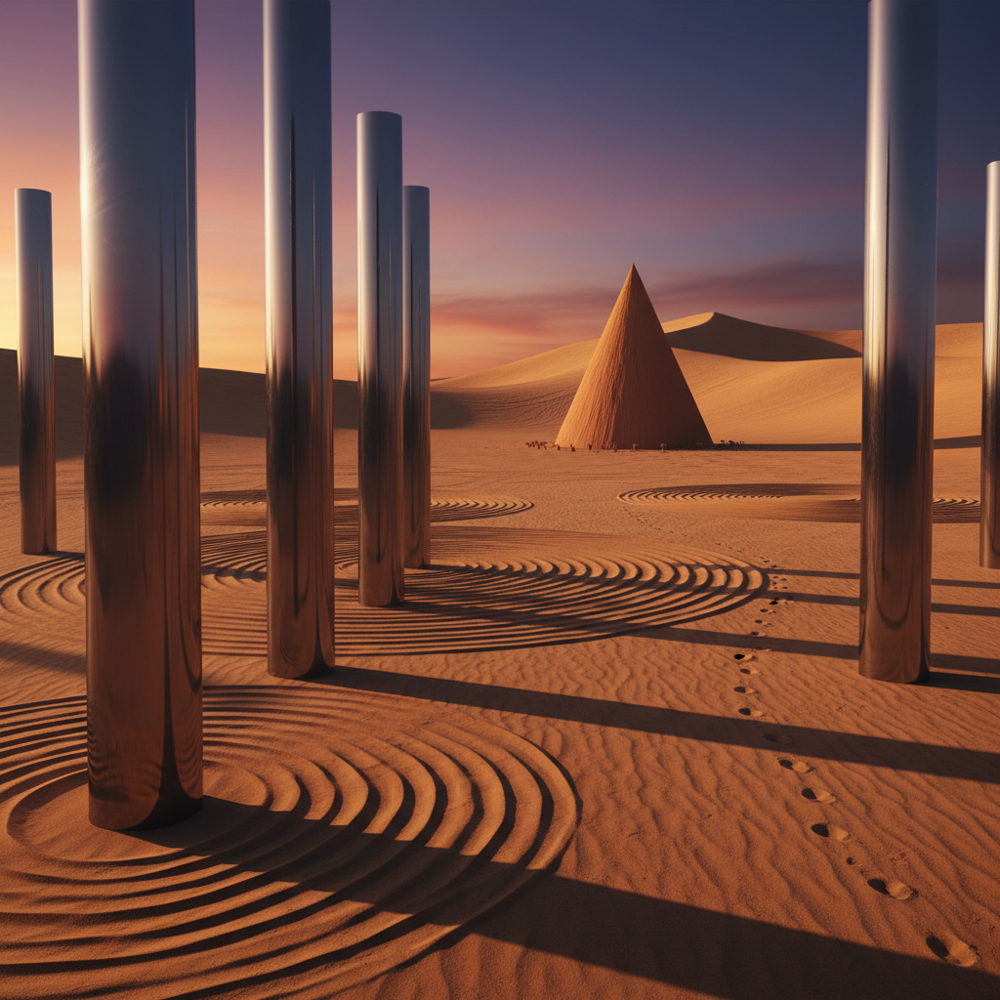

# Desert Art 沙漠艺术

> "Desert art embraces the most extreme landscape on Earth — a place where life is stripped to its essentials, where the horizon stretches to infinity, where silence is so complete you can hear your own blood flowing, and where the light is so pure it reveals every grain of sand as a universe unto itself. The desert artist works with absence as much as presence, with emptiness as much as form, with the understanding that in a landscape of nothing, everything becomes significant." — Unknown

## 概述

沙漠艺术（Desert Art）是以沙漠环境——广袤的沙地、极端的气候、独特的光线和地质形态——为创作场所、材料和灵感的艺术实践。沙漠是地球上最极端的环境之一，占地球陆地面积的三分之一，却拥有独特的美学品质：无限的空间感、纯净的光线、极简的色彩和形态。

沙漠艺术的实践包括：1）沙漠大地艺术——在沙漠中创作大型地景作品；2）沙画——用沙子作为绘画材料；3）沙漠建筑——适应沙漠环境的建筑艺术；4）沙丘雕塑——利用风塑造的沙丘形态；5）沙漠光影——利用沙漠独特的光线条件创作；6）沙漠生存艺术——以沙漠生存体验为主题的行为艺术。

## 核心特征

| 特征 | 描述 |
|------|------|
| 广袤 | 无限的空间 |
| 极简 | 极简的形态 |
| 光线 | 纯净强烈的光 |
| 沙 | 沙作为材料 |
| 极端 | 极端的环境 |
| 寂静 | 深沉的寂静 |

## 视觉特征

- **金色**：沙的金色调
- **曲线**：沙丘的流畅曲线
- **阴影**：强烈的光影对比
- **无限**：无尽的地平线
- **纹理**：风蚀的纹理
- **极简**：极简的构图

## 代表作品

| 作品 | 艺术家 | 年代 | 意义 |
|------|--------|------|------|
| *Double Negative* | Michael Heizer | 1969 | 沙漠大地艺术 |
| *Sun Tunnels* | Nancy Holt | 1976 | 沙漠光影装置 |
| *Lightning Field* | Walter De Maria | 1977 | 沙漠闪电场 |
| *Spiral Jetty* | Robert Smithson | 1970 | 盐湖螺旋堤 |
| *Desert Breath* | D.A.ST. Arteam | 1997 | 撒哈拉大地艺术 |

## 历史时间线

| 时期 | 事件 |
|------|------|
| 古代 | 纳斯卡线条、岩画 |
| 1960年代 | 大地艺术运动兴起 |
| 1970年代 | 经典沙漠大地艺术 |
| 1990年代 | Burning Man艺术节 |
| 当代 | 沙漠与气候变化艺术 |

## 中国语境

沙漠艺术在中国有独特的地理和文化基础。中国拥有广阔的沙漠和戈壁——塔克拉玛干沙漠、巴丹吉林沙漠、腾格里沙漠等。中国传统文化中对沙漠有丰富的意象——"大漠孤烟直，长河落日圆"（王维）是中国诗歌中最经典的沙漠描写。丝绸之路穿越沙漠连接东西方文明，敦煌莫高窟就坐落在沙漠边缘。中国当代的一些艺术家在探索沙漠艺术：在中国西北沙漠中创作大地艺术、用防沙治沙的"草方格"作为艺术形式、以及将中国传统的"大漠"美学与当代环境艺术结合。

## AI生成概念图

## 与其他风格的关系

- **Land Art** → 大地艺术
- **Minimalism** → 极简主义
- **Light Art** → 光艺术
- **Ephemeral Art** → 短暂艺术
- **Environmental Art** → 环境艺术
- **Sand Art** → 沙画艺术

---

*浮光艺志 | Chronicle of Artistry*
