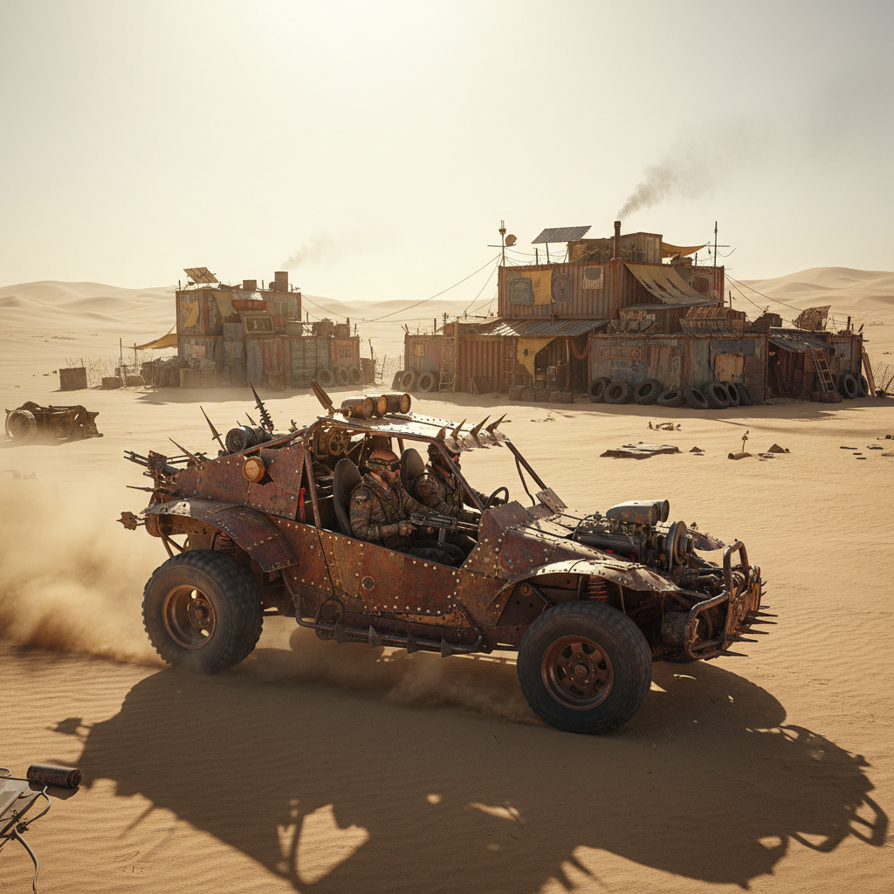

# Desert Punk Art 沙漠朋克艺术

> **时期：** 2010年代–至今  
> **关键词：** 后末日沙漠、废土美学、DIY生存、干旱未来、游牧科技

## 概述

沙漠朋克（Desert Punk）是一种以干旱荒漠为背景的后末日美学，想象水资源枯竭后的世界。它融合了《疯狂的麦克斯》的废土机械、Burning Man的临时建筑、中东/北非的传统建筑智慧和DIY生存文化——创造出一种在极端环境中用废弃材料重建文明的视觉语言。

## 风格特征

- **废土机械**：用废弃零件拼装的车辆和装备
- **沙漠色调**：土黄、铁锈红、风化白
- **DIY建筑**：帐篷、集装箱、废弃材料的临时庇护所
- **水的珍贵**：水作为核心资源的视觉符号
- **游牧美学**：移动、轻量、可拆卸的一切

## 代表人物与作品

- 《疯狂的麦克斯》系列视觉设计
- Burning Man 临时建筑
- Jakub Rozalski 废土绘画
- 中东当代建筑的沙漠适应设计

## 概念图

