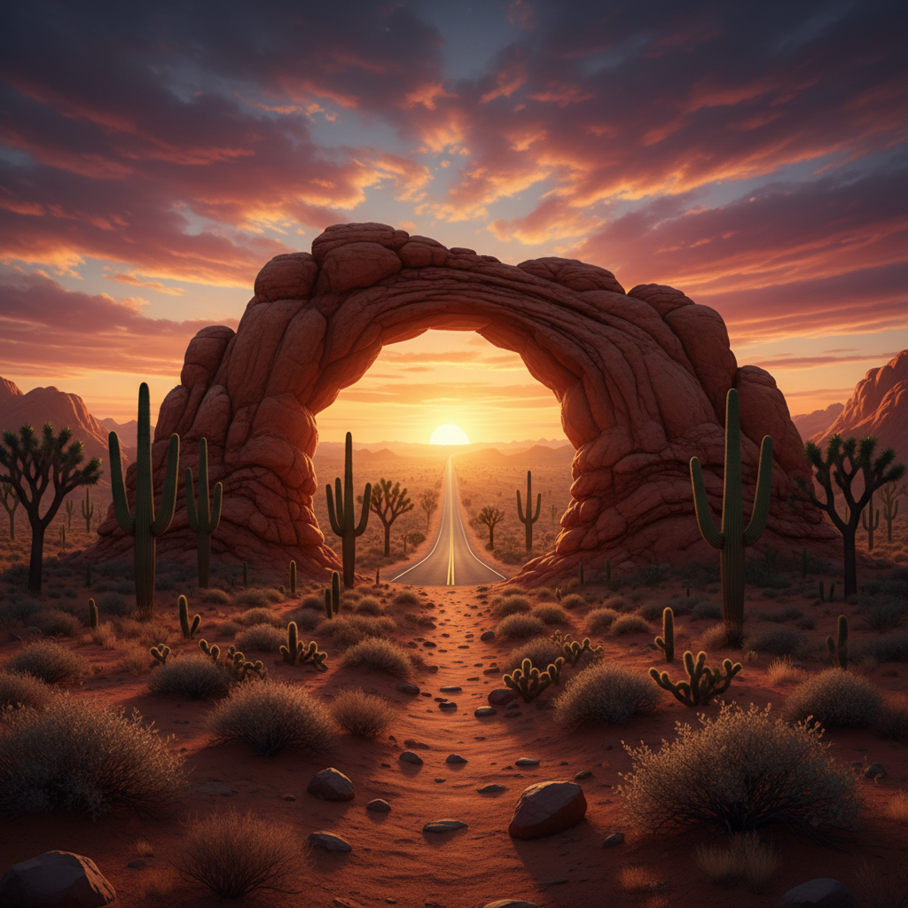

# Desertcore 沙漠核



> **"红色砂岩、仙人掌、无尽地平线——在荒芜中找到壮美。"**

## 概述

| 维度 | 描述 |
|------|------|
| 时期 | 2020–至今 |
| 别名 | Desertcore, Desert Aesthetic, Arid Aesthetic |
| 核心色彩 | 赭石、沙色、铁锈红、天蓝、米白 |
| 关键元素 | 仙人掌、砂岩、日落、公路、星空 |
| 代表人物 | Pinterest/TikTok 社区、Georgia O'Keeffe |
| 关联风格 | Americana, Boho Chic, Country, Southwestern |

---

## 历史脉络

| 年份 | 事件 |
|------|------|
| 古代 | 沙漠在各文化中的精神意义 |
| 1920s | Georgia O'Keeffe 的新墨西哥沙漠画 |
| 1960s | 公路电影中的沙漠美学 |
| 2015 | Joshua Tree 成为 Instagram 圣地 |
| 2020 | Desertcore 作为独立美学兴起 |

### 核心哲学

Desertcore 的精神是**"在空旷中找到自我——少即是壮美"**：
- 空旷 = 自由（没有边界）
- 极端 = 力量（生存本身就是胜利）
- 日落 = 每天的奇迹
- "沙漠教会你什么是真正重要的"

---

## 视觉语法

### 色彩系统

```
主色：
  赭石 (#CC7722) — 砂岩、大地
  沙色 (#C2B280) — 沙丘
  铁锈红 (#B7410E) — 红岩
  天蓝 (#87CEEB) — 无云的天空
  米白 (#F5F5DC) — 骨头、干燥

辅色：
  紫色 (#4B0082) — 日落
  橙色 (#FF8C00) — 黄昏
  绿色 (#556B2F) — 仙人掌

质感：
  粗糙 — 砂岩、干裂
  光滑 — 沙丘曲线
  多刺 — 仙人掌
  干燥 — 一切都是干的
```

### 标志性元素

| 类别 | 元素 |
|------|------|
| 植物 | 仙人掌、约书亚树、龙舌兰 |
| 地形 | 砂岩拱门、沙丘、峡谷、台地 |
| 天空 | 日落、星空、银河、无云蓝天 |
| 动物 | 响尾蛇、秃鹰、蜥蜴、郊狼 |
| 人造 | 公路、加油站、Adobe建筑 |
| 态度 | 孤独、壮美、精神性、极简 |

---

## 与千禧怀旧的关系

### Instagram 时代的沙漠
- Joshua Tree/Sedona = Instagram 朝圣地
- "沙漠婚礼"/"沙漠度假"趋势
- 与 Boho Chic 的天然交叉
- "去沙漠找自己"的精神旅行叙事

---

## 中国语境

- 中国西北沙漠（敦煌、鸣沙山）
- "大漠孤烟直"的中国沙漠美学传统
- 沙漠旅游在中国的兴起
- 与中国"西部公路"文化的交叉

---

## 设计应用

| 场景 | 应用方式 |
|------|----------|
| 品牌 | 大地色+极简+自然+精神性 |
| 空间 | Adobe风格+仙人掌+天然材料+暖色 |
| 时尚 | 大地色+天然面料+极简+层叠 |
| 摄影 | 金色光线+广角+极简构图 |

---

## 相关风格

← [Americana 美式复古](americana.md) | [Boho Chic 波西米亚时尚](boho-chic.md) →

↑ [返回千禧怀旧目录](README.md) | [返回总目录](../README.md)
