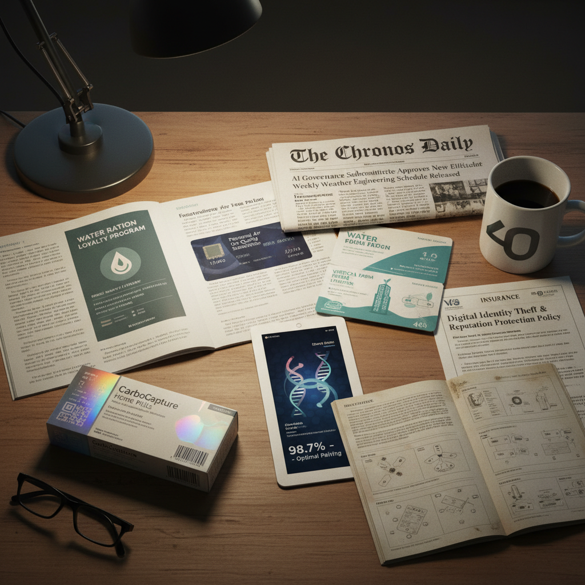

# Design Fiction Art 设计虚构艺术

> "Design fiction is the art of making the future mundane — not the spectacular future of science fiction with its spaceships and laser guns, but the boring future of instruction manuals, product packaging, customer service scripts, and terms of service agreements for technologies that don't exist yet, because it is in these banal artifacts that the real texture of daily life reveals itself, and it is by imagining the mundane details of possible futures that we can most clearly see whether we would actually want to live in them." — Julian Bleecker

## 概述

设计虚构（Design Fiction）是一种使用设计方法来创造关于未来的叙事和原型的实践。设计虚构不同于科幻——它不追求戏剧性和奇观，而是关注未来日常生活的平凡细节。设计虚构的核心方法是创造"来自未来的日常物品"——产品手册、新闻报道、广告、包装、用户界面——这些看似平凡的人工制品暗示了一个完整的未来世界。

设计虚构的概念由Bruce Sterling和Julian Bleecker等人发展，Near Future Laboratory是这一领域的重要实践者。设计虚构的代表性作品包括：《TBD Catalog》（一本来自近未来的产品目录）、各种虚构的新闻报道和广告、以及为不存在的技术设计的用户界面和包装。设计虚构被广泛用于企业战略、政策制定和公众参与——帮助人们具体地想象和讨论可能的未来。

## 核心特征

| 特征 | 描述 |
|------|------|
| 日常 | 关注未来的日常 |
| 平凡 | 平凡物品的虚构 |
| 叙事 | 通过物品讲故事 |
| 原型 | 未来的原型制作 |
| 讨论 | 激发关于未来的讨论 |
| 细节 | 对细节的关注 |

## 视觉特征

- **产品**：虚构的产品设计
- **包装**：虚构的产品包装
- **界面**：虚构的用户界面
- **文档**：虚构的说明书和文档
- **广告**：虚构的广告和宣传
- **新闻**：虚构的新闻报道

## 代表作品

| 作品 | 创作者 | 年代 | 意义 |
|------|--------|------|------|
| *TBD Catalog* | Near Future Laboratory | 2014 | 近未来产品目录 |
| *Uninvited Guests* | Superflux | 2015 | 老龄化未来的虚构 |
| *Design Fiction films* | Various | 2010年代 | 设计虚构短片 |
| *Future mundane* | Various | 2010年代 | 未来日常的想象 |
| *AI product fictions* | Various | 2020年代 | AI产品的虚构 |

## 历史时间线

| 时期 | 事件 |
|------|------|
| 2005 | Bruce Sterling提出"Design Fiction" |
| 2009 | Julian Bleecker的理论化 |
| 2014 | 《TBD Catalog》出版 |
| 2010年代 | 设计虚构的全球传播 |
| 当代 | AI时代的设计虚构 |

## 中国语境

设计虚构在中国有越来越多的实践和关注。中国的快速技术发展——从移动支付到人脸识别到智能城市——为设计虚构提供了丰富的素材。中国的一些设计师和研究者在创作关于中国未来的设计虚构：想象未来的中国城市生活、虚构基于中国技术生态的产品和服务、以及探索中国特有的社会和文化议题在未来的演变。中国的科技公司也开始使用设计虚构作为战略工具——通过创造未来场景来指导产品开发和创新方向。中国的设计院校也在将设计虚构纳入课程，培养学生的未来想象力和批判性思维。

## AI生成概念图

## 与其他风格的关系

- **Speculative Design** → 推测设计
- **Critical Design** → 批判设计
- **Science Fiction** → 科幻
- **UX Design** → 用户体验设计
- **Worldbuilding** → 世界构建
- **Prototyping** → 原型制作

---

*浮光艺志 | Chronicle of Artistry*
