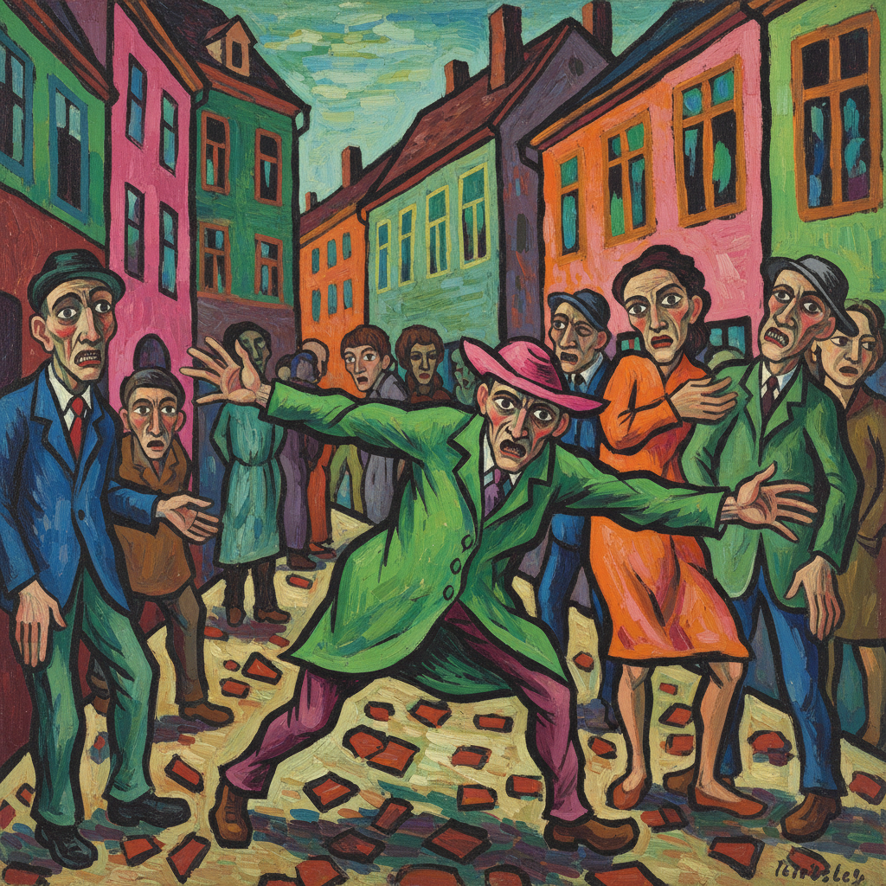

# Die Brücke 桥社

> "We call all young people together, and as young people who carry the future, we want to wrest freedom for our actions and our lives from the older, comfortably established forces." — Die Brücke Manifesto, 1906

## 概述

桥社（Die Brücke，1905–1913）是德国表现主义的第一个艺术团体，由德累斯顿建筑系学生创立。他们用粗犷的笔触、刺目的色彩和原始的木刻版画，表达对工业社会的反叛和对原始生命力的渴望。

## 核心特征

| 特征 | 描述 |
|------|------|
| 刺目色彩 | 非自然的、情感驱动的强烈用色 |
| 粗犷笔触 | 故意粗糙、未经修饰的画面 |
| 木刻版画 | 回归原始的黑白对比 |
| 原始主义 | 受非洲和大洋洲艺术启发 |
| 裸体与自然 | 湖边裸浴的自由身体 |
| 城市焦虑 | 柏林街头的紧张与疏离 |

## 核心成员

| 画家 | 特色 |
|------|------|
| Ernst Ludwig Kirchner | 领袖，柏林街景的焦虑 |
| Erich Heckel | 角状形体，精神性风景 |
| Karl Schmidt-Rottluff | 最大胆的色彩，非洲面具 |
| Emil Nolde | 宗教狂热的色彩爆发 |
| Max Pechstein | 南太平洋的原始梦想 |

## 代表作品

| 作品 | 画家 | 意义 |
|------|------|------|
| *Street, Berlin* | Kirchner, 1913 | 都市焦虑的经典 |
| *Franzi in Front of Carved Chair* | Kirchner, 1910 | 原始与现代的碰撞 |
| *Dance Around the Golden Calf* | Nolde, 1910 | 宗教狂喜的色彩 |

## AI生成概念图

## 与其他风格的关系

- **Der Blaue Reiter** → 德国表现主义的另一极（精神性 vs 原始性）
- **Fauvism** → 法国的色彩解放运动，时间相近
- **Expressionism** → 德国表现主义的开端
- **Primitivism** → 对非西方艺术的借鉴
