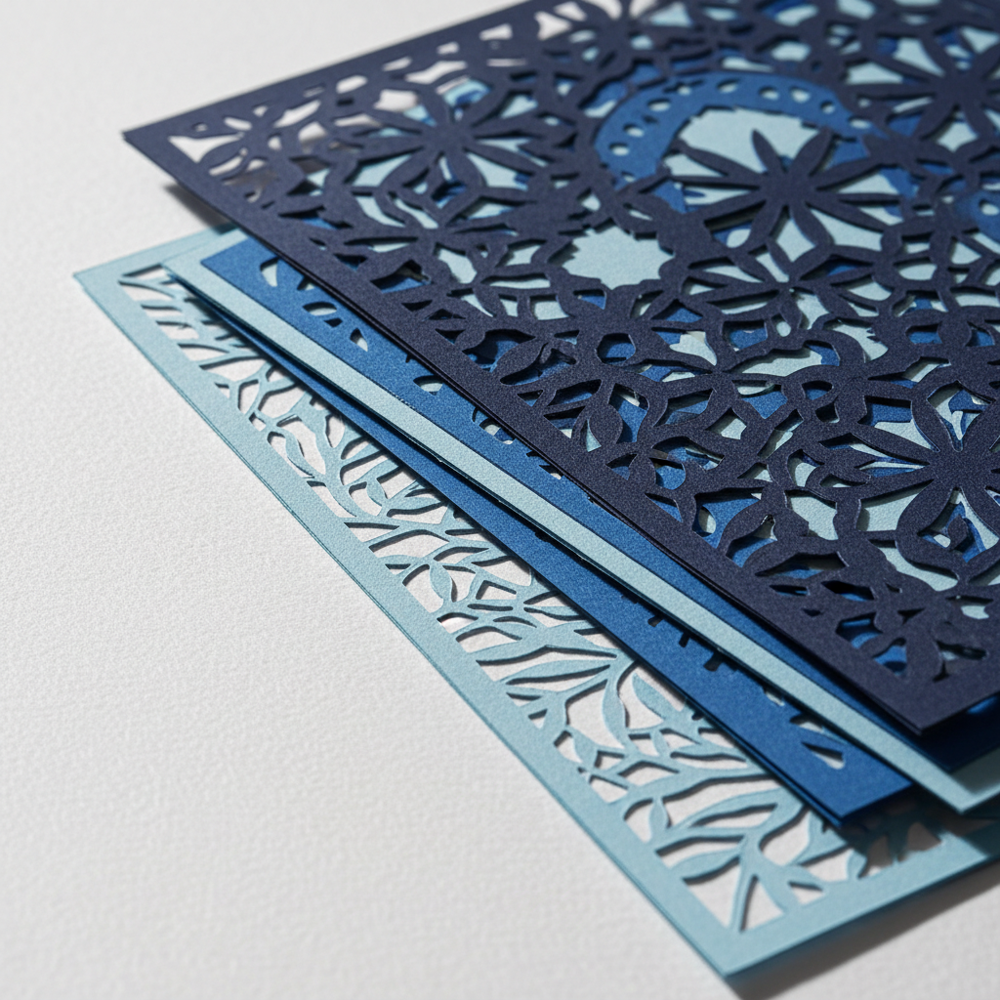

# Die Cutting Art 模切艺术

> "Die cutting is drawing with a blade — a shaped steel rule pressed through paper cuts precise silhouettes, windows, and interlocking forms that transform flat sheets into three-dimensional sculptures. The cut edge becomes a design element itself, revealing layers beneath or framing negative space with the clean authority of a surgeon's scalpel." — Unknown

## 概述

模切艺术（Die Cutting Art）是一种使用定制的钢刀模具在纸张、卡纸或其他薄材料上切割出精确形状的印后加工技法。模切将平面印刷品转化为具有独特轮廓、窗口和立体结构的作品——从简单的圆角名片到复杂的弹出式贺卡和纸雕，模切赋予纸张超越平面的可能性。

模切艺术的实践包括：1）刀模设计——设计切割路径和形状；2）刀模制作——将钢刀弯曲固定在木板上；3）压切——在模切机上施加压力切割；4）半切——只切穿部分层的半切技法；5）窗口切割——在纸面上切出窗口；6）弹出结构——创造弹出式立体结构；7）当代模切——将传统技法与现代设计结合的创作。

## 核心特征

| 特征 | 描述 |
|------|------|
| 精确 | 精确的形状切割 |
| 定制 | 定制的刀模形状 |
| 立体 | 创造立体效果 |
| 轮廓 | 独特的轮廓形状 |
| 窗口 | 窗口和镂空效果 |
| 多层 | 多层次的结构 |

## 视觉特征

- **轮廓**：精确的切割轮廓
- **镂空**：镂空的负空间
- **层次**：多层次的深度
- **立体**：立体的结构效果
- **精确**：精确的边缘
- **创意**：创意的形状设计

## 代表作品

| 作品 | 艺术家/文化 | 年代 | 意义 |
|------|-------------|------|------|
| *Pop-up books* | 国际 | 19世纪起 | 弹出式书籍 |
| *Laser-cut cards* | 国际 | 当代 | 激光切割贺卡 |
| *Paper engineering* | 国际 | 当代 | 纸张工程设计 |
| *Die-cut packaging* | 国际 | 当代 | 模切包装设计 |
| *Contemporary die-cut art* | 国际 | 当代 | 当代模切艺术 |

## 历史时间线

| 时期 | 事件 |
|------|------|
| 19世纪 | 工业模切技术的发展 |
| 19世纪中 | 弹出式书籍的流行 |
| 20世纪 | 商业包装中的广泛应用 |
| 1990年代 | 激光切割技术的引入 |
| 当代 | 模切的艺术化和数字化 |

## 中国语境

模切在中国的印刷和包装产业中有极其广泛的应用。中国是全球最大的模切加工市场之一——在包装、贺卡、标签和各种印刷品中大量使用。中国的传统剪纸艺术——与模切有相似的"切割创造形状"的理念。中国的包装设计中，模切——是创造独特包装结构的核心工艺。中国的贺卡和文创产业中，激光切割和模切——被广泛用于创造精美的纸艺产品。中国的设计教育中，模切作为重要的印后工艺——在包装设计课程中深入教授。中国的弹出式书籍和纸雕产业——在全球市场有重要地位。

## AI生成概念图

## 与其他风格的关系

- **Paper Cut** → 剪纸
- **Pop-up Book** → 弹出式书籍
- **Laser Cut** → 激光切割
- **Packaging Design** → 包装设计
- **Paper Engineering** → 纸张工程
- **Blind Embossing** → 无墨压凸

---

*浮光艺志 | Chronicle of Artistry*
