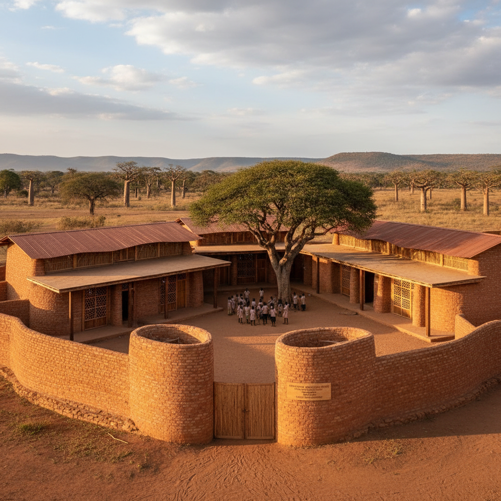

# Diébédo Francis Kéré 弗朗西斯·凯雷

> **时期：** 1965–至今  
> **关键词：** 非洲建筑、社区参与、气候适应、在地建造

## 概述

Diébédo Francis Kéré 是布基纳法索建筑师，2022年普利兹克奖得主。他用当地的泥土、石头和社区劳动力建造学校、医院和公共建筑——证明在资源极度匮乏的条件下，建筑仍然可以美丽、创新且赋予社区尊严。

## 风格特征

- **在地材料**：压缩土砖、当地石材、回收金属
- **气候适应**：双层屋顶、自然通风、遮阳策略
- **社区建造**：当地居民参与建造过程
- **色彩与光**：利用材料的天然色彩和精心设计的采光
- **树冠意象**：屋顶如同大树的树冠提供庇护

## 代表作品

- *甘多小学*（2001）
- *布基纳法索国家议会*（设计中）
- *蛇形画廊临时展亭*（2017）
- *Lycée Schorge中学*（2016）

## 概念图

