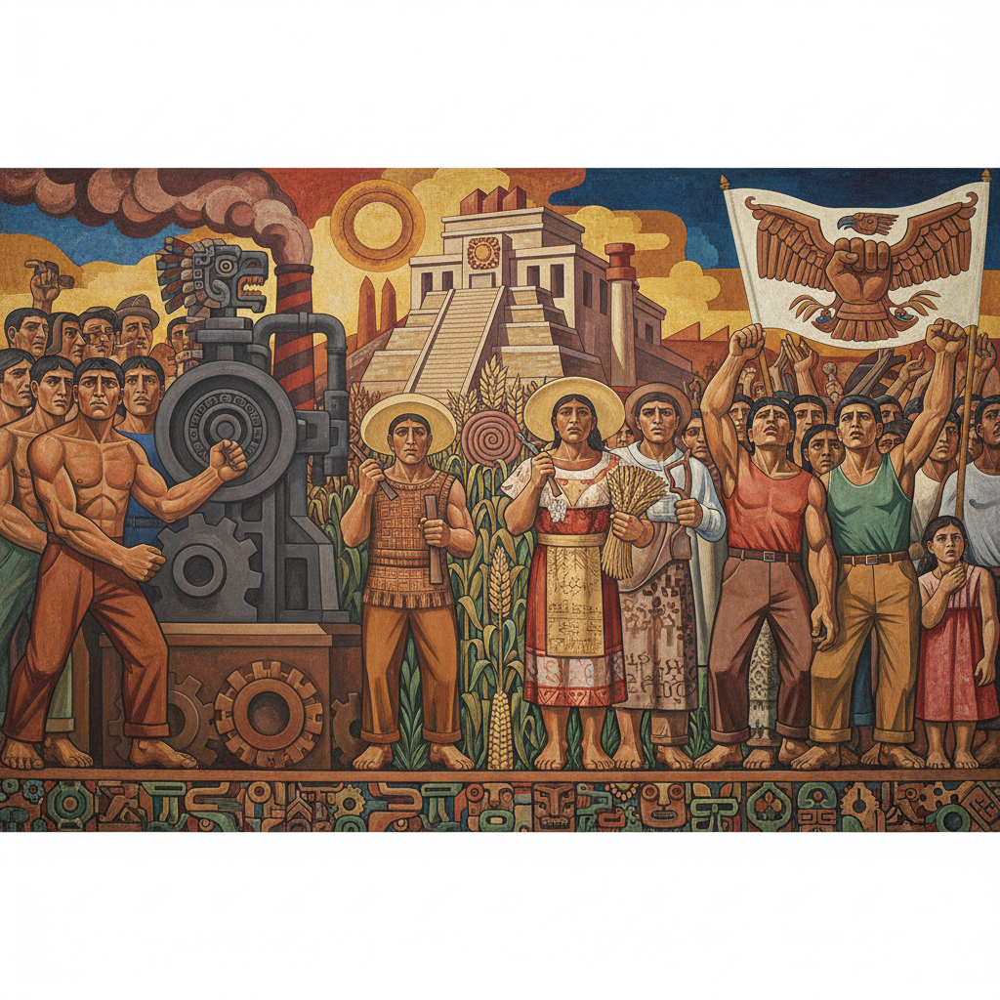

# Diego Rivera 迭戈·里维拉

> "I paint what I see, what I feel, and what my country is." — Diego Rivera

## 概述

迭戈·里维拉（Diego Rivera，1886–1957）是墨西哥壁画运动的领袖人物，20世纪最具影响力的公共艺术家之一。他以巨型壁画闻名——将墨西哥历史、工人阶级生活和社会主义理想融入宏大的叙事构图，用鲜明的色彩和简化的形体让艺术走向大众。

## 核心特征

| 特征 | 描述 |
|------|------|
| 巨型壁画 | 公共建筑上的史诗叙事 |
| 社会主义现实主义 | 工人、农民、革命的颂歌 |
| 墨西哥身份 | 前哥伦布文明与现代的融合 |
| 简化形体 | 立体主义影响的厚重人物 |
| 鲜明色彩 | 大地色与原色的强烈对比 |
| 叙事密度 | 一面墙讲述一个民族的历史 |

## 代表作品

| 作品 | 年代 | 意义 |
|------|------|------|
| *Man at the Crossroads* | 1934 | 洛克菲勒中心的争议壁画 |
| *Detroit Industry Murals* | 1932–33 | 工业时代的史诗 |
| *History of Mexico* | 1929–35 | 国家宫殿的民族叙事 |
| *Dream of a Sunday Afternoon* | 1947 | 墨西哥历史的梦幻长卷 |

## AI生成概念图

## 与其他风格的关系

- **Mexican Muralism** → 壁画运动三巨头之首
- **Cubism** → 早期受立体主义训练
- **Social Realism** → 社会现实主义的拉美版本
- **Frida Kahlo** → 伴侣与艺术对话
