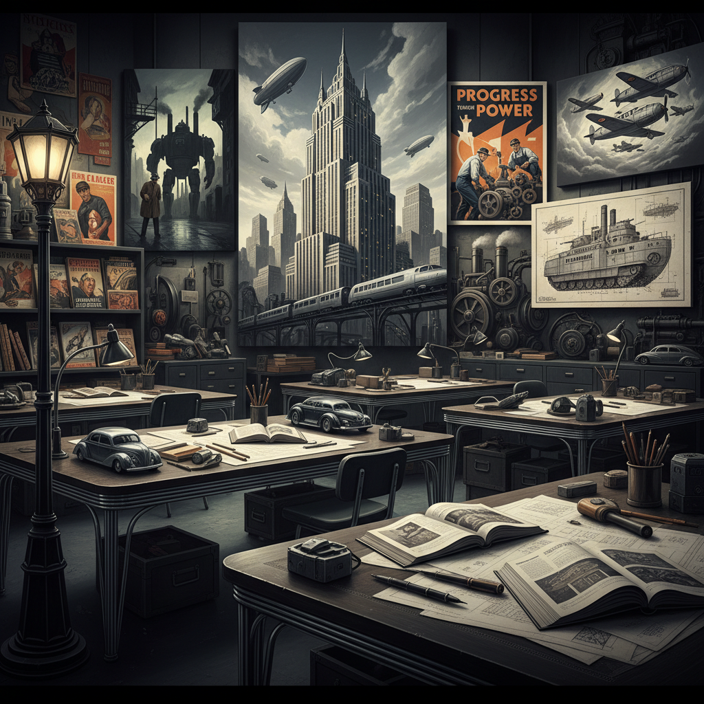

# Dieselpunk Art 柴油朋克艺术

> "Dieselpunk roars with the power of the interwar era — the thundering engines of Art Deco skyscrapers and streamlined locomotives, the glamour of noir detectives and femmes fatales, the propaganda posters and radio serials of a world caught between two wars, a retro-future powered not by delicate steam but by raw diesel combustion, where the aesthetic is heavier, darker, and more dangerous than its Victorian cousin, chrome and rivets replacing brass and gears." — Unknown

## 概述

柴油朋克（Dieselpunk）是一种以1920-1950年代（两次世界大战之间及二战时期）的美学和技术为基础的复古未来主义风格。与蒸汽朋克的维多利亚优雅不同，柴油朋克更加粗犷、工业化和军事化——它的视觉世界充满了装饰艺术（Art Deco）建筑、流线型设计、柴油引擎、螺旋桨飞机、坦克、黑色电影的光影和战时宣传画的美学。

"Dieselpunk"一词由游戏设计师刘易斯·波拉克（Lewis Pollak）在2001年为其角色扮演游戏《Children of the Sun》创造。柴油朋克的视觉灵感来源包括：装饰艺术运动、流线型现代主义、二战时期的军事设计、黑色电影、1930-40年代的科幻杂志封面（如《Amazing Stories》）、以及诺曼·贝尔·格迪斯（Norman Bel Geddes）等工业设计师的未来主义构想。

## 核心特征

| 特征 | 描述 |
|------|------|
| 装饰艺术 | Art Deco的美学 |
| 柴油 | 柴油和内燃机动力 |
| 战争 | 两次世界大战的背景 |
| 流线型 | 流线型的设计 |
| 黑色电影 | 黑色电影的光影 |
| 工业 | 重工业的粗犷感 |

## 视觉特征

- **铬**：铬和钢的金属质感
- **流线**：流线型的造型
- **装饰**：装饰艺术的几何图案
- **军事**：军事装备和制服
- **烟雾**：柴油烟雾和工业废气
- **黑白**：黑色电影的高对比

## 代表作品

| 作品 | 艺术家 | 年代 | 意义 |
|------|--------|------|------|
| *Sky Captain and the World of Tomorrow* | Kerry Conran | 2004 | 柴油朋克电影 |
| *BioShock* | 2K Games | 2007 | 柴油朋克游戏 |
| *The Rocketeer* | Dave Stevens | 1982 | 火箭人漫画 |
| *Iron Sky* | Timo Vuorensola | 2012 | 柴油朋克科幻 |
| *Crimson Skies* | Microsoft | 2000 | 柴油朋克空战游戏 |

## 历史时间线

| 时期 | 事件 |
|------|------|
| 2001 | Lewis Pollak创造"dieselpunk"一词 |
| 2000年代 | 柴油朋克亚文化的形成 |
| 2007 | BioShock的柴油朋克美学 |
| 2010年代 | 柴油朋克的视觉发展 |
| 当代 | 柴油朋克的持续影响 |

## 中国语境

柴油朋克在中国有一定的爱好者群体，特别是在游戏和动漫社区中。中国的1930-40年代（民国时期）提供了独特的柴油朋克想象空间——上海的装饰艺术建筑、民国时期的军阀混战、抗战时期的军事技术等都可以成为"中国柴油朋克"的素材。中国的一些游戏和影视作品已经开始探索这种"民国柴油朋克"的美学——将民国时期的中国元素与柴油朋克的复古未来主义结合。上海外滩的装饰艺术建筑群本身就是柴油朋克美学的现实参照。

## AI生成概念图

## 与其他风格的关系

- **Steampunk** → 蒸汽朋克
- **Atompunk** → 原子朋克
- **Art Deco** → 装饰艺术
- **Film Noir** → 黑色电影
- **Retro-Futurism** → 复古未来主义
- **Cyberpunk** → 赛博朋克

---

*浮光艺志 | Chronicle of Artistry*
